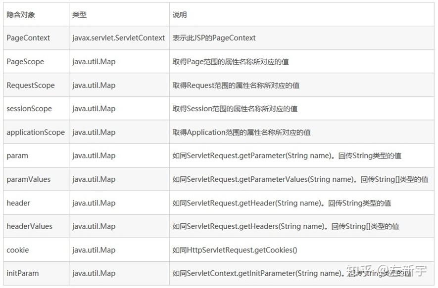

## JSP

### 10.1 JSP生命周期

理解JSP底层功能的关键就是去理解它们所遵守的生命周期。

JSP生命周期就是从创建到销毁的整个过程，类似于servlet生命周期，区别在于JSP生命周期还包括将JSP文件编译成servlet。

以下是JSP生命周期中所走过的几个阶段：

- **编译阶段：**

  servlet容器编译servlet源文件，生成servlet类

- 初始化阶段：

  加载与JSP对应的servlet类，创建其实例，并调用它的初始化方法

- 执行阶段：

  调用与JSP对应的servlet实例的服务方法

- 销毁阶段：

  调用与JSP对应的servlet实例的销毁方法，然后销毁servlet实例

很明显，JSP生命周期的四个主要阶段和servlet生命周期非常相似，下面给出图示：


#### 10.1.1 JSP编译

当浏览器请求JSP页面时，JSP引擎会首先去检查是否需要编译这个文件。如果这个文件没有被编译过，或者在上次编译后被更改过，则编译这个JSP文件。

编译的过程包括三个步骤：

- 解析JSP文件。
- 将JSP文件转为servlet。
- 编译servlet。

#### 10.1.2 JSP初始化

容器载入JSP文件后，它会在为请求提供任何服务前调用jspInit()方法。如果您需要执行自定义的JSP初始化任务，复写jspInit()方法就行了，就像下面这样：

```java
public void jspInit(){
  // 初始化代码
}
```

一般来讲程序只初始化一次，servlet也是如此。通常情况下您可以在jspInit()方法中初始化数据库连接、打开文件和创建查询表。

#### 10.1.3 JSP执行

这一阶段描述了JSP生命周期中一切与请求相关的交互行为，直到被销毁。

当JSP网页完成初始化后，JSP引擎将会调用_jspService()方法。

_jspService()方法需要一个HttpServletRequest对象和一个HttpServletResponse对象作为它的参数，就像下面这样：

```java
void _jspService(HttpServletRequest request,
                 HttpServletResponse response)
{
   // 服务端处理代码
}
```

_jspService()方法在每个request中被调用一次并且负责产生与之相对应的response，并且它还负责产生所有7个HTTP方法的回应，比如GET、POST、DELETE等等。

#### 10.1.4 JSP清理

JSP生命周期的销毁阶段描述了当一个JSP网页从容器中被移除时所发生的一切。

jspDestroy()方法在JSP中等价于servlet中的销毁方法。当您需要执行任何清理工作时复写jspDestroy()方法，比如释放数据库连接或者关闭文件夹等等。

jspDestroy()方法的格式如下：

```java
public void jspDestroy()
{
   // 清理代码
}
```

### 10.2 JSP指令

#### 10.2.1 指令

JSP指令用来设置整个JSP页面相关的属性，如网页的编码方式和脚本语言。

语法格式如下：

```jsp
<%@ directive attribute="value" %>
```

指令可以有很多个属性，它们以键值对的形式存在，并用逗号隔开。

JSP中的三种指令标签：

| **指令**           | **描述**                                                |
| :----------------- | :------------------------------------------------------ |
| <%@ page ... %>    | 定义网页依赖属性，比如脚本语言、error页面、缓存需求等等 |
| <%@ include ... %> | 包含其他文件                                            |
| <%@ taglib ... %>  | 引入标签库的定义                                        |

#### 10.2.2 Page指令

Page指令为容器提供当前页面的使用说明。一个JSP页面可以包含多个page指令。

Page指令的语法格式：

```jsp
<%@ page attribute="value" %>
```

等价的XML格式：

```jsp
<jsp:directive.page attribute="value" />
```

**属性**

下表列出与Page指令相关的属性：说

| **属性**           | **描述**                                            |
| :----------------- | :-------------------------------------------------- |
| buffer             | 指定out对象使用缓冲区的大小                         |
| autoFlush          | 控制out对象的 缓存区                                |
| contentType        | 指定当前JSP页面的MIME类型和字符编码                 |
| errorPage          | 指定当JSP页面发生异常时需要转向的错误处理页面       |
| isErrorPage        | 指定当前页面是否可以作为另一个JSP页面的错误处理页面 |
| extends            | 指定servlet从哪一个类继承                           |
| import             | 导入要使用的Java类                                  |
| info               | 定义JSP页面的描述信息                               |
| isThreadSafe       | 指定对JSP页面的访问是否为线程安全                   |
| language           | 定义JSP页面所用的脚本语言，默认是Java               |
| session            | 指定JSP页面是否使用session                          |
| isELIgnored        | 指定是否执行EL表达式                                |
| isScriptingEnabled | 确定脚本元素能否被使用                              |


#### 10.2.3 Include指令

JSP可以通过include指令来包含其他文件。被包含的文件可以是JSP文件、HTML文件或文本文件。包含的文件就好像是该JSP文件的一部分，会被同时编译执行。

Include指令的语法格式如下：

```jsp
<%@ include file="relative url" %>
```

Include指令中的文件名实际上是一个相对的URL。如果您没有给文件关联一个路径，JSP编译器默认在当前路径下寻找。

等价的XML语法：

```jsp
<jsp:directive.include file="relative url" />
```


#### 10.2.4 Taglib指令

JSP API允许用户自定义标签，一个自定义标签库就是自定义标签的集合。

Taglib指令引入一个自定义标签集合的定义，包括库路径、自定义标签。

Taglib指令的语法：

```jsp
<%@ taglib uri="uri" prefix="prefixOfTag" %>
```

uri属性确定标签库的位置，prefix属性指定标签库的前缀。

等价的XML语法：

```jsp
<jsp:directive.taglib uri="uri" prefix="prefixOfTag" />
```


### 10.3 JSP 动作元素

与JSP指令元素不同的是，JSP动作元素在请求处理阶段起作用。JSP动作元素是用XML语法写成的。

利用JSP动作可以动态地插入文件、重用JavaBean组件、把用户重定向到另外的页面、为Java插件生成HTML代码。

动作元素只有一种语法，它符合XML标准：

```jsp
<jsp:action_name attribute="value" />
```

动作元素基本上都是预定义的函数，JSP规范定义了一系列的标准动作，它用JSP作为前缀，可用的标准动作元素如下：

| 语法            | 描述                                            |
| :-------------- | :---------------------------------------------- |
| jsp:include     | 在页面被请求的时候引入一个文件。                |
| jsp:useBean     | 寻找或者实例化一个JavaBean。                    |
| jsp:setProperty | 设置JavaBean的属性。                            |
| jsp:getProperty | 输出某个JavaBean的属性。                        |
| jsp:forward     | 把请求转到一个新的页面。                        |
| jsp:plugin      | 根据浏览器类型为Java插件生成OBJECT或EMBED标记。 |
| jsp:element     | 定义动态XML元素                                 |
| jsp:attribute   | 设置动态定义的XML元素属性。                     |
| jsp:body        | 设置动态定义的XML元素内容。                     |
| jsp:text        | 在JSP页面和文档中使用写入文本的模板             |

------

#### 10.3.1 常见的属性

所有的动作要素都有两个属性：id属性和scope属性。

- id属性：

  id属性是动作元素的唯一标识，可以在JSP页面中引用。动作元素创建的id值可以通过PageContext来调用。

  

- scope属性：

  该属性用于识别动作元素的生命周期。 id属性和scope属性有直接关系，scope属性定义了相关联id对象的寿命。 scope属性有四个可能的值： (a) page, (b)request, (c)session, 和 (d) application。

  

------

#### 10.3.2 <jsp:include>动作元素

<jsp:include>动作元素用来包含静态和动态的文件。该动作把指定文件插入正在生成的页面。语法格式如下：

```jsp
<jsp:include page="relative URL" flush="true" />
```

　前面已经介绍过include指令，它是在JSP文件被转换成Servlet的时候引入文件，而这里的jsp:include动作不同，插入文件的时间是在页面被请求的时候。

以下是include动作相关的属性列表。

| 属性  | 描述                                       |
| :---- | :----------------------------------------- |
| page  | 包含在页面中的相对URL地址。                |
| flush | 布尔属性，定义在包含资源前是否刷新缓存区。 |

#### 10.3.3 <jsp:useBean>动作元素

jsp:useBean动作用来装载一个将在JSP页面中使用的JavaBean。

这个功能非常有用，因为它使得我们既可以发挥Java组件重用的优势，同时也避免了损失JSP区别于Servlet的方便性。

jsp:useBean动作最简单的语法为：

```jsp
<jsp:useBean id="name" class="package.class" />
```

在类载入后，我们既可以通过 jsp:setProperty 和 jsp:getProperty 动作来修改和检索bean的属性。 

以下是useBean动作相关的属性列表。

| 属性     | 描述                                                        |
| :------- | :---------------------------------------------------------- |
| class    | 指定Bean的完整包名。                                        |
| type     | 指定将引用该对象变量的类型。                                |
| beanName | 通过 java.beans.Beans 的 instantiate() 方法指定Bean的名字。 |

在给出具体实例前，让我们先来看下 jsp:setProperty 和 jsp:getProperty 动作元素：

#### 10.3.4 <jsp:setProperty>动作元素

　jsp:setProperty用来设置已经实例化的Bean对象的属性，有两种用法。首先，你可以在jsp:useBean元素的外面（后面）使用jsp:setProperty，如下所示：

```jsp
<jsp:useBean id="myName" ... />
...
<jsp:setProperty name="myName" property="someProperty" .../>
```

　此时，不管jsp:useBean是找到了一个现有的Bean，还是新创建了一个Bean实例，jsp:setProperty都会执行。第二种用法是把jsp:setProperty放入jsp:useBean元素的内部，如下所示：

```jsp
<jsp:useBean id="myName" ... >
...
   <jsp:setProperty name="myName" property="someProperty" .../>
</jsp:useBean>
```

此时，jsp:setProperty只有在新建Bean实例时才会执行，如果是使用现有实例则不执行jsp:setProperty。

| 属性     | 描述                                                         |
| :------- | :----------------------------------------------------------- |
| name     | name属性是必需的。它表示要设置属性的是哪个Bean。             |
| property | property属性是必需的。它表示要设置哪个属性。有一个特殊用法：如果property的值是"*"，表示所有名字和Bean属性名字匹配的请求参数都将被传递给相应的属性set方法。 |
| value    | value 属性是可选的。该属性用来指定Bean属性的值。字符串数据会在目标类中通过标准的valueOf方法自动转换成数字、boolean、Boolean、 byte、Byte、char、Character。例如，boolean和Boolean类型的属性值（比如"true"）通过 Boolean.valueOf转换，int和Integer类型的属性值（比如"42"）通过Integer.valueOf转换。 　　value和param不能同时使用，但可以使用其中任意一个。 |
| param    | param 是可选的。它指定用哪个请求参数作为Bean属性的值。如果当前请求没有参数，则什么事情也不做，系统不会把null传递给Bean属性的set方法。因此，你可以让Bean自己提供默认属性值，只有当请求参数明确指定了新值时才修改默认属性值。 |


#### 10.3.5 <jsp:getProperty>动作元素

　jsp:getProperty动作提取指定Bean属性的值，转换成字符串，然后输出。语法格式如下：

```jsp
<jsp:useBean id="myName" ... />
...
<jsp:getProperty name="myName" property="someProperty" .../>
```

下表是与getProperty相关联的属性：

| 属性     | 描述                                   |
| :------- | :------------------------------------- |
| name     | 要检索的Bean属性名称。Bean必须已定义。 |
| property | 表示要提取Bean属性的值                 |

#### 10.3.6 <jsp:forward> 动作元素

　jsp:forward动作把请求转到另外的页面。jsp:forward标记只有一个属性page。语法格式如下所示：

```jsp
<jsp:forward page="Relative URL" />
```

以下是forward相关联的属性：

| 属性 | 描述                                                         |
| :--- | :----------------------------------------------------------- |
| page | page属性包含的是一个相对URL。page的值既可以直接给出，也可以在请求的时候动态计算，可以是一个JSP页面或者一个 Java Servlet. |

#### 10.3.7 <jsp:plugin>动作元素

jsp:plugin动作用来根据浏览器的类型，插入通过Java插件 运行Java Applet所必需的OBJECT或EMBED元素。

如果需要的插件不存在，它会下载插件，然后执行Java组件。 Java组件可以是一个applet或一个JavaBean。

plugin动作有多个对应HTML元素的属性用于格式化Java 组件。param元素可用于向Applet 或 Bean 传递参数。

以下是使用plugin 动作元素的典型实例:

```jsp
<jsp:plugin type="applet" codebase="dirname" code="MyApplet.class"                            width="60" height="80">
   <jsp:param name="fontcolor" value="red" />
   <jsp:param name="background" value="black" />
 
   <jsp:fallback>
      Unable to initialize Java Plugin
   </jsp:fallback>
 
</jsp:plugin>
```

如果你有兴趣可以尝试使用applet来测试jsp:plugin动作元素，`<fallback>`元素是一个新元素，在组件出现故障的错误是发送给用户错误信息。

------

#### 10.3.8 `<jsp:element>` 、 `<jsp:attribute>`、 `<jsp:body>`动作元素

`<jsp:element>` 、 `<jsp:attribute>`、 `<jsp:body>`动作元素动态定义XML元素。动态是非常重要的，这就意味着XML元素在编译时是动态生成的而非静态。

以下实例动态定义了XML元素：

```jsp
<%@page language="java" contentType="text/html"%>
<html xmlns="http://www.w3c.org/1999/xhtml"       xmlns:jsp="http://java.sun.com/JSP/Page">

<head><title>Generate XML Element</title></head>
<body>
<jsp:element name="xmlElement">
<jsp:attribute name="xmlElementAttr">
   Value for the attribute
</jsp:attribute>
<jsp:body>
   Body for XML element
</jsp:body>
</jsp:element>
</body>
</html>
```

执行时生成HTML代码如下：

```jsp
<html xmlns="http://www.w3c.org/1999/xhtml"       xmlns:jsp="http://java.sun.com/JSP/Page">
 
<head><title>Generate XML Element</title></head>
<body>
<xmlElement xmlElementAttr="Value for the attribute">
   Body for XML element
</xmlElement>
</body>
</html>
```

#### 10.3.9 `<jsp:text>`动作元素

`<jsp:text>`动作元素允许在JSP页面和文档中使用写入文本的模板，语法格式如下：

```jsp
<jsp:text>Template data</jsp:text>
```

以上文本模板不能包含其他元素，只能只能包含文本和EL表达式（注：EL表达式将在后续章节中介绍）。请注 意，在XML文件中，您不能使用表达式如 ${whatever > 0}，因为>符号是非法的。 你可以使用 ${whatever gt 0}表达式或者嵌入在一个CDATA部分的值。

```jsp
<jsp:text><![CDATA[<br>]]></jsp:text>
```

如果你需要在 XHTML 中声明 DOCTYPE,必须使用到`<jsp:text>`动作元素，实例如下：

```jsp
<jsp:text><![CDATA[<!DOCTYPE html PUBLIC "-//W3C//DTD XHTML 1.0 Strict//EN" "DTD/xhtml1-strict.dtd">]]>
</jsp:text>
<head><title>jsp:text action</title></head>
<body>

<books><book><jsp:text>  
    Welcome to JSP Programming
</jsp:text></book></books>

</body>
</html>
```

你可以对以上实例尝试使用 `<jsp:text>`及不使用该动作元素执行结果的区别。

### 10.4 JSP 隐式对象

JSP隐式对象是JSP容器为每个页面提供的Java对象，开发者可以直接使用它们而不用显式声明。JSP隐式对象也被称为预定义变量。

JSP所支持的九大隐式对象：

| **对象**    | **描述**                                                     |
| :---------- | :----------------------------------------------------------- |
| request     | **HttpServletRequest**类的实例                               |
| response    | **HttpServletResponse**类的实例                              |
| out         | **PrintWriter**类的实例，用于把结果输出至网页上              |
| session     | **HttpSession**类的实例                                      |
| application | **ServletContext**类的实例，与应用上下文有关                 |
| config      | **ServletConfig**类的实例                                    |
| pageContext | **PageContext**类的实例，提供对JSP页面所有对象以及命名空间的访问 |
| page        | 类似于Java类中的this关键字                                   |
| Exception   | **Exception**类的对象，代表发生错误的JSP页面中对应的异常对象 |

------

#### 10.4.1 request对象

request对象是javax.servlet.http.HttpServletRequest 类的实例。每当客户端请求一个JSP页面时，JSP引擎就会制造一个新的request对象来代表这个请求。

request对象提供了一系列方法来获取HTTP头信息，cookies，HTTP方法等等。

------

#### 10.4.2 response对象

response对象是javax.servlet.http.HttpServletResponse类的实例。当服务器创建request对象时会同时创建用于响应这个客户端的response对象。

response对象也定义了处理HTTP头模块的接口。通过这个对象，开发者们可以添加新的cookies，时间戳，HTTP状态码等等。

------

#### 10.4.3 out对象

out对象是 javax.servlet.jsp.JspWriter 类的实例，用来在response对象中写入内容。

最初的JspWriter类对象根据页面是否有缓存来进行不同的实例化操作。可以在page指令中使用buffered='false'属性来轻松关闭缓存。

JspWriter类包含了大部分java.io.PrintWriter类中的方法。不过，JspWriter新增了一些专为处理缓存而设计的方法。还有就是，JspWriter类会抛出IOExceptions异常，而PrintWriter不会。

下表列出了我们将会用来输出boolean，char，int，double，Srtring，object等类型数据的重要方法：

| **方法**                     | **描述**                 |
| :--------------------------- | :----------------------- |
| **out.print(dataType dt)**   | 输出Type类型的值         |
| **out.println(dataType dt)** | 输出Type类型的值然后换行 |
| **out.flush()**              | 刷新输出流               |

------

#### 10.4.4 session对象

session对象是 javax.servlet.http.HttpSession 类的实例。和Java Servlets中的session对象有一样的行为。

session对象用来跟踪在各个客户端请求间的会话。

------

#### 10.4.5 application对象

application对象直接包装了servlet的ServletContext类的对象，是javax.servlet.ServletContext 类的实例。

这个对象在JSP页面的整个生命周期中都代表着这个JSP页面。这个对象在JSP页面初始化时被创建，随着jspDestroy()方法的调用而被移除。

通过向application中添加属性，则所有组成您web应用的JSP文件都能访问到这些属性。

------

#### 10.4.6 config对象

config对象是 javax.servlet.ServletConfig 类的实例，直接包装了servlet的ServletConfig类的对象。

这个对象允许开发者访问Servlet或者JSP引擎的初始化参数，比如文件路径等。

以下是config对象的使用方法，不是很重要，所以不常用：

```java
config.getServletName();
```

它返回包含在`<servlet-name>`元素中的servlet名字，注意，`<servlet-name>`元素在 WEB-INF\web.xml 文件中定义。

------

#### 10.4.7 pageContext 对象

pageContext对象是javax.servlet.jsp.PageContext 类的实例，用来代表整个JSP页面。

这个对象主要用来访问页面信息，同时过滤掉大部分实现细节。

这个对象存储了request对象和response对象的引用。application对象，config对象，session对象，out对象可以通过访问这个对象的属性来导出。

pageContext对象也包含了传给JSP页面的指令信息，包括缓存信息，ErrorPage URL,页面scope等。

PageContext类定义了一些字段，包括PAGE_SCOPE，REQUEST_SCOPE，SESSION_SCOPE， APPLICATION_SCOPE。它也提供了40余种方法，有一半继承自javax.servlet.jsp.JspContext 类。

其中一个重要的方法就是removeArribute()，它可接受一个或两个参数。比如，pageContext.removeArribute("attrName")移除四个scope中相关属性，但是下面这种方法只移除特定scope中的相关属性：

```java
pageContext.removeAttribute("attrName", PAGE_SCOPE);
```

------

#### 10.4.8 page 对象

这个对象就是页面实例的引用。它可以被看做是整个JSP页面的代表。

page 对象就是this对象的同义词。

------

#### 10.4.9 exception 对象

exception 对象包装了从先前页面中抛出的异常信息。它通常被用来产生对出错条件的适当响应。


### 10.5 EL语法

#### 10.5.1 语法格式

**${ expression }**

要在页面中输出，则可用\${}

{“Hello World”}

#### 10.5.2 EL隐含对象




### 10.6 JSTL

#### 10.6.1 引入

```jsp
<%@ taglib prefix="c" uri="http://java.sun.com/jsp/jstl/core" %>
```

#### 10.6.2 常用标签

`<c:out>`	用于在JSP中显示数据，就像<%= ... >
`<c:set>`	用于保存数据
`<c:remove>`	用于删除数据
`<c:catch>`	用来处理产生错误的异常状况，并且将错误信息储存起来
`<c:if>`	与我们在一般程序中用的if一样
`<c:choose>`	本身只当做`<c:when>`和`<c:otherwise>`的父标签
`<c:when>`	`<c:choose>`的子标签，用来判断条件是否成立
`<c:otherwise>`	`<c:choose>`的子标签，接在`<c:when>`标签后，当`<c:when>`标签判断为false时被执行
`<c:import>`	检索一个绝对或相对 URL，然后将其内容暴露给页面
`<c:forEach>`	基础迭代标签，接受多种集合类型
`<c:forTokens>`	根据指定的分隔符来分隔内容并迭代输出
`<c:param>`	用来给包含或重定向的页面传递参数
`<c:redirect>`	重定向至一个新的URL.
`<c:url>`	使用可选的查询参数来创造一个URL
