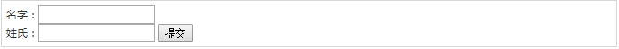
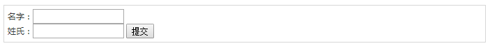
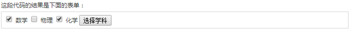

## 表单提交数据

### 3.1 使用表单的 GET 方法实例

下面是一个简单的实例，使用 HTML 表单和提交按钮传递两个值。我们将使用相同的 Servlet HelloForm 来处理输入。

```html
<html>
<body>
<form action="HelloForm" method="GET">
名字：<input type="text" name="first_name">
<br />
姓氏：<input type="text" name="last_name" />
<input type="submit" value="提交" />
</form>
</body>
</html>
```

**action：对应的Servlet名字**

**method：处理的方法名**

**name：对应表单组件的名字，用来Servlet识别**

保存这个 HTML 到 hello.htm 文件中。当您访问 `http://localhost:8080/Hello.html` 时，下面是上面表单的实际输出。



尝试输入名字和姓氏，然后点击"提交"按钮，在您本机上查看输出结果。基于所提供的输入，它会产生与上一个实例类似的结果。

### 3.2 使用表单的 POST 方法实例

让我们对上面的 Servlet 做小小的修改，以便它可以处理 GET 和 POST 方法。下面的 **HelloForm.java** Servlet 程序使用 GET 和 POST 方法处理由 Web 浏览器给出的输入。

```java
// 导入必需的 java 库
import java.io.*;
import javax.servlet.*;
import javax.servlet.http.*;

// 扩展 HttpServlet 类
public class HelloForm extends HttpServlet {
 
  // 处理 GET 方法请求的方法
  public void doGet(HttpServletRequest request,
                    HttpServletResponse response)
            throws ServletException, IOException
  {
      // 设置响应内容类型
      response.setContentType("text/html");

      PrintWriter out = response.getWriter();
      String title = "Using GET Method to Read Form Data";
      String docType =
      "<!doctype html public \"-//w3c//dtd html 4.0 " +       "transitional//en\">\n";
      out.println(docType +
                "<html>\n" +
                "<head><title>" + title + "</title></head>\n" +
                "<body bgcolor=\"#f0f0f0\">\n" +
                "<h1 align=\"center\">" + title + "</h1>\n" +
                "<ul>\n" +
                "  <li><b>名字</b>："
                + request.getParameter("first_name") + "\n" +
                "  <li><b>姓氏</b>："
                + request.getParameter("last_name") + "\n" +
                "</ul>\n" +
                "</body></html>");
  }
  // 处理 POST 方法请求的方法
  public void doPost(HttpServletRequest request,
                     HttpServletResponse response)
      throws ServletException, IOException {
     doGet(request, response);
  }
}
```

现在，编译部署上述的 Servlet，并使用带有 POST 方法的 Hello.htm 进行测试，如下所示：

```java
<html>
<body>
<form action="HelloForm" method="POST">
名字：<input type="text" name="first_name">
<br />
姓氏：<input type="text" name="last_name" />
<input type="submit" value="提交" />
</form>
</body>
</html>
```

下面是上面表单的实际输出，尝试输入名字和姓氏，然后点击"提交"按钮，在您本机上查看输出结果。



基于所提供的输入，它会产生与上一个实例类似的结果。

### 3.3 将复选框数据传递到 Servlet 程序

当需要选择一个以上的选项时，则使用复选框。

下面是一个 HTML 代码实例 CheckBox.htm，一个带有两个复选框的表单。

```html
<html>
<body>
<form action="CheckBox" method="POST" target="_blank">
<input type="checkbox" name="maths" checked="checked" /> 数学
<input type="checkbox" name="physics"  /> 物理
<input type="checkbox" name="chemistry" checked="checked" /> 
                                                化学
<input type="submit" value="选择学科" />
</form>
</body>
</html>
```

这段代码的结果是下面的表单：



下面是 CheckBox.java Servlet 程序，处理 Web 浏览器给出的复选框输入。

```java
// 导入必需的 java 库
import java.io.*;
import javax.servlet.*;
import javax.servlet.http.*;

// 扩展 HttpServlet 类
public class CheckBox extends HttpServlet {
 
  // 处理 GET 方法请求的方法
  public void doGet(HttpServletRequest request,
                    HttpServletResponse response)
            throws ServletException, IOException
  {
      // 设置响应内容类型
      response.setContentType("text/html");

      PrintWriter out = response.getWriter();
     String title = "读取复选框数据";
      String docType =
      "<!doctype html public \"-//w3c//dtd html 4.0 " +       "transitional//en\">\n";
      out.println(docType +
                "<html>\n" +
                "<head><title>" + title + "</title></head>\n" +
                "<body bgcolor=\"#f0f0f0\">\n" +
                "<h1 align=\"center\">" + title + "</h1>\n" +
                "<ul>\n" +
                "  <li><b>数学标识：</b>: "
                + request.getParameter("maths") + "\n" +
                "  <li><b>物理标识：</b>: "
                + request.getParameter("physics") + "\n" +
                "  <li><b>化学标识：</b>: "
                + request.getParameter("chemistry") + "\n" +
                "</ul>\n" +
                "</body></html>");
  }
  // 处理 POST 方法请求的方法
  public void doPost(HttpServletRequest request,
                     HttpServletResponse response)
      throws ServletException, IOException {
     doGet(request, response);
  }
}
```

上面的实例将显示下面的结果：

读取复选框数据**数学标识：**on**物理标识：**null**化学标识：**on

### 3.4 读取所有的表单参数

以下是通用的实例，使用 HttpServletRequest 的 `getParameterNames()` 方法读取所有可用的表单参数。该方法返回一个枚举，其中包含未指定顺序的参数名。

一旦我们有一个枚举，我们可以以标准方式循环枚举，使用 `hasMoreElements()` 方法来确定何时停止，使用 *nextElement()* 方法来获取每个参数的名称。

```java
// 导入必需的 java 库
import java.io.*;
import javax.servlet.*;
import javax.servlet.http.*;
import java.util.*;

// 扩展 HttpServlet 类
public class ReadParams extends HttpServlet {
 
  // 处理 GET 方法请求的方法
  public void doGet(HttpServletRequest request,
                    HttpServletResponse response)
            throws ServletException, IOException
  {
      // 设置响应内容类型
      response.setContentType("text/html");

      PrintWriter out = response.getWriter();
     String title = "读取所有的表单数据";
      String docType =
      "<!doctype html public \"-//w3c//dtd html 4.0 " +       "transitional//en\">\n";
      out.println(docType +
        "<html>\n" +
        "<head><title>" + title + "</title></head>\n" +
        "<body bgcolor=\"#f0f0f0\">\n" +
        "<h1 align=\"center\">" + title + "</h1>\n" +
        "<table width=\"100%\" border=\"1\" align=\"center\">\n" +
        "<tr bgcolor=\"#949494\">\n" +
        "<th>参数名称</th><th>参数值</th>\n"+
        "</tr>\n");

      Enumeration paramNames = request.getParameterNames();
      
      while(paramNames.hasMoreElements()) {
         String paramName = (String)paramNames.nextElement();
         out.print("<tr><td>" + paramName + "</td>\n<td>");
         String[] paramValues =
                request.getParameterValues(paramName);
         // 读取单个值的数据
         if (paramValues.length == 1) {
           String paramValue = paramValues[0];
           if (paramValue.length() == 0)
             out.println("<i>No Value</i>");
           else
             out.println(paramValue);
         } else {
             // 读取多个值的数据
             out.println("<ul>");
             for(int i=0; i < paramValues.length; i++) {                 out.println("<li>" + paramValues[i]);
             }
             out.println("</ul>");
         }
      }
      out.println("</tr>\n</table>\n</body></html>");
  }
  // 处理 POST 方法请求的方法
  public void doPost(HttpServletRequest request,
                     HttpServletResponse response)
      throws ServletException, IOException {
     doGet(request, response);
  }
}
```

现在，通过下面的表单尝试上面的 Servlet：

```java
<html>
<body>
<form action="ReadParams" method="POST" target="_blank">
<input type="checkbox" name="maths" checked="checked" /> 数学
<input type="checkbox" name="physics"  /> 物理
<input type="checkbox" name="chemistry" checked="checked" /> 化学
<input type="submit" value="选择学科" />
</form>
</body>
</html>
```

现在使用上面的表单调用 Servlet，将产生以下结果：

**读取所有的表单数据**

| 参数名称  | 参数值 |
| --------- | ------ |
| maths     | on     |
| chemistry | on     |

您可以尝试使用上面的 Servlet 来读取其他的表单数据，比如文本框、单选按钮或下拉框等。
