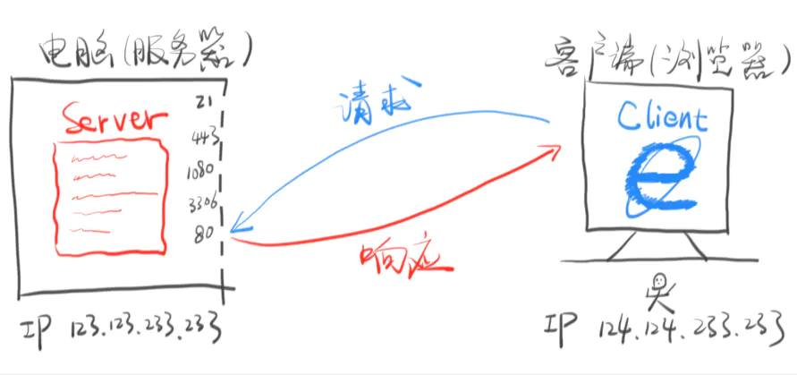

## 请求与响应

### 4.1 理解



### 4.2 Request

HttpServletRequest对象方法

| 序号 | 方法 & 描述                                                  |
| :--- | :----------------------------------------------------------- |
| 1    | **Cookie[] getCookies()** 返回一个数组，包含客户端发送该请求的所有的 Cookie 对象。 |
| 2    | **Enumeration getAttributeNames()** 返回一个枚举，包含提供给该请求可用的属性名称。 |
| 3    | **Enumeration getHeaderNames()** 返回一个枚举，包含在该请求中包含的所有的头名。 |
| 4    | **Enumeration getParameterNames()** 返回一个 String 对象的枚举，包含在该请求中包含的参数的名称。 |
| 5    | **HttpSession getSession()** 返回与该请求关联的当前 session 会话，或者如果请求没有 session 会话，则创建一个。 |
| 6    | **HttpSession getSession(boolean create)** 返回与该请求关联的当前 HttpSession，或者如果没有当前会话，且创建是真的，则返回一个新的 session 会话。 |
| 7    | **Locale getLocale()** 基于 Accept-Language 头，返回客户端接受内容的首选的区域设置。 |
| 8    | **Object getAttribute(String name)** 以对象形式返回已命名属性的值，如果没有给定名称的属性存在，则返回 null。 |
| 9    | **ServletInputStream getInputStream()** 使用 ServletInputStream，以二进制数据形式检索请求的主体。 |
| 10   | **String getAuthType()** 返回用于保护 Servlet 的身份验证方案的名称，例如，"BASIC" 或 "SSL"，如果JSP没有受到保护则返回 null。 |
| 11   | **String getCharacterEncoding()** 返回请求主体中使用的字符编码的名称。 |
| 12   | **String getContentType()** 返回请求主体的 MIME 类型，如果不知道类型则返回 null。 |
| 13   | **String getContextPath()** 返回指示请求上下文的请求 URI 部分。 |
| 14   | **String getHeader(String name)** 以字符串形式返回指定的请求头的值。 |
| 15   | **String getMethod()** 返回请求的 HTTP 方法的名称，例如，GET、POST 或 PUT。 |
| 16   | **String getParameter(String name)** 以字符串形式返回请求参数的值，或者如果参数不存在则返回 null。 |
| 17   | **String getPathInfo()** 当请求发出时，返回与客户端发送的 URL 相关的任何额外的路径信息。 |
| 18   | **String getProtocol()** 返回请求协议的名称和版本。          |
| 19   | **String getQueryString()** 返回包含在路径后的请求 URL 中的查询字符串。 |
| 20   | **String getRemoteAddr()** 返回发送请求的客户端的互联网协议（IP）地址。 |
| 21   | **String getRemoteHost()** 返回发送请求的客户端的完全限定名称。 |
| 22   | **String getRemoteUser()** 如果用户已通过身份验证，则返回发出请求的登录用户，或者如果用户未通过身份验证，则返回 null。 |
| 23   | **String getRequestURI()** 从协议名称直到 HTTP 请求的第一行的查询字符串中，返回该请求的 URL 的一部分。 |
| 24   | **String getRequestedSessionId()** 返回由客户端指定的 session 会话 ID。 |
| 25   | **String getServletPath()** 返回调用 JSP 的请求的 URL 的一部分。 |
| 26   | **String[] getParameterValues(String name)** 返回一个字符串对象的数组，包含所有给定的请求参数的值，如果参数不存在则返回 null。 |
| 27   | **boolean isSecure()** 返回一个布尔值，指示请求是否使用安全通道，如 HTTPS。 |
| 28   | **int getContentLength()** 以字节为单位返回请求主体的长度，并提供输入流，或者如果长度未知则返回 -1。 |
| 29   | **int getIntHeader(String name)** 返回指定的请求头的值为一个 int 值。 |
| 30   | **int getServerPort()** 返回接收到这个请求的端口号。         |
| 31   | **setCharacterEncoding()** 设置被发送到服务端的响应的字符编码。例如，UTF-8。 |

### 4.3 response

**HttpServletResponse对象方法**

| 序号 | 方法 & 描述                                                  |
| :--- | :----------------------------------------------------------- |
| 1    | **String encodeRedirectURL(String url)** 为 sendRedirect 方法中使用的指定的 URL 进行编码，或者如果编码不是必需的，则返回 URL 未改变。 |
| 2    | **String encodeURL(String url)** 对包含 session 会话 ID 的指定 URL 进行编码，或者如果编码不是必需的，则返回 URL 未改变。 |
| 3    | **boolean containsHeader(String name)** 返回一个布尔值，指示是否已经设置已命名的响应报头。 |
| 4    | **boolean isCommitted()** 返回一个布尔值，指示响应是否已经提交。 |
| 5    | **void addCookie(Cookie cookie)** 把指定的 cookie 添加到响应。 |
| 6    | **void addDateHeader(String name, long date)** 添加一个带有给定的名称和日期值的响应报头。 |
| 7    | **void addHeader(String name, String value)** 添加一个带有给定的名称和值的响应报头。 |
| 8    | **void addIntHeader(String name, int value)** 添加一个带有给定的名称和整数值的响应报头。 |
| 9    | **void flushBuffer()** 强制任何在缓冲区中的内容被写入到客户端。 |
| 10   | **void reset()** 清除缓冲区中存在的任何数据，包括状态码和头。 |
| 11   | **void resetBuffer()** 清除响应中基础缓冲区的内容，不清除状态码和头。 |
| 12   | **void sendError(int sc)** 使用指定的状态码发送错误响应到客户端，并清除缓冲区。 |
| 13   | **void sendError(int sc, String msg)** 使用指定的状态发送错误响应到客户端。 |
| 14   | **void sendRedirect(String location)** 使用指定的重定向位置 URL 发送临时重定向响应到客户端。 |
| 15   | **void setBufferSize(int size)** 为响应主体设置首选的缓冲区大小。 |
| 16   | **void setCharacterEncoding(String charset)** 设置被发送到客户端的响应的字符编码（MIME 字符集）例如，UTF-8。 |
| 17   | **void setContentLength(int len)** 设置在 HTTP Servlet 响应中的内容主体的长度，该方法设置 HTTP Content-Length 头。 |
| 18   | **void setContentType(String type)** 如果响应还未被提交，设置被发送到客户端的响应的内容类型。 |
| 19   | **void setDateHeader(String name, long date)** 设置一个带有给定的名称和日期值的响应报头。 |
| 20   | **void setHeader(String name, String value)** 设置一个带有给定的名称和值的响应报头。 |
| 21   | **void setIntHeader(String name, int value)** 设置一个带有给定的名称和整数值的响应报头。 |
| 22   | **void setLocale(Locale loc)** 如果响应还未被提交，设置响应的区域。 |
| 23   | **void setStatus(int sc)** 为该响应设置状态码。              |

### 4.4 http状态码

#### 4.4.1 状态码

| 代码 | 消息                          | 描述                                                         |
| :--- | :---------------------------- | :----------------------------------------------------------- |
| 100  | Continue                      | 只有请求的一部分已经被服务器接收，但只要它没有被拒绝，客户端应继续该请求。 |
| 101  | Switching Protocols           | 服务器切换协议。                                             |
| 200  | OK                            | 请求成功。                                                   |
| 201  | Created                       | 该请求是完整的，并创建一个新的资源。                         |
| 202  | Accepted                      | 该请求被接受处理，但是该处理是不完整的。                     |
| 203  | Non-authoritative Information |                                                              |
| 204  | No Content                    |                                                              |
| 205  | Reset Content                 |                                                              |
| 206  | Partial Content               |                                                              |
| 300  | Multiple Choices              | 链接列表。用户可以选择一个链接，进入到该位置。最多五个地址。 |
| 301  | Moved Permanently             | 所请求的页面已经转移到一个新的 URL。                         |
| 302  | Found                         | 所请求的页面已经临时转移到一个新的 URL。                     |
| 303  | See Other                     | 所请求的页面可以在另一个不同的 URL 下被找到。                |
| 304  | Not Modified                  |                                                              |
| 305  | Use Proxy                     |                                                              |
| 306  | *Unused*                      | 在以前的版本中使用该代码。现在已不再使用它，但代码仍被保留。 |
| 307  | Temporary Redirect            | 所请求的页面已经临时转移到一个新的 URL。                     |
| 400  | Bad Request                   | 服务器不理解请求。                                           |
| 401  | Unauthorized                  | 所请求的页面需要用户名和密码。                               |
| 402  | Payment Required              | *您还不能使用该代码。*                                       |
| 403  | Forbidden                     | 禁止访问所请求的页面。                                       |
| 404  | Not Found                     | 服务器无法找到所请求的页面。.                                |
| 405  | Method Not Allowed            | 在请求中指定的方法是不允许的。                               |
| 406  | Not Acceptable                | 服务器只生成一个不被客户端接受的响应。                       |
| 407  | Proxy Authentication Required | 在请求送达之前，您必须使用代理服务器的验证。                 |
| 408  | Request Timeout               | 请求需要的时间比服务器能够等待的时间长，超时。               |
| 409  | Conflict                      | 请求因为冲突无法完成。                                       |
| 410  | Gone                          | 所请求的页面不再可用。                                       |
| 411  | Length Required               | "Content-Length" 未定义。服务器无法处理客户端发送的不带 Content-Length 的请求信息。 |
| 412  | Precondition Failed           | 请求中给出的先决条件被服务器评估为 false。                   |
| 413  | Request Entity Too Large      | 服务器不接受该请求，因为请求实体过大。                       |
| 414  | Request-url Too Long          | 服务器不接受该请求，因为 URL 太长。当您转换一个 "post" 请求为一个带有长的查询信息的 "get" 请求时发生。 |
| 415  | Unsupported Media Type        | 服务器不接受该请求，因为媒体类型不被支持。                   |
| 417  | Expectation Failed            |                                                              |
| 500  | Internal Server Error         | 未完成的请求。服务器遇到了一个意外的情况。                   |
| 501  | Not Implemented               | 未完成的请求。服务器不支持所需的功能。                       |
| 502  | Bad Gateway                   | 未完成的请求。服务器从上游服务器收到无效响应。               |
| 503  | Service Unavailable           | 未完成的请求。服务器暂时超载或死机。                         |
| 504  | Gateway Timeout               | 网关超时。                                                   |
| 505  | HTTP Version Not Supported    | 服务器不支持"HTTP协议"版本。                                 |

#### 4.4.2 设置 HTTP 状态代码的方法

下面的方法可用于在 Servlet 程序中设置 HTTP 状态码。这些方法通过 *HttpServletResponse* 对象可用。

| 序号 | 方法 & 描述                                                  |
| :--- | :----------------------------------------------------------- |
| 1    | **public void setStatus ( int statusCode )** 该方法设置一个任意的状态码。setStatus 方法接受一个 int（状态码）作为参数。如果您的反应包含了一个特殊的状态码和文档，请确保在使用 *PrintWriter* 实际返回任何内容之前调用 setStatus。 |
| 2    | **public void sendRedirect(String url)** 该方法生成一个 302 响应，连同一个带有新文档 URL 的 *Location* 头。 |
| 3    | **public void sendError(int code, String message)** 该方法发送一个状态码（通常为 404），连同一个在 HTML 文档内部自动格式化并发送到客户端的短消息。 |

**HTTP 状态码实例**

下面的例子把 407 错误代码发送到客户端浏览器，浏览器会显示 "Need authentication!!!" 消息。

```java
// 导入必需的 java 库
import java.io.*;
import javax.servlet.*;
import javax.servlet.http.*;
import java.util.*;

// 扩展 HttpServlet 类
public class showError extends HttpServlet {
 
  // 处理 GET 方法请求的方法
  public void doGet(HttpServletRequest request,
                    HttpServletResponse response)
            throws ServletException, IOException
  {
      // 设置错误代码和原因
      response.sendError(407, "Need authentication!!!" );
  }
  // 处理 POST 方法请求的方法
  public void doPost(HttpServletRequest request,
                     HttpServletResponse response)
      throws ServletException, IOException {
     doGet(request, response);
  }
}
```

现在，调用上面的 Servlet 将显示以下结果：

HTTP Status 407 - Need authentication!!!**type** Status report**message** Need authentication!!!**description** The client must first authenticate itself with the proxy (Need authentication!!!).Apache Tomcat/5.5.29
