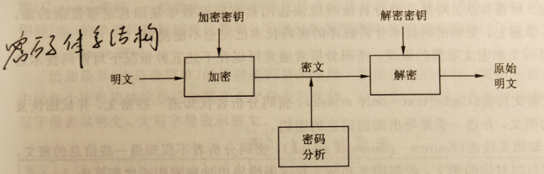
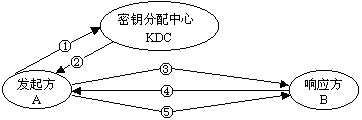

# 信息安全理论与技术

## 1. 信息安全基础知识

**信息安全特征**：保密性、完整性、可用性、可控性、可审查性

**网络安全含义**：运行系统安全、网络上系统信息的安全、网络

**信息安全含义**：系统安全、系统中信息安全、管理安全、信息传播的安全、网络上信息内容的安全

**信息安全服务与目标主要是指保护信息系统**

**ISO安全体系结构**：安全服务、安全机制、安全管理

**安全服务**：认证服务、访问控制服务、数据保密性服务、数据完整性服务、不可否认服务

**安全机制**：加密机智、数字签名机制、访问控制机制、数据完整性机制、鉴别交换机制、业务填充机制、路由控制机制、公证机制

**安全管理**：系统安全管理、安全服务管理、安全机制管理

**网络安全防范体系**：关于网络安全防范系统的最高层概念抽象，他由各种网络安全防范单元组成，各组成单元按照一定的规则关系，能够有机集成起来，共同实现网络安全目标

**网络安全体系**：组织体系、技术体系、管理体系

**PDRR**：防护、检测、恢复、响应

**PPDR**：安全策略、防护、检测、恢复、响应

安全 = 风险分析 + 执行策略 + 系统实施 + 漏洞检测 + 实时响应

**PPDR方向**：提高系统的防护时间，降低检测时间和响应时间五层网络安全模型：网络、操作系统、用户、应用程序、数据是否安全

**TCSEC**：D 无保护级、 C自主保护级、 B 强制保护级、 A 验证保护级网络与信息安全 =信息安全技术 +信息安全管理体系

**ISMS 建设**：定义信息安全策略、定义 NISMS 范围、进行信息安全风险评估、信息安全风险管理、确定管制目标和选择管制措施、准备信息安全适用性说明

 

## 2. 密码学基本原理

**密码体系结构**

即一个密码体制通常由五部分组成:

(1)明文空间P:全体明文的集合;

(2)密文空间C:全体密文的集合;

(3)密钥空间K:全体密钥的集合，通常由加密密钥k。和解密密钥ka组成，k=(k。, kg);

(4)加密算法E:由加密密钥控制的加密交换的集合;

(5)解密算法D:由解密密钥控制的解密交换的集合。

**对称加密和非对称加密体制的优缺点**

1、对称加密bai算法

优点：加解密的高du速度和使用长密钥时的难破解性。

缺点：对称加密算法的安全性取决于加密密钥的保存情况，但要求企业中每一个持有密钥的人都保守秘密是不可能的，他们通常会有意无意的把密钥泄漏出去。如果一个用户使用的密钥被入侵者所获得，入侵者便可以读取该用户密钥加密的所有文档，如果整个企业共用一个加密密钥，那整个企业文档的保密性便无从谈起。

2、非对称加密算法

优点：非对称密钥体制有两种密钥，其中一个是公开的，这样就可以不需要像对称密码那样传输对方的密钥了。这样安全性就大了很多。

缺点：算法强度复杂、安全性依赖于算法与密钥但是由于其算法复杂，而使得加密解密速度没有对称加密解密的速度快。

3、传统密码体制

优点：由于DES加密速度快，适合加密较长的报文。

缺点：通用密钥密码体制的加密密钥和解密密钥是通用的，即发送方和接收方使用同样密钥的密码体制。

4、公钥密码体制

优点：RSA算法的加密密钥和加密算法分开，使得密钥分配更为方便。RSA算法解决了大量网络用户密钥管理的难题。

缺点：RSA的密钥很长，加密速度慢。

 

## 3. 密钥管理技术

**密钥类型：**数据加密密钥（会话密钥）、密钥加密密钥、主密钥

**会话密钥：**用户一次通话或交换数据是使用的密钥，大多是临时的，动态的

**密钥加密密钥：**用于对会话密钥或下层密钥进行保护

**主密钥：**主要用于对密钥加密密钥、会话密钥或其他下层密钥的保护，主密钥是用户选定或系统分配给用户的，分发基于物理渠道或其他可靠的方法

**集中式密钥分配方案：**由一个可信赖的联机服务器作为密钥分配中心或密钥传递中心

**分布式密钥分配方案：**网络通信中各个通信方具有相同的地位，他们之间的密钥分配取决于它们之间的协商

**密钥管理系统涉及到密钥管理的哪些方面**

密钥的生成、密钥的储存、密钥的保护、密钥的备份与恢复、密钥的销毁、密钥分配与密钥协定

 

## 4. 数字签名和认证技术

**消息摘要 （hash函数）**

哈希函数，就是能将任意长度的数据映射为固定长度的数据的函数。哈希函数返回的值被叫做哈希值、哈希码、散列，或者直接叫做哈希。

消息摘要，将长度不固定的消息（message)作为输入参数，运行特定的Hash函数，生成固定长度的输出，这个输出就是Hash，也称为这个消息的消息摘要（Message Digest）信息摘要算法是hash算法的一种，具有以下特点：

1.无论输入的消息有多长，计算出来的消息摘要的长度总是固定的，计算出的结果越长，一般认为该摘要算法越安全，MD5 128位 SHA-1 160位

2.输入的消息不同，产生的消息摘要必不同，输入的消息相同，产生的消息摘要一定是相同的

3.单向不可逆

**数字签名的要求**：签名是可信的，签名是不可伪造的，签名是不可复制的，签名的消息是不可改变的，签名是不可抵赖的

**数字签名的基本原理：**签名、签别

**数字签名的步骤：**

①. 使用单向散列算法算出原始数据的 hash 

②. 发送方用自己的私钥加密 hash 

③. 发送方把原始数据和加密的 hash 发送给对方

④. 接收方用发送方的公钥解密，并用相同的 hash 函数对数据进行计算 hash 

⑤. 如果计算所出来的 hash 值与发方发送的相同则可以确定确实是发方的

**Kerberos系统定义**:

Kerberos提供了一个集中式的认证服务器结构，认证服务器的功能是实现用户与其访问的服务器间的相互鉴别，并在用户和服务器之间建立安全信道。Kerberos建立的是一个实现身份认证的框架结构，其实现采用的是对称密钥加密技术，而未采用公开密钥加密。

**Kerberos的设计目标**:

(1)安全性。能够有效防止攻击者假扮成另一个合法的授权用户。

(2)可靠性。分布式服务器体系结构，提供相互备份。

(3)对用户透明性。

(4)可伸缩。能够支持大数量的客户和服务器。

问的服

**Kerberos 的设计思路**：

一个Kerberos系统涉及四个基本实体:

(1)Kerberos客户机:用户用来访问服务器的设备。

(2)认证服务器(Authentication Server):为用户分发TGT(Ticket Granting Ticket)的服务器。用户使用TGT向TGS证明自己的身份。

(3)票据许可服务器(Ticket Granting Server, TGS):为用户分发到最终目的票据的服务器，用户使用这个票据向自己要求提供服务的服务器证明自己的身份。

(3)应用服务器(Application Server):为用户提供特定服务。

## 5. PKI技术

**PKI基本概念**: 用公开密钥的概念和技术来实施和提供安全服务的具有普适性的安全基础设施

**研究对象**：数字证书、 CA、证书用户、证书注册机构、证书储存、证书服务器、证书状态查询服务器、证书验证服务器

**服务**：认证、完整性、机密性、不可否认性

一般认为PKI 提供了以下几种主要安全服务:

(1)认证。向一个实体确认另一个实体确实是他自己。PKI的认证服务采用数字签名这一密码技术。

(2)完整性。向一个实体确保数据没有被有意或无意地修改。PKI的完整性服务采用了两种技术:第一种技术是数字签名;第二种技术是消息认证码或MAC,这项技术通常采用对称分组密码或密码杂凑丽数。

(3)机密性。向一个实体确保除了接收者，无人能读懂数据的关键部分。PKI的机密性服务采用类似于完整性服务的机制，即:首先，A生成一个对称密钥(也许是使用他的密钥交换私钥和B的密钥交换公钥);其次，用对称密钥加密数据(使用对称分组密码加密数据);最后，将加密后的数据以及A的密钥交换公钥或用B的加密公钥加密后的对称密钥发送给B。为了在实体(A和B)间建立对称密钥，需要建立密钥交换和密钥传输机制。

(4)不可否认性。通过数字签名机制来提供该服务。一个实体不能否认自己所做的数字签名及其签名的消息，即不可抵赖性。

**PKI结构**： PKI策略、软硬件系统、 CA、注册机构（ RA）、证书发布系统、 PKI应用

1. PKI策略：建立和定义了一个组织在信息安全方面的指导方针，同时定义了密码系统使用的处理方法和原
2. CA：管理公钥整个生命周期；作用有发放证书、规定证书有效期、通过废除列表（  CRL）来废除证书

3. RA：获取并认证用户的身份，向 CA提出证书请求证书发放系统：负责证书的发放

**PKI应用**：VPN、安全电子邮件、Web 安全、电子商务等

**数字证书的内容**：

x.509 V1和V2 证书所包含的主要内容如下:

1. 证书版本号(Version): 版本号指明x.509证书的格式版本，现在的值可以为0、1、2，也为将来的版本进行了预定义。

2. 证书序列号(Serial Number):序列号指定由CA分配给证书的唯一的数字型标识符，当证书被取消时，实际上是将此证书的序列号放人由CA签发的CRL中，这也是序列号唯一的原因。

3. 签名算法标识符(Signature):签名算法标识符用来指定由CA签发证书时所使用的公开密初算共和Hash算法，需向国际知名标准组织(如ISO)注册。

4. 签发机构名(Issuer)：此域用来标识签发证书的CA的x.500 DN。包括国家、省市、地区、组织机构、单位部门和通用名。

5. 有效期(Validity):指定证书的有效期，包括证书开始生效的日期和时间以及失效的日期和时间。每次使用证书时，需要检查证书是否在有效期内。

6. 证书用户名(Subject):指定证书持有者的X. 500唯一名字。包括国家、省市、地区、组织机构、单位部门和通用名，还可包含E- mail地址等个人信息等。

7. 证书持有者公开密钥信息(Subject Public Key Info):证书持有者公开密钥信息域包含两个重要信息:证书持有者的公开密钥的值;公开密钥使用的算法标识符。此标识符包含公开密钥算法和Hash算法。

8. 签发者唯一标识符(Issuer Unique Identifier):签发者唯一标识符在第2版的标准中加人X.509证书定义。此域用在当同一个X.500名字用于多个认证机构时，用一比特字符串来唯一标识签发者的X.500名字(可选)。

9. 证书持有者唯一标识符(Subject Unique Identifier):证书持有者唯一标识符在第2版

**证书的认证过程**：证书拆封、序列号验证、有效期验证、撤销列表查询

**数字证书的用处**：确保信息是由签名者自己发送的，保证信息自签发后未做过任何修改认证信息类型：所知道的秘密、所拥有的实物、生物特征信息、上下文信息认证的用途：验证网络资源访问者的身份、发送者和接收者的真实性、网络信息的完整性

**认证技术**：静态密码、 IC 卡、短信密码、动态口令牌、 USB Key、数字签名、生物识别、双因素身份认证、身份零知识证明

 

## 6. 网络攻击与防御技术

**扫描的目的**:扫描的目的主要有三个：查看目标网络中哪些主机是存活的；查看存活的主机运行了哪些服务；查看主机提供的服务有无漏铜。

**扫描技术**: IP扫描（ ping、icmp）、端口扫描（ SYN、 UDP数据包）、漏洞扫描 

**嗅探方法**: MAC 洪范：向交换机发送大量虚假 MAC 和 IP 的包，使交换机进入类似  hub 的工作方式

MAC 欺骗：伪造 MAC 

ARP欺骗

其他信息收集技术：利用公开服务、网络拓扑检测（ tracert ）、系统类型检测

**网络欺骗**：

①. IP欺骗：

a) 找一台被目标主机信任的主机

b) 使被信任的主机丧失工作能力

c) 伪装成被信任的主机，向目标主机发送 syn 

d) 猜测或嗅探 SYN+ACK的值

e) 向目标主机发送 ACK来建立连接

②. 电子邮件欺骗：伪造电子邮件头（利用 SMTP）

③. Web 欺骗（钓鱼网站）

④. ARP欺骗

a) 对路由器 ARP缓存表的欺骗 

i.截获网关数据

ii. 按照一定的频率发给路由器错误的内网 MAC 地址

iii.真实的地址信息无法通过更新保存在路由器的 ARP缓存中，正常 PC无法收到消息 b) 伪造网关：建立假网关，被欺骗的 pc 都向假网关发送数据

**口令攻击**：

①. 主动口令攻击

a) 字典攻击

b) 强力攻击 c) 组合攻击

②. 被动口令攻击

a) 网络数据流窃听

b) 重放 

c) 钓鱼

**缓冲区溢出**：用户输入的数据长度超过哦程序为其分配的内存空间，这些数据就会覆盖程序为其他数据分配的内存空间。

C语言中可能产生溢出的函数： strlen、strcpy、malloc、strcat 等缓冲区溢出类型：栈溢出、堆溢出、整型溢出：

①. 存储溢出

②. 计算溢出

③. 符号问题

**拒绝服务(DoS)**：导致计算机系统崩溃、贷款耗尽或硬盘被填满，导致不能提供正常的服务

**拒绝服务攻击**：带宽攻击（以极大的通信量冲击网络） 、连通性攻击（大量连接请求冲击计算机）攻击方式：利用系统漏洞、利用协议漏洞

①.SYN Flood（发送大量 TCP连接请求）

②.UDP Flood（发送大量伪造源地址的 UDP包） ③ . Land（发送大量源地址与目的地址相同的包）

④.死 ping（发送超过 65535 字节的 ICMP 包）

 

## 7. 恶意代码及防范技术

**恶意代码**：故意执行危害信息安全的恶意任务的代码

**主要危害**：破坏数据、占用磁盘存储空间、抢占系统资源、影响计算机运行速度

**命名机制**： <病毒前缀 >.<病毒名 >.<病毒后缀 >，常见病毒前缀木马为 Trojan，蠕虫为 Worm 

**常见类型**：系统病毒、蠕虫病毒、木马病毒、脚本病毒、宏病毒、后门病毒等

**恶意代码的生存周期**：设计-传播-感染-触发-运行-消亡

**传播机制**：互联网、局域网、移动存储设备、无线设备和点对点通信系统

**感染机制**：感染执行文件、感染引导区、感染结构化文档

**触发机制**：日期触发、时间触发、键盘触发、感染触发、启动触发、访问磁盘次数触发、调用中断功能触发、型号触发

**分析方法**：基于代码特征、基于代码语义、基于代码行为、

**检测方法**：基于特征码、启发式检测法、基于行为的检测法、完整性检测法、基于特征函数的检测方法 

 

## 8. 访问控制技术

**访问控制**：针对越权使用的防御措施，保证网络资源不被非法使用和非法访问

**基本目标**：防止对任何资源进行未授权的访问

**作用**：机密性、完整性

**访问控制策略**：自主访问控制、强制访问控制、基于角色的访问控制

**自主访问控制**：

特点：灵活性高

缺点：安全性低

分类：基于个人的策略、基于组的策略

**访问控制的常用实现方法**：访问控制表、访问能力表、安全标签、基于口令的机制

**防火墙**：防火墙是设置在被保护网络和外部网络之间的一道屏障，这道屏障的作用是阻断来自外部对本网络的威胁和入侵

1. 基本功能：网络安全的屏障、控制对主机系统的访问、强化网络安全策略、对网络存取和访问进行监控审计

2. 附加功能： NAT、VPN 
3. 缺点：不能防范内部网络的攻击、不经由防火墙的攻击、病毒或文件的传输、利用标准网络协议中缺陷进行的攻击、利用服务器漏洞进行的攻击、新的网络安全问题、限制了有用的网络服务

4. 基本结构：屏蔽路由器、双宿主机防火墙（堡垒主机） 、屏蔽主机防火墙（屏蔽路由器和堡垒主机） 、屏蔽子网防火墙（内外网之间建立被隔离的子网）

**类型**：

①. 数据包过滤路由器：对数据包实施有选择的通过规则、选择依据，只有满足规则的数据包才会被转发到相应的网络接口，其余数据包则从数据流中删除。

②. 应用层网关：又称代理服务器，包过滤在网络层拦截所有的信息流，代理技术针对的是某一程序，在应用层上实现防火墙的功能。

③. 电路级网关技术

④. 状态检测技术

**网络服务访问权限策略**：定义在网络中允许的或禁止的网络服务，而且还包括对拨号访问和 SLIIP/PPP连接的限制

**防火墙设计策略**：黑名单、白名单

**防火墙攻击策略**：扫描防火墙策略、通过防火墙认证机制策略（  IP欺骗、 TCP序号攻击）、利用防火墙漏洞策略

**第四代防火墙的主要技术与功能**：多端口结构、透明的访问方式、灵活的代理系统、多级的过滤技术、网络地址转换技术、 internet 网关技术、安全服务器网络、用户鉴别与加密、用户定制服务、审计和告警功能

**入侵检测系统模型**：事件产生器、事件分析器、响应单元、事件数据库

**入侵检测技术分类**：基于误用的入侵检测系统（基于特征） 、基于异常的入侵检测系统

**入侵检测系统的组成**：数据采集模块、入侵分析引擎模块、应急处理模块、管理配置模块和相关辅助模块

**入侵检测系统的分类**：基于主机、基于网络、分布式、基于网络的分布式

 

## 9. 虚拟专用网络(VPN)

**VPN概念**：VPN通过一个私有的通道来创建一个安全的连接，将远程用户、公司分支机构、公司的业务伙伴等跟企业网连接起来，形成一个扩展的公司企业网。VPN 只涉及加密的VPN,并非传统的隧道

**VPN优点**：利用VPN，可节省专用和拨号连接的成本；基于VPN技术，能够迅速建立和重构网络；简化了企业联网和广域网操作；提高了网络可靠性；VPN网络有很好的兼容性和可扩展性；企业可以利用 VPN 迅速开展新的服务和连接全球的设施

**VPN的功能**: 数据机密性保护、数据完整性保护、数据源身份认证、重放攻击保护

**VPN隧道的建立方式**：

1. Host 对 Host：该模式要求两边主机都支持IPSec ，VPN网关可支持也可不支持IPSec

2. Host 对 VPN 网关：该模式要求一边的主机都支持IPSec ，另一边的VPN网关必须支持IPSec

3. VPN 对 VPN 网关：该模式不要求主机支持IPSec，两边的VPN网关必须都支持IPSec

4. Remote User 对 VPN 网关：主机必须支持IPSec，Gateway 必须支持IPSec

 

## 10. 系统安全技术

**五大类安全服务**：认证（鉴别） 、访问控制、数据保密性、数据完整性、抗否认性

**八大类安全机制**：加密、数字签名、访问控制、数据完整性、认证、业务流填充、路由控制、公证

**IPSec协议（网络层安全）**：鉴别首部协议（ AH）（源鉴别和数据完整性） 、封装安全性载荷协议（ ESP）（鉴别、数据完整性、机密性）

**IPSec功能**：认证功能（ AH）（无连接完整性和真实性） 、认证和机密组合功能（ ESP）（数据机密性、有限抗流量分析、无连接完整性、数据源认证、抗重传） 、密钥交换功能（真实性、可靠性）

**IPSec目标**：保护 IP数据包安全、为抵御网络攻击提供防护措施

**SSL（安全套接层）协议(传输层安全）**：握手协议（协商加密参数） 、记录协议（交换数据） 、警告协议（告知何时终止）连接步骤：

①. 客户机连接到服务器，并要求服务器验证它自身的身份

②. 服务器通过发送的数字证书来证明身份

③. 服务器发出请求对客户端的证书进行验证 （因缺乏公钥体系结构当今大多数服务器不进行客户端验证）

④. 协商用于加密消息的加密算法和用于完整性检查的哈希函数

⑤. 客户机和服务器生成会话密钥

a) 客户机生成一个随机数，并使用服务器的公钥对它进行加密发送给服务器

b) 服务器用更加随机的数据相应

c) 使用哈希函数用随机数据生成密钥

**SSL基本属性**：连接是私有的、可以使用非对称加密、连接是可靠的

**TLS（传输层安全）**：提供保密性和数据完整性组成:TLS记录协议和 TLS握手协议（改变密码规格协议、警惕协议、握手协议）

**SET(应用层安全)**

 

## 11. 安全审计

**安全审计概念**：安全审计是指按照一定的安全策略，利用记录系统活动和用户活动等信息，检查、审查和检验操作事件的环境及活动，从而发现漏洞、入侵行为或者改善系统性能的过程。审计是记录与审查用户操作计算机及网络系统活动的过程，是提高系统安全性的重要举措。