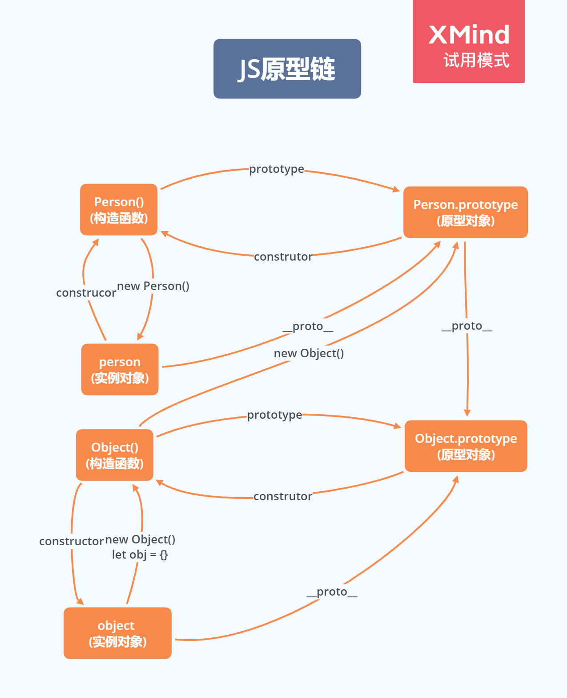

# Object


## 几个基础关注点

### 表达式还是语句？

对象采用大括号表示，这导致了一个问题：如果行首是一个大括号，它到底是表达式还是语句？

```js
{ foo: 123 }
```

JavaScript 引擎读到上面这行代码，会发现可能有两种含义。第一种可能是，这是一个表达式，表示一个包含`foo`属性的对象；第二种可能是，这是一个语句，表示一个代码区块，里面有一个标签`foo`，指向表达式`123`。

为了避免这种歧义，JavaScript 引擎的做法是，如果遇到这种情况，无法确定是对象还是代码块，一律解释为代码块。

```js
{ console.log(123) } // 123
```

上面的语句是一个代码块，而且只有解释为代码块，才能执行。

如果要解释为对象，最好在大括号前加上圆括号。因为圆括号的里面，只能是表达式，所以确保大括号只能解释为对象。

```js
({ foo: 123 }) // 正确
({ console.log(123) }) // 报错
```

这种差异在`eval`语句（作用是对字符串求值）中反映得最明显。

```js
eval('{foo: 123}') // 123
eval('({foo: 123})') // {foo: 123}
```

上面代码中，如果没有圆括号，`eval`将其理解为一个代码块；加上圆括号以后，就理解成一个对象。

### delete 命令

`delete`命令用于删除对象的属性，删除成功后返回`true`。

```js
var obj = { p: 1 };
Object.keys(obj) // ["p"]

delete obj.p // true
obj.p // undefined
Object.keys(obj) // []
```

上面代码中，`delete`命令删除对象`obj`的`p`属性。删除后，再读取`p`属性就会返回`undefined`，而且`Object.keys`方法的返回值也不再包括该属性。

**注意，删除一个不存在的属性，`delete`不报错，而且返回`true`。**

```js
var obj = {};
delete obj.p // true
```

上面代码中，对象`obj`并没有`p`属性，但是`delete`命令照样返回`true`。因此，不能根据`delete`命令的结果，认定某个属性是存在的。

**只有一种情况，`delete`命令会返回`false`，那就是该属性存在，且不得删除。**

```js
var obj = Object.defineProperty({}, 'p', {
  value: 123,
  configurable: false
});

obj.p // 123
delete obj.p // false
```

上面代码之中，对象`obj`的`p`属性是不能删除的，所以`delete`命令返回`false`**（另外，需要注意的是，`delete`命令只能删除对象本身的属性，无法删除继承的属性）。**

```js
var obj = {};
delete obj.toString // true
obj.toString // function toString() { [native code] }
```

上面代码中，`toString`是对象`obj`继承的属性，虽然`delete`命令返回`true`，但该属性并没有被删除，依然存在。这个例子还说明，即使`delete`返回`true`，该属性依然可能读取到值。

### in 运算符

`in`运算符用于检查对象是否包含某个属性（注意，检查的是键名，不是键值），如果包含就返回`true`，否则返回`false`。它的左边是一个字符串，表示属性名，右边是一个对象。

```js
var obj = { p: 1 };
'p' in obj // true
'toString' in obj // true
```

`in`运算符的一个问题是，它不能识别哪些属性是对象自身的，哪些属性是继承的。就像上面代码中，对象`obj`本身并没有`toString`属性，但是`in`运算符会返回`true`，因为这个属性是继承的。

这时，可以使用对象的`hasOwnProperty`方法判断一下，是否为对象自身的属性。

```js
var obj = {};
if ('toString' in obj) {
  console.log(obj.hasOwnProperty('toString')) // false
}
```

### 属性的简洁表示法

ES6 允许在大括号里面，直接写入变量和函数，作为对象的属性和方法。这样的书写更加简洁。

```js
const foo = 'bar';
const baz = {foo};
baz // {foo: "bar"}

// 等同于
const baz = {foo: foo};
```

上面代码中，变量`foo`直接写在大括号里面。这时，属性名就是变量名, 属性值就是变量值。下面是另一个例子。

```js
function f(x, y) {
  return {x, y};
}

// 等同于

function f(x, y) {
  return {x: x, y: y};
}

f(1, 2) // Object {x: 1, y: 2}
```

除了属性简写，方法也可以简写。

```js
const o = {
  method() {
    return "Hello!";
  }
};

// 等同于

const o = {
  method: function() {
    return "Hello!";
  }
};
```

下面是一个实际的例子。

```js
let birth = '2000/01/01';

const Person = {

  name: '张三',

  //等同于birth: birth
  birth,

  // 等同于hello: function ()...
  hello() { console.log('我的名字是', this.name); }

};
```

这种写法用于函数的返回值，将会非常方便。

```js
function getPoint() {
  const x = 1;
  const y = 10;
  return {x, y};
}

getPoint()
// {x:1, y:10}
```

CommonJS 模块输出一组变量，就非常合适使用简洁写法。

```js
let ms = {};

function getItem (key) {
  return key in ms ? ms[key] : null;
}

function setItem (key, value) {
  ms[key] = value;
}

function clear () {
  ms = {};
}

module.exports = { getItem, setItem, clear };
// 等同于
module.exports = {
  getItem: getItem,
  setItem: setItem,
  clear: clear
};
```

**属性的赋值器（setter）和取值器（getter），事实上也是采用这种写法。**

```js
const cart = {
  _wheels: 4,

  get wheels () {
    return this._wheels;
  },

  set wheels (value) {
    if (value < this._wheels) {
      throw new Error('数值太小了！');
    }
    this._wheels = value;
  }
}
```

简洁写法在打印对象时也很有用。

```js
let user = {
  name: 'test'
};

let foo = {
  bar: 'baz'
};

console.log(user, foo)
// {name: "test"} {bar: "baz"}
console.log({user, foo})
// {user: {name: "test"}, foo: {bar: "baz"}}
```

上面代码中，`console.log`直接输出`user`和`foo`两个对象时，就是两组键值对，可能会混淆。把它们放在大括号里面输出，就变成了对象的简洁表示法，每组键值对前面会打印对象名，这样就比较清晰了。

注意，简写的对象方法不能用作构造函数，会报错。

```js
const obj = {
  f() {
    this.foo = 'bar';
  }
};

new obj.f() // 报错
```

上面代码中，`f`是一个简写的对象方法，所以`obj.f`不能当作构造函数使用。

### 属性名表达式

JavaScript 定义对象的属性，有两种方法。

```js
// 方法一
obj.foo = true;

// 方法二
obj['a' + 'bc'] = 123;
```

上面代码的方法一是直接用标识符作为属性名，方法二是用表达式作为属性名，这时要将表达式放在方括号之内。

但是，如果使用字面量方式定义对象（使用大括号），在 ES5 中只能使用方法一（标识符）定义属性。

```js
var obj = {
  foo: true,
  abc: 123
};
```

ES6 允许字面量定义对象时，用方法二（表达式）作为对象的属性名，即把表达式放在方括号内。

```js
let propKey = 'foo';

let obj = {
  [propKey]: true,
  ['a' + 'bc']: 123
};
```

下面是另一个例子。

```js
let lastWord = 'last word';

const a = {
  'first word': 'hello',
  [lastWord]: 'world'
};

a['first word'] // "hello"
a[lastWord] // "world"
a['last word'] // "world"
```

表达式还可以用于定义方法名。

```js
let obj = {
  ['h' + 'ello']() {
    return 'hi';
  }
};

obj.hello() // hi
```

注意，属性名表达式与简洁表示法，不能同时使用，会报错。

```js
// 报错
const foo = 'bar';
const bar = 'abc';
const baz = { [foo] };

// 正确
const foo = 'bar';
const baz = { [foo]: 'abc'};
```

注意，属性名表达式如果是一个对象，默认情况下会自动将对象转为字符串`[object Object]`，这一点要特别小心。

```js
const keyA = {a: 1};
const keyB = {b: 2};

const myObject = {
  [keyA]: 'valueA',
  [keyB]: 'valueB'
};

myObject // Object {[object Object]: "valueB"}
```

上面代码中，`[keyA]`和`[keyB]`得到的都是`[object Object]`，所以`[keyB]`会把`[keyA]`覆盖掉，而`myObject`最后只有一个`[object Object]`属性。

### 方法的 name 属性

函数的`name`属性，返回函数名。对象方法也是函数，因此也有`name`属性。

```js
const person = {
  sayName() {
    console.log('hello!');
  },
};

person.sayName.name   // "sayName"
```

上面代码中，方法的`name`属性返回函数名（即方法名）。

如果对象的方法使用了取值函数（`getter`）和存值函数（`setter`），则`name`属性不是在该方法上面，而是该方法的属性的描述对象的`get`和`set`属性上面，返回值是方法名前加上`get`和`set`。

```js
const obj = {
  get foo() {},
  set foo(x) {}
};

obj.foo.name
// TypeError: Cannot read property 'name' of undefined

const descriptor = Object.getOwnPropertyDescriptor(obj, 'foo');

descriptor.get.name // "get foo"
descriptor.set.name // "set foo"
```

有两种特殊情况：`bind`方法创造的函数，`name`属性返回`bound`加上原函数的名字；`Function`构造函数创造的函数，`name`属性返回`anonymous`。

```js
(new Function()).name // "anonymous"

var doSomething = function() {
  // ...
};
doSomething.bind().name // "bound doSomething"
```

如果对象的方法是一个 Symbol 值，那么`name`属性返回的是这个 Symbol 值的描述。

```js
const key1 = Symbol('description');
const key2 = Symbol();
let obj = {
  [key1]() {},
  [key2]() {},
};
obj[key1].name // "[description]"
obj[key2].name // ""
```

上面代码中，`key1`对应的 Symbol 值有描述，`key2`没有。

### with 语句

`with`语句的格式如下：

```js
with (对象) {
  语句;
}
```

它的作用是操作同一个对象的多个属性时，提供一些书写的方便。

```js
// 例一
var obj = {
  p1: 1,
  p2: 2,
};
with (obj) {
  p1 = 4;
  p2 = 5;
}
// 等同于
obj.p1 = 4;
obj.p2 = 5;

// 例二
with (document.links[0]){
  console.log(href);
  console.log(title);
  console.log(style);
}
// 等同于
console.log(document.links[0].href);
console.log(document.links[0].title);
console.log(document.links[0].style);
```

注意，如果`with`区块内部有变量的赋值操作，必须是当前对象已经存在的属性，否则会创造一个当前作用域的全局变量。

```js
var obj = {};
with (obj) {
  p1 = 4;
  p2 = 5;
}

obj.p1 // undefined
p1 // 4
```

上面代码中，对象`obj`并没有`p1`属性，对`p1`赋值等于创造了一个全局变量`p1`。正确的写法应该是，先定义对象`obj`的属性`p1`，然后在`with`区块内操作它。

**这是因为`with`区块没有改变作用域，它的内部依然是当前作用域。这造成了`with`语句的一个很大的弊病，就是绑定对象不明确。**

```js
with (obj) {
  console.log(x);
}
```

单纯从上面的代码块，根本无法判断`x`到底是全局变量，还是对象`obj`的一个属性。这非常不利于代码的除错和模块化，编译器也无法对这段代码进行优化，只能留到运行时判断，这就拖慢了运行速度。

**因此，建议不要使用`with`语句，可以考虑用一个临时变量代替`with`。**

```js
with(obj1.obj2.obj3) {
  console.log(p1 + p2);
}

// 可以写成
var temp = obj1.obj2.obj3;
console.log(temp.p1 + temp.p2);
```


## Object 构造函数

`Object`不仅可以当作工具函数使用，还可以当作构造函数使用，即前面可以使用`new`命令。

**`Object`构造函数的首要用途，是直接通过它来生成新对象。**

```js
var obj = new Object();
```

> 注意，通过`var obj = new Object()`的写法生成新对象，与字面量的写法`var obj = {}`是等价的。或者说，后者只是前者的一种简便写法。

`Object`构造函数的用法与工具方法很相似，几乎一模一样。使用时，可以接受一个参数，如果该参数是一个对象，则直接返回这个对象；如果是一个原始类型的值，则返回该值对应的包装对象。

```js
var o1 = {a: 1};
var o2 = new Object(o1);
o1 === o2 // true

var obj = new Object(123);
obj instanceof Number // true
```

**虽然用法相似，但是`Object(value)`与`new Object(value)`两者的语义是不同的，`Object(value)`表示将`value`转成一个对象，`new Object(value)`则表示新生成一个对象，它的值是`value`。**


## 元属性

### 概述

JavaScript 提供了一个内部数据结构，用来描述对象的属性，控制它的行为，比如该属性是否可写、可遍历等等。这个内部数据结构称为“属性描述对象”（attributes object）。每个属性都有自己对应的属性描述对象，保存该属性的一些元信息。

下面是属性描述对象的一个例子。

```js
{
  value: 123,
  writable: false,
  enumerable: true,
  configurable: false,
  get: undefined,
  set: undefined
}
```

属性描述对象提供6个元属性。

（1）`value`

`value`是该属性的属性值，默认为`undefined`。

（2）`writable`

`writable`是一个布尔值，表示属性值（value）是否可改变（即是否可写），默认为`true`。

（3）`enumerable`

`enumerable`是一个布尔值，表示该属性是否可遍历，默认为`true`。如果设为`false`，会使得某些操作（比如`for...in`循环、`Object.keys()`）跳过该属性。

（4）`configurable`

`configurable`是一个布尔值，表示可配置性，默认为`true`。如果设为`false`，将阻止某些操作改写该属性，比如无法删除该属性，也不得改变该属性的属性描述对象（`value`属性除外）。也就是说，`configurable`属性控制了属性描述对象的可写性。

（5）`get`

`get`是一个函数，表示该属性的取值函数（getter），默认为`undefined`。

（6）`set`

`set`是一个函数，表示该属性的存值函数（setter），默认为`undefined`。

#### value

`value`属性是目标属性的值。

```js
var obj = {};
obj.p = 123;

Object.getOwnPropertyDescriptor(obj, 'p').value
// 123

Object.defineProperty(obj, 'p', { value: 246 });
obj.p // 246
```

上面代码是通过`value`属性，读取或改写`obj.p`的例子。

#### writable

`writable`属性是一个布尔值，决定了目标属性的值（value）是否可以被改变。

```js
var obj = {};

Object.defineProperty(obj, 'a', {
  value: 37,
  writable: false
});

obj.a // 37
obj.a = 25;
obj.a // 37
```

上面代码中，`obj.a`的`writable`属性是`false`。然后，改变`obj.a`的值，不会有任何效果。

注意，正常模式下，对`writable`为`false`的属性赋值不会报错，只会默默失败。但是，严格模式下会报错，即使对`a`属性重新赋予一个同样的值。

```js
'use strict';
var obj = {};

Object.defineProperty(obj, 'a', {
  value: 37,
  writable: false
});

obj.a = 37;
// Uncaught TypeError: Cannot assign to read only property 'a' of object
```

上面代码是严格模式，对`obj.a`任何赋值行为都会报错。

如果原型对象的某个属性的`writable`为`false`，那么子对象将无法自定义这个属性。

```js
var proto = Object.defineProperty({}, 'foo', {
  value: 'a',
  writable: false
});

var obj = Object.create(proto);

obj.foo = 'b';
obj.foo // 'a'
```

上面代码中，`proto`是原型对象，它的`foo`属性不可写。`obj`对象继承`proto`，也不可以再自定义这个属性了。如果是严格模式，这样做还会抛出一个错误。

但是，有一个规避方法，就是通过覆盖属性描述对象，绕过这个限制。原因是这种情况下，原型链会被完全忽视。

```js
var proto = Object.defineProperty({}, 'foo', {
  value: 'a',
  writable: false
});

var obj = Object.create(proto);
Object.defineProperty(obj, 'foo', {
  value: 'b'
});

obj.foo // "b"
```

#### enumerable

`enumerable`（可遍历性）返回一个布尔值，表示目标属性是否可遍历。

JavaScript 的早期版本，`for...in`循环是基于`in`运算符的。我们知道，`in`运算符不管某个属性是对象自身的还是继承的，都会返回`true`。

```js
var obj = {};
'toString' in obj // true
```

上面代码中，`toString`不是`obj`对象自身的属性，但是`in`运算符也返回`true`，这导致了`toString`属性也会被`for...in`循环遍历。

这显然不太合理，后来就引入了“可遍历性”这个概念。只有可遍历的属性，才会被`for...in`循环遍历，同时还规定`toString`这一类实例对象继承的原生属性，都是不可遍历的，这样就保证了`for...in`循环的可用性。

具体来说，如果一个属性的`enumerable`为`false`，下面三个操作不会取到该属性。

- `for..in`循环
- `Object.keys`方法
- `JSON.stringify`方法

因此，`enumerable`可以用来设置“秘密”属性。

```js
var obj = {};

Object.defineProperty(obj, 'x', {
  value: 123,
  enumerable: false
});

obj.x // 123

for (var key in obj) {
  console.log(key);
}
// undefined

Object.keys(obj)  // []
JSON.stringify(obj) // "{}"
```

上面代码中，`obj.x`属性的`enumerable`为`false`，所以一般的遍历操作都无法获取该属性，使得它有点像“秘密”属性，但不是真正的私有属性，还是可以直接获取它的值。

注意，`for...in`循环包括继承的属性，`Object.keys`方法不包括继承的属性。如果需要获取对象自身的所有属性，不管是否可遍历，可以使用`Object.getOwnPropertyNames`方法。

另外，`JSON.stringify`方法会排除`enumerable`为`false`的属性，有时可以利用这一点。如果对象的 JSON 格式输出要排除某些属性，就可以把这些属性的`enumerable`设为`false`。

### configurable

`configurable`(可配置性）返回一个布尔值，决定了是否可以修改属性描述对象。也就是说，`configurable`为`false`时，`value`、`writable`、`enumerable`和`configurable`都不能被修改了。

```js
var obj = Object.defineProperty({}, 'p', {
  value: 1,
  writable: false,
  enumerable: false,
  configurable: false
});

Object.defineProperty(obj, 'p', {value: 2})
// TypeError: Cannot redefine property: p

Object.defineProperty(obj, 'p', {writable: true})
// TypeError: Cannot redefine property: p

Object.defineProperty(obj, 'p', {enumerable: true})
// TypeError: Cannot redefine property: p

Object.defineProperty(obj, 'p', {configurable: true})
// TypeError: Cannot redefine property: p
```

上面代码中，`obj.p`的`configurable`为`false`。然后，改动`value`、`writable`、`enumerable`、`configurable`，结果都报错。

注意，`writable`只有在`false`改为`true`会报错，`true`改为`false`是允许的。

```js
var obj = Object.defineProperty({}, 'p', {
  writable: true,
  configurable: false
});

Object.defineProperty(obj, 'p', {writable: false})
// 修改成功
```

至于`value`，只要`writable`和`configurable`有一个为`true`，就允许改动。

```js
var o1 = Object.defineProperty({}, 'p', {
  value: 1,
  writable: true,
  configurable: false
});

Object.defineProperty(o1, 'p', {value: 2})
// 修改成功

var o2 = Object.defineProperty({}, 'p', {
  value: 1,
  writable: false,
  configurable: true
});

Object.defineProperty(o2, 'p', {value: 2})
// 修改成功
```

另外，`writable`为`false`时，直接目标属性赋值，不报错，但不会成功。

```js
var obj = Object.defineProperty({}, 'p', {
  value: 1,
  writable: false,
  configurable: false
});

obj.p = 2;
obj.p // 1
```

上面代码中，`obj.p`的`writable`为`false`，对`obj.p`直接赋值不会生效。如果是严格模式，还会报错。

可配置性决定了目标属性是否可以被删除（delete）。

```js
var obj = Object.defineProperties({}, {
  p1: { value: 1, configurable: true },
  p2: { value: 2, configurable: false }
});

delete obj.p1 // true
delete obj.p2 // false

obj.p1 // undefined
obj.p2 // 2
```

上面代码中，`obj.p1`的`configurable`是`true`，所以可以被删除，`obj.p2`就无法删除。

## 存取器

除了直接定义以外，属性还可以用存取器（accessor）定义。其中，存值函数称为`setter`，使用属性描述对象的`set`属性；取值函数称为`getter`，使用属性描述对象的`get`属性。

一旦对目标属性定义了存取器，那么存取的时候，都将执行对应的函数。利用这个功能，可以实现许多高级特性，比如定制属性的读取和赋值行为。

```js
var obj = Object.defineProperty({}, 'p', {
  get: function () {
    return 'getter';
  },
  set: function (value) {
    console.log('setter: ' + value);
  }
});

obj.p // "getter"
obj.p = 123 // "setter: 123"
```

上面代码中，`obj.p`定义了`get`和`set`属性。`obj.p`取值时，就会调用`get`；赋值时，就会调用`set`。

JavaScript 还提供了存取器的另一种写法。

```js
// 写法二
var obj = {
  get p() {
    return 'getter';
  },
  set p(value) {
    console.log('setter: ' + value);
  }
};
```

上面两种写法，虽然属性`p`的读取和赋值行为是一样的，但是有一些细微的区别。第一种写法，属性`p`的`configurable`和`enumerable`都为`false`，从而导致属性`p`是不可遍历的；第二种写法，属性`p`的`configurable`和`enumerable`都为`true`，因此属性`p`是可遍历的。实际开发中，写法二更常用。

注意，取值函数`get`不能接受参数，存值函数`set`只能接受一个参数（即属性的值）。

存取器往往用于，属性的值依赖对象内部数据的场合。

```js
var obj ={
  $n : 5,
  get next() { return this.$n++ },
  set next(n) {
    if (n >= this.$n) this.$n = n;
    else throw new Error('新的值必须大于当前值');
  }
};

obj.next // 5

obj.next = 10;
obj.next // 10

obj.next = 5;
// Uncaught Error: 新的值必须大于当前值
```

上面代码中，`next`属性的存值函数和取值函数，都依赖于内部属性`$n`。


## this 关键字

### 含义

`this`关键字是一个非常重要的语法点。毫不夸张地说，不理解它的含义，大部分开发任务都无法完成。

前一章已经提到，`this`可以用在构造函数之中，表示实例对象。除此之外，`this`还可以用在别的场合。但不管是什么场合，`this`都有一个共同点：它总是返回一个对象。

简单说，`this`就是属性或方法“当前”所在的对象。

```js
this.property
```

上面代码中，`this`就代表`property`属性当前所在的对象。

下面是一个实际的例子。

```js
var person = {
  name: '张三',
  describe: function () {
    return '姓名：'+ this.name;
  }
};

person.describe()
// "姓名：张三"
```

上面代码中，`this.name`表示`name`属性所在的那个对象。由于`this.name`是在`describe`方法中调用，而`describe`方法所在的当前对象是`person`，因此`this`指向`person`，`this.name`就是`person.name`。

由于对象的属性可以赋给另一个对象，所以属性所在的当前对象是可变的，即`this`的指向是可变的。

```js
var A = {
  name: '张三',
  describe: function () {
    return '姓名：'+ this.name;
  }
};

var B = {
  name: '李四'
};

B.describe = A.describe;
B.describe()
// "姓名：李四"
```

上面代码中，`A.describe`属性被赋给`B`，于是`B.describe`就表示`describe`方法所在的当前对象是`B`，所以`this.name`就指向`B.name`。

稍稍重构这个例子，`this`的动态指向就能看得更清楚。

```js
function f() {
  return '姓名：'+ this.name;
}

var A = {
  name: '张三',
  describe: f
};

var B = {
  name: '李四',
  describe: f
};

A.describe() // "姓名：张三"
B.describe() // "姓名：李四"
```

上面代码中，函数`f`内部使用了`this`关键字，随着`f`所在的对象不同，`this`的指向也不同。

只要函数被赋给另一个变量，`this`的指向就会变。

```js
var A = {
  name: '张三',
  describe: function () {
    return '姓名：'+ this.name;
  }
};

var name = '李四';
var f = A.describe;
f() // "姓名：李四"
```

上面代码中，`A.describe`被赋值给变量`f`，内部的`this`就会指向`f`运行时所在的对象（本例是顶层对象）。

总结一下，JavaScript 语言之中，一切皆对象，运行环境也是对象，所以函数都是在某个对象之中运行，`this`就是函数运行时所在的对象（环境）。这本来并不会让用户糊涂，但是 JavaScript 支持运行环境动态切换，也就是说，`this`的指向是动态的，没有办法事先确定到底指向哪个对象，这才是最让初学者感到困惑的地方。

### 实质

JavaScript 语言之所以有 this 的设计，跟内存里面的数据结构有关系。

```js
var obj = { foo:  5 };
```

上面的代码将一个对象赋值给变量`obj`。JavaScript 引擎会先在内存里面，生成一个对象`{ foo: 5 }`，然后把这个对象的内存地址赋值给变量`obj`。也就是说，变量`obj`是一个地址（reference）。后面如果要读取`obj.foo`，引擎先从`obj`拿到内存地址，然后再从该地址读出原始的对象，返回它的`foo`属性。

原始的对象以字典结构保存，每一个属性名都对应一个属性描述对象。举例来说，上面例子的`foo`属性，实际上是以下面的形式保存的。

```js
{
  foo: {
    [[value]]: 5
    [[writable]]: true
    [[enumerable]]: true
    [[configurable]]: true
  }
}
```

注意，`foo`属性的值保存在属性描述对象的`value`属性里面。

这样的结构是很清晰的，问题在于属性的值可能是一个函数。

```js
var obj = { foo: function () {} };
```

这时，引擎会将函数单独保存在内存中，然后再将函数的地址赋值给`foo`属性的`value`属性。

```js
{
  foo: {
    [[value]]: 函数的地址
    ...
  }
}
```

由于函数是一个单独的值，所以它可以在不同的环境（上下文）执行。

```js
var f = function () {};
var obj = { f: f };

// 单独执行
f()

// obj 环境执行
obj.f()
```

JavaScript 允许在函数体内部，引用当前环境的其他变量。

```js
var f = function () {
  console.log(x);
};
```

上面代码中，函数体里面使用了变量`x`。该变量由运行环境提供。

现在问题就来了，由于函数可以在不同的运行环境执行，所以需要有一种机制，能够在函数体内部获得当前的运行环境（context）。所以，`this`就出现了，它的设计目的就是在函数体内部，指代函数当前的运行环境。

```js
var f = function () {
  console.log(this.x);
}
```

上面代码中，函数体里面的`this.x`就是指当前运行环境的`x`。

```js
var f = function () {
  console.log(this.x);
}

var x = 1;
var obj = {
  f: f,
  x: 2,
};

// 单独执行
f() // 1

// obj 环境执行
obj.f() // 2
```

上面代码中，函数`f`在全局环境执行，`this.x`指向全局环境的`x`；在`obj`环境执行，`this.x`指向`obj.x`。

### 使用场合

`this`主要有以下几个使用场合。

#### 全局环境

全局环境使用`this`，它指的就是顶层对象`window`。

```js
this === window // true

function f() {
  console.log(this === window);
}
f() // true
```

上面代码说明，不管是不是在函数内部，只要是在全局环境下运行，`this`就是指顶层对象`window`。

#### 构造函数

构造函数中的`this`，指的是实例对象。

```js
var Obj = function (p) {
  this.p = p;
};
```

上面代码定义了一个构造函数`Obj`。由于`this`指向实例对象，所以在构造函数内部定义`this.p`，就相当于定义实例对象有一个`p`属性。

```js
var o = new Obj('Hello World!');
o.p // "Hello World!"
```

#### 对象的方法

如果对象的方法里面包含`this`，`this`的指向就是方法运行时所在的对象。该方法赋值给另一个对象，就会改变`this`的指向。

但是，这条规则很不容易把握。请看下面的代码。

```js
var obj ={
  foo: function () {
    console.log(this);
  }
};

obj.foo() // obj
```

上面代码中，`obj.foo`方法执行时，它内部的`this`指向`obj`。

但是，下面这几种用法，都会改变`this`的指向。

```js
// 情况一
(obj.foo = obj.foo)() // window
// 情况二
(false || obj.foo)() // window
// 情况三
(1, obj.foo)() // window
```

上面代码中，`obj.foo`就是一个值。这个值真正调用的时候，运行环境已经不是`obj`了，而是全局环境，所以`this`不再指向`obj`。

可以这样理解，JavaScript 引擎内部，`obj`和`obj.foo`储存在两个内存地址，称为地址一和地址二。`obj.foo()`这样调用时，是从地址一调用地址二，因此地址二的运行环境是地址一，`this`指向`obj`。但是，上面三种情况，都是直接取出地址二进行调用，这样的话，运行环境就是全局环境，因此`this`指向全局环境。上面三种情况等同于下面的代码。

```js
// 情况一
(obj.foo = function () {
  console.log(this);
})()
// 等同于
(function () {
  console.log(this);
})()

// 情况二
(false || function () {
  console.log(this);
})()

// 情况三
(1, function () {
  console.log(this);
})()
```

如果`this`所在的方法不在对象的第一层，这时`this`只是指向当前一层的对象，而不会继承更上面的层。

```js
var a = {
  p: 'Hello',
  b: {
    m: function() {
      console.log(this.p);
    }
  }
};

a.b.m() // undefined
```

上面代码中，`a.b.m`方法在`a`对象的第二层，该方法内部的`this`不是指向`a`，而是指向`a.b`，因为实际执行的是下面的代码。

```js
var b = {
  m: function() {
   console.log(this.p);
  }
};

var a = {
  p: 'Hello',
  b: b
};

(a.b).m() // 等同于 b.m()
```

如果要达到预期效果，只有写成下面这样。

```js
var a = {
  b: {
    m: function() {
      console.log(this.p);
    },
    p: 'Hello'
  }
};
```

如果这时将嵌套对象内部的方法赋值给一个变量，`this`依然会指向全局对象。

```js
var a = {
  b: {
    m: function() {
      console.log(this.p);
    },
    p: 'Hello'
  }
};

var hello = a.b.m;
hello() // undefined
```

上面代码中，`m`是多层对象内部的一个方法。为求简便，将其赋值给`hello`变量，结果调用时，`this`指向了顶层对象。为了避免这个问题，可以只将`m`所在的对象赋值给`hello`，这样调用时，`this`的指向就不会变。

```js
var hello = a.b;
hello.m() // Hello
```

### 使用注意点

#### 避免多层 this

由于`this`的指向是不确定的，所以切勿在函数中包含多层的`this`。

```js
var o = {
  f1: function () {
    console.log(this);
    var f2 = function () {
      console.log(this);
    }();
  }
}

o.f1()
// Object
// Window
```

上面代码包含两层`this`，结果运行后，第一层指向对象`o`，第二层指向全局对象，因为实际执行的是下面的代码。

```js
var temp = function () {
  console.log(this);
};

var o = {
  f1: function () {
    console.log(this);
    var f2 = temp();
  }
}
```

一个解决方法是在第二层改用一个指向外层`this`的变量。

```js
var o = {
  f1: function() {
    console.log(this);
    var that = this;
    var f2 = function() {
      console.log(that);
    }();
  }
}

o.f1()
// Object
// Object
```

上面代码定义了变量`that`，固定指向外层的`this`，然后在内层使用`that`，就不会发生`this`指向的改变。

事实上，使用一个变量固定`this`的值，然后内层函数调用这个变量，是非常常见的做法，请务必掌握。

JavaScript 提供了严格模式，也可以硬性避免这种问题。严格模式下，如果函数内部的`this`指向顶层对象，就会报错。

```js
var counter = {
  count: 0
};
counter.inc = function () {
  'use strict';
  this.count++
};
var f = counter.inc;
f()
// TypeError: Cannot read property 'count' of undefined
```

上面代码中，`inc`方法通过`'use strict'`声明采用严格模式，这时内部的`this`一旦指向顶层对象，就会报错。

#### 避免数组处理方法中的 this

数组的`map`和`foreach`方法，允许提供一个函数作为参数。这个函数内部不应该使用`this`。

```js
var o = {
  v: 'hello',
  p: [ 'a1', 'a2' ],
  f: function f() {
    this.p.forEach(function (item) {
      console.log(this.v + ' ' + item);
    });
  }
}

o.f()
// undefined a1
// undefined a2
```

上面代码中，`foreach`方法的回调函数中的`this`，其实是指向`window`对象，因此取不到`o.v`的值。原因跟上一段的多层`this`是一样的，就是内层的`this`不指向外部，而指向顶层对象。

解决这个问题的一种方法，就是前面提到的，使用中间变量固定`this`。

```js
var o = {
  v: 'hello',
  p: [ 'a1', 'a2' ],
  f: function f() {
    var that = this;
    this.p.forEach(function (item) {
      console.log(that.v+' '+item);
    });
  }
}

o.f()
// hello a1
// hello a2
```

另一种方法是将`this`当作`foreach`方法的第二个参数，固定它的运行环境。

```
var o = {
  v: 'hello',
  p: [ 'a1', 'a2' ],
  f: function f() {
    this.p.forEach(function (item) {
      console.log(this.v + ' ' + item);
    }, this);
  }
}

o.f()
// hello a1
// hello a2
```

#### 避免回调函数中的 this

回调函数中的`this`往往会改变指向，最好避免使用。

```js
var o = new Object();
o.f = function () {
  console.log(this === o);
}

// jQuery 的写法
$('#button').on('click', o.f);
```

上面代码中，点击按钮以后，控制台会显示`false`。原因是此时`this`不再指向`o`对象，而是指向按钮的 DOM 对象，因为`f`方法是在按钮对象的环境中被调用的。这种细微的差别，很容易在编程中忽视，导致难以察觉的错误。

为了解决这个问题，可以采用下面的一些方法对`this`进行绑定，也就是使得`this`固定指向某个对象，减少不确定性。

### 绑定 this 的方法

`this`的动态切换，固然为 JavaScript 创造了巨大的灵活性，但也使得编程变得困难和模糊。有时，需要把`this`固定下来，避免出现意想不到的情况。JavaScript 提供了`call`、`apply`、`bind`这三个方法，来切换/固定`this`的指向。

#### Function.prototype.call()

函数实例的`call`方法，可以指定函数内部`this`的指向（即函数执行时所在的作用域），然后在所指定的作用域中，调用该函数。

```js
var obj = {};

var f = function () {
  return this;
};

f() === window // true
f.call(obj) === obj // true
```

上面代码中，全局环境运行函数`f`时，`this`指向全局环境（浏览器为`window`对象）；`call`方法可以改变`this`的指向，指定`this`指向对象`obj`，然后在对象`obj`的作用域中运行函数`f`。

`call`方法的参数，应该是一个对象。如果参数为空、`null`和`undefined`，则默认传入全局对象。

```js
var n = 123;
var obj = { n: 456 };

function a() {
  console.log(this.n);
}

a.call() // 123
a.call(null) // 123
a.call(undefined) // 123
a.call(window) // 123
a.call(obj) // 456
```

上面代码中，`a`函数中的`this`关键字，如果指向全局对象，返回结果为`123`。如果使用`call`方法将`this`关键字指向`obj`对象，返回结果为`456`。可以看到，如果`call`方法没有参数，或者参数为`null`或`undefined`，则等同于指向全局对象。

如果`call`方法的参数是一个原始值，那么这个原始值会自动转成对应的包装对象，然后传入`call`方法。

```js
var f = function () {
  return this;
};

f.call(5)
// Number {[[PrimitiveValue]]: 5}
```

上面代码中，`call`的参数为`5`，不是对象，会被自动转成包装对象（`Number`的实例），绑定`f`内部的`this`。

`call`方法还可以接受多个参数。

```js
func.call(thisValue, arg1, arg2, ...)
```

`call`的第一个参数就是`this`所要指向的那个对象，后面的参数则是函数调用时所需的参数。

```js
function add(a, b) {
  return a + b;
}

add.call(this, 1, 2) // 3
```

上面代码中，`call`方法指定函数`add`内部的`this`绑定当前环境（对象），并且参数为`1`和`2`，因此函数`add`运行后得到`3`。

`call`方法的一个应用是调用对象的原生方法。

```js
var obj = {};
obj.hasOwnProperty('toString') // false

// 覆盖掉继承的 hasOwnProperty 方法
obj.hasOwnProperty = function () {
  return true;
};
obj.hasOwnProperty('toString') // true

Object.prototype.hasOwnProperty.call(obj, 'toString') // false
```

上面代码中，`hasOwnProperty`是`obj`对象继承的方法，如果这个方法一旦被覆盖，就不会得到正确结果。`call`方法可以解决这个问题，它将`hasOwnProperty`方法的原始定义放到`obj`对象上执行，这样无论`obj`上有没有同名方法，都不会影响结果。

#### Function.prototype.apply()

`apply`方法的作用与`call`方法类似，也是改变`this`指向，然后再调用该函数。唯一的区别就是，它接收一个数组作为函数执行时的参数，使用格式如下。

```js
func.apply(thisValue, [arg1, arg2, ...])
```

`apply`方法的第一个参数也是`this`所要指向的那个对象，如果设为`null`或`undefined`，则等同于指定全局对象。第二个参数则是一个数组，该数组的所有成员依次作为参数，传入原函数。原函数的参数，在`call`方法中必须一个个添加，但是在`apply`方法中，必须以数组形式添加。

```js
function f(x, y){
  console.log(x + y);
}

f.call(null, 1, 1) // 2
f.apply(null, [1, 1]) // 2
```

上面代码中，`f`函数本来接受两个参数，使用`apply`方法以后，就变成可以接受一个数组作为参数。

利用这一点，可以做一些有趣的应用。

**（1）找出数组最大元素**

JavaScript 不提供找出数组最大元素的函数。结合使用`apply`方法和`Math.max`方法，就可以返回数组的最大元素。

```js
var a = [10, 2, 4, 15, 9];
Math.max.apply(null, a) // 15
```

**（2）将数组的空元素变为`undefined`**

通过`apply`方法，利用`Array`构造函数将数组的空元素变成`undefined`。

```js
Array.apply(null, ['a', ,'b'])
// [ 'a', undefined, 'b' ]
```

空元素与`undefined`的差别在于，数组的`forEach`方法会跳过空元素，但是不会跳过`undefined`。因此，遍历内部元素的时候，会得到不同的结果。

```js
var a = ['a', , 'b'];

function print(i) {
  console.log(i);
}

a.forEach(print)
// a
// b

Array.apply(null, a).forEach(print)
// a
// undefined
// b
```

**（3）转换类似数组的对象**

另外，利用数组对象的`slice`方法，可以将一个类似数组的对象（比如`arguments`对象）转为真正的数组。

```js
Array.prototype.slice.apply({0: 1, length: 1}) // [1]
Array.prototype.slice.apply({0: 1}) // []
Array.prototype.slice.apply({0: 1, length: 2}) // [1, undefined]
Array.prototype.slice.apply({length: 1}) // [undefined]
```

上面代码的`apply`方法的参数都是对象，但是返回结果都是数组，这就起到了将对象转成数组的目的。从上面代码可以看到，这个方法起作用的前提是，被处理的对象必须有`length`属性，以及相对应的数字键。

**（4）绑定回调函数的对象**

前面的按钮点击事件的例子，可以改写如下。

```js
var o = new Object();

o.f = function () {
  console.log(this === o);
}

var f = function (){
  o.f.apply(o);
  // 或者 o.f.call(o);
};

// jQuery 的写法
$('#button').on('click', f);
```

上面代码中，点击按钮以后，控制台将会显示`true`。由于`apply()`方法（或者`call()`方法）不仅绑定函数执行时所在的对象，还会立即执行函数，因此不得不把绑定语句写在一个函数体内。更简洁的写法是采用下面介绍的`bind()`方法。

#### Function.prototype.bind()

`bind()`方法用于将函数体内的`this`绑定到某个对象，然后返回一个新函数。

```js
var d = new Date();
d.getTime() // 1481869925657

var print = d.getTime;
print() // Uncaught TypeError: this is not a Date object.
```

上面代码中，我们将`d.getTime()`方法赋给变量`print`，然后调用`print()`就报错了。这是因为`getTime()`方法内部的`this`，绑定`Date`对象的实例，赋给变量`print`以后，内部的`this`已经不指向`Date`对象的实例了。

`bind()`方法可以解决这个问题。

```js
var print = d.getTime.bind(d);
print() // 1481869925657
```

上面代码中，`bind()`方法将`getTime()`方法内部的`this`绑定到`d`对象，这时就可以安全地将这个方法赋值给其他变量了。

`bind`方法的参数就是所要绑定`this`的对象，下面是一个更清晰的例子。

```js
var counter = {
  count: 0,
  inc: function () {
    this.count++;
  }
};

var func = counter.inc.bind(counter);
func();
counter.count // 1
```

上面代码中，`counter.inc()`方法被赋值给变量`func`。这时必须用`bind()`方法将`inc()`内部的`this`，绑定到`counter`，否则就会出错。

`this`绑定到其他对象也是可以的。

```js
var counter = {
  count: 0,
  inc: function () {
    this.count++;
  }
};

var obj = {
  count: 100
};
var func = counter.inc.bind(obj);
func();
obj.count // 101
```

上面代码中，`bind()`方法将`inc()`方法内部的`this`，绑定到`obj`对象。结果调用`func`函数以后，递增的就是`obj`内部的`count`属性。

`bind()`还可以接受更多的参数，将这些参数绑定原函数的参数。

```js
var add = function (x, y) {
  return x * this.m + y * this.n;
}

var obj = {
  m: 2,
  n: 2
};

var newAdd = add.bind(obj, 5);
newAdd(5) // 20
```

上面代码中，`bind()`方法除了绑定`this`对象，还将`add()`函数的第一个参数`x`绑定成`5`，然后返回一个新函数`newAdd()`，这个函数只要再接受一个参数`y`就能运行了。

如果`bind()`方法的第一个参数是`null`或`undefined`，等于将`this`绑定到全局对象，函数运行时`this`指向顶层对象（浏览器为`window`）。

```js
function add(x, y) {
  return x + y;
}

var plus5 = add.bind(null, 5);
plus5(10) // 15
```

上面代码中，函数`add()`内部并没有`this`，使用`bind()`方法的主要目的是绑定参数`x`，以后每次运行新函数`plus5()`，就只需要提供另一个参数`y`就够了。而且因为`add()`内部没有`this`，所以`bind()`的第一个参数是`null`，不过这里如果是其他对象，也没有影响。

`bind()`方法有一些使用注意点。

**（1）每一次返回一个新函数**

`bind()`方法每运行一次，就返回一个新函数，这会产生一些问题。比如，监听事件的时候，不能写成下面这样。

```js
element.addEventListener('click', o.m.bind(o));
```

上面代码中，`click`事件绑定`bind()`方法生成的一个匿名函数。这样会导致无法取消绑定，所以下面的代码是无效的。

```js
element.removeEventListener('click', o.m.bind(o));
```

正确的方法是写成下面这样：

```js
var listener = o.m.bind(o);
element.addEventListener('click', listener);
//  ...
element.removeEventListener('click', listener);
```

**（2）结合回调函数使用**

回调函数是 JavaScript 最常用的模式之一，但是一个常见的错误是，将包含`this`的方法直接当作回调函数。解决方法就是使用`bind()`方法，将`counter.inc()`绑定`counter`。

```js
var counter = {
  count: 0,
  inc: function () {
    'use strict';
    this.count++;
  }
};

function callIt(callback) {
  callback();
}

callIt(counter.inc.bind(counter));
counter.count // 1
```

上面代码中，`callIt()`方法会调用回调函数。这时如果直接把`counter.inc`传入，调用时`counter.inc()`内部的`this`就会指向全局对象。使用`bind()`方法将`counter.inc`绑定`counter`以后，就不会有这个问题，`this`总是指向`counter`。

还有一种情况比较隐蔽，就是某些数组方法可以接受一个函数当作参数。这些函数内部的`this`指向，很可能也会出错。

```js
var obj = {
  name: '张三',
  times: [1, 2, 3],
  print: function () {
    this.times.forEach(function (n) {
      console.log(this.name);
    });
  }
};

obj.print()
// 没有任何输出
```

上面代码中，`obj.print`内部`this.times`的`this`是指向`obj`的，这个没有问题。但是，`forEach()`方法的回调函数内部的`this.name`却是指向全局对象，导致没有办法取到值。稍微改动一下，就可以看得更清楚。

```js
obj.print = function () {
  this.times.forEach(function (n) {
    console.log(this === window);
  });
};

obj.print()
// true
// true
// true
```

解决这个问题，也是通过`bind()`方法绑定`this`。

```js
obj.print = function () {
  this.times.forEach(function (n) {
    console.log(this.name);
  }.bind(this));
};

obj.print()
// 张三
// 张三
// 张三
```

**（3）结合`call()`方法使用**

利用`bind()`方法，可以改写一些 JavaScript 原生方法的使用形式，以数组的`slice()`方法为例。

```js
[1, 2, 3].slice(0, 1) // [1]
// 等同于
Array.prototype.slice.call([1, 2, 3], 0, 1) // [1]
```

上面的代码中，数组的`slice`方法从`[1, 2, 3]`里面，按照指定的开始位置和结束位置，切分出另一个数组。这样做的本质是在`[1, 2, 3]`上面调用`Array.prototype.slice()`方法，因此可以用`call`方法表达这个过程，得到同样的结果。

`call()`方法实质上是调用`Function.prototype.call()`方法，因此上面的表达式可以用`bind()`方法改写。

```js
var slice = Function.prototype.call.bind(Array.prototype.slice);
slice([1, 2, 3], 0, 1) // [1]
```

上面代码的含义就是，将`Array.prototype.slice`变成`Function.prototype.call`方法所在的对象，调用时就变成了`Array.prototype.slice.call`。类似的写法还可以用于其他数组方法。

```js
var push = Function.prototype.call.bind(Array.prototype.push);
var pop = Function.prototype.call.bind(Array.prototype.pop);

var a = [1 ,2 ,3];
push(a, 4)
a // [1, 2, 3, 4]

pop(a)
a // [1, 2, 3]
```

如果再进一步，将`Function.prototype.call`方法绑定到`Function.prototype.bind`对象，就意味着`bind`的调用形式也可以被改写。

```js
function f() {
  console.log(this.v);
}

var o = { v: 123 };
var bind = Function.prototype.call.bind(Function.prototype.bind);
bind(f, o)() // 123
```

上面代码的含义就是，将`Function.prototype.bind`方法绑定在`Function.prototype.call`上面，所以`bind`方法就可以直接使用，不需要在函数实例上使用。


## super 关键字

我们知道，`this`关键字总是指向函数所在的当前对象，ES6 又新增了另一个类似的关键字`super`，**指向当前对象的原型对象**。

```js
const proto = {
  foo: 'hello'
};

const obj = {
  foo: 'world',
  find() {
    return super.foo;
  }
};

Object.setPrototypeOf(obj, proto);
obj.find() // "hello"
```

上面代码中，对象`obj.find()`方法之中，通过`super.foo`引用了原型对象`proto`的`foo`属性。

注意，`super`关键字表示原型对象时，只能用在对象的方法之中，用在其他地方都会报错。

```js
// 报错
const obj = {
  foo: super.foo
}

// 报错
const obj = {
  foo: () => super.foo
}

// 报错
const obj = {
  foo: function () {
    return super.foo
  }
}
```

上面三种`super`的用法都会报错，因为对于 JavaScript 引擎来说，这里的`super`都没有用在对象的方法之中。第一种写法是`super`用在属性里面，第二种和第三种写法是`super`用在一个函数里面，然后赋值给`foo`属性。目前，只有对象方法的简写法可以让 JavaScript 引擎确认，定义的是对象的方法。

**JavaScript 引擎内部，`super.foo`等同于`Object.getPrototypeOf(this).foo`（属性）或`Object.getPrototypeOf(this).foo.call(this)`（方法）。**

```js
const proto = {
  x: 'hello',
  foo() {
    console.log(this.x);
  },
};

const obj = {
  x: 'world',
  foo() {
    super.foo();
  }
}

Object.setPrototypeOf(obj, proto);

obj.foo() // "world"
```

上面代码中，`super.foo`指向原型对象`proto`的`foo`方法，但是绑定的`this`却还是当前对象`obj`，因此输出的就是`world`。


## 对象的继承

### 原型对象概述

#### 构造函数的缺点

JavaScript 通过构造函数生成新对象，因此构造函数可以视为对象的模板。实例对象的属性和方法，可以定义在构造函数内部。

```js
function Cat (name, color) {
  this.name = name;
  this.color = color;
}

var cat1 = new Cat('大毛', '白色');

cat1.name // '大毛'
cat1.color // '白色'
```

上面代码中，`Cat`函数是一个构造函数，函数内部定义了`name`属性和`color`属性，所有实例对象（上例是`cat1`）都会生成这两个属性，即这两个属性会定义在实例对象上面。

通过构造函数为实例对象定义属性，虽然很方便，但是有一个缺点。同一个构造函数的多个实例之间，无法共享属性，从而造成对系统资源的浪费。

```js
function Cat(name, color) {
  this.name = name;
  this.color = color;
  this.meow = function () {
    console.log('喵喵');
  };
}

var cat1 = new Cat('大毛', '白色');
var cat2 = new Cat('二毛', '黑色');

cat1.meow === cat2.meow
// false
```

上面代码中，`cat1`和`cat2`是同一个构造函数的两个实例，它们都具有`meow`方法。由于`meow`方法是生成在每个实例对象上面，所以两个实例就生成了两次。也就是说，每新建一个实例，就会新建一个`meow`方法。这既没有必要，又浪费系统资源，因为所有`meow`方法都是同样的行为，完全应该共享。

这个问题的解决方法，就是 JavaScript 的原型对象（prototype）。

#### prototype 属性的作用

JavaScript 继承机制的设计思想就是，原型对象的所有属性和方法，都能被实例对象共享。也就是说，如果属性和方法定义在原型上，那么所有实例对象就能共享，不仅节省了内存，还体现了实例对象之间的联系。

下面，先看怎么为对象指定原型。JavaScript 规定，每个函数都有一个`prototype`属性，指向一个对象。

```js
function f() {}
typeof f.prototype // "object"
```

上面代码中，函数`f`默认具有`prototype`属性，指向一个对象。

对于普通函数来说，该属性基本无用。但是，对于构造函数来说，生成实例的时候，该属性会自动成为实例对象的原型。

```js
function Animal(name) {
  this.name = name;
}
Animal.prototype.color = 'white';

var cat1 = new Animal('大毛');
var cat2 = new Animal('二毛');

cat1.color // 'white'
cat2.color // 'white'
```

上面代码中，构造函数`Animal`的`prototype`属性，就是实例对象`cat1`和`cat2`的原型对象。原型对象上添加一个`color`属性，结果，实例对象都共享了该属性。

原型对象的属性不是实例对象自身的属性。只要修改原型对象，变动就立刻会体现在**所有**实例对象上。

```js
Animal.prototype.color = 'yellow';

cat1.color // "yellow"
cat2.color // "yellow"
```

上面代码中，原型对象的`color`属性的值变为`yellow`，两个实例对象的`color`属性立刻跟着变了。这是因为实例对象其实没有`color`属性，都是读取原型对象的`color`属性。也就是说，当实例对象本身没有某个属性或方法的时候，它会到原型对象去寻找该属性或方法。这就是原型对象的特殊之处。

如果实例对象自身就有某个属性或方法，它就不会再去原型对象寻找这个属性或方法。

```js
cat1.color = 'black';

cat1.color // 'black'
cat2.color // 'yellow'
Animal.prototype.color // 'yellow';
```

上面代码中，实例对象`cat1`的`color`属性改为`black`，就使得它不再去原型对象读取`color`属性，后者的值依然为`yellow`。

总结一下，原型对象的作用，就是定义所有实例对象共享的属性和方法。这也是它被称为原型对象的原因，而实例对象可以视作从原型对象衍生出来的子对象。

```js
Animal.prototype.walk = function () {
  console.log(this.name + ' is walking');
};
```

上面代码中，`Animal.prototype`对象上面定义了一个`walk`方法，这个方法将可以在所有`Animal`实例对象上面调用。

#### 原型链

JavaScript 规定，所有对象都有自己的原型对象（prototype）。一方面，任何一个对象，都可以充当其他对象的原型；另一方面，由于原型对象也是对象，所以它也有自己的原型。因此，就会形成一个“原型链”（prototype chain）：对象到原型，再到原型的原型……

如果一层层地上溯，所有对象的原型最终都可以上溯到`Object.prototype`，即`Object`构造函数的`prototype`属性。也就是说，所有对象都继承了`Object.prototype`的属性。这就是所有对象都有`valueOf`和`toString`方法的原因，因为这是从`Object.prototype`继承的。

用一张图表示关系：



那么，`Object.prototype`对象有没有它的原型呢？回答是`Object.prototype`的原型是`null`。`null`没有任何属性和方法，也没有自己的原型。因此，原型链的尽头就是`null`。

```js
Object.getPrototypeOf(Object.prototype)
// null
```

上面代码表示，`Object.prototype`对象的原型是`null`，由于`null`没有任何属性，所以原型链到此为止。`Object.getPrototypeOf`方法返回参数对象的原型，具体介绍请看后文。

读取对象的某个属性时，JavaScript 引擎先寻找对象本身的属性，如果找不到，就到它的原型去找，如果还是找不到，就到原型的原型去找。如果直到最顶层的`Object.prototype`还是找不到，则返回`undefined`。如果对象自身和它的原型，都定义了一个同名属性，那么优先读取对象自身的属性，这叫做“覆盖”（overriding）。

注意，一级级向上，在整个原型链上寻找某个属性，对性能是有影响的。所寻找的属性在越上层的原型对象，对性能的影响越大。如果寻找某个不存在的属性，将会遍历整个原型链。

举例来说，如果让构造函数的`prototype`属性指向一个数组，就意味着实例对象可以调用数组方法。

```js
var MyArray = function () {};

MyArray.prototype = new Array();
MyArray.prototype.constructor = MyArray;

var mine = new MyArray();
mine.push(1, 2, 3);
mine.length // 3
mine instanceof Array // true
```

上面代码中，`mine`是构造函数`MyArray`的实例对象，由于`MyArray.prototype`指向一个数组实例，使得`mine`可以调用数组方法（这些方法定义在数组实例的`prototype`对象上面）。最后那行`instanceof`表达式，用来比较一个对象是否为某个构造函数的实例，结果就是证明`mine`为`Array`的实例，`instanceof`运算符的详细解释详见后文。

上面代码还出现了原型对象的`constructor`属性，这个属性的含义下一节就来解释。

#### constructor 属性

`prototype`对象有一个`constructor`属性，默认指向`prototype`对象所在的构造函数。

```js
function P() {}
P.prototype.constructor === P // true
```

由于`constructor`属性定义在`prototype`对象上面，意味着可以被所有实例对象继承。

```js
function P() {}
var p = new P();

p.constructor === P // true
p.constructor === P.prototype.constructor // true
p.hasOwnProperty('constructor') // false
```

上面代码中，`p`是构造函数`P`的实例对象，但是`p`自身没有`constructor`属性，该属性其实是读取原型链上面的`P.prototype.constructor`属性。

`constructor`属性的作用是，可以得知某个实例对象，到底是哪一个构造函数产生的。

```js
function F() {};
var f = new F();

f.constructor === F // true
f.constructor === RegExp // false
```

上面代码中，`constructor`属性确定了实例对象`f`的构造函数是`F`，而不是`RegExp`。

另一方面，有了`constructor`属性，就可以从一个实例对象新建另一个实例。

```js
function Constr() {}
var x = new Constr();

var y = new x.constructor();
y instanceof Constr // true
```

上面代码中，`x`是构造函数`Constr`的实例，可以从`x.constructor`间接调用构造函数。这使得在实例方法中，调用自身的构造函数成为可能。

```js
Constr.prototype.createCopy = function () {
  return new this.constructor();
};
```

上面代码中，`createCopy`方法调用构造函数，新建另一个实例。

`constructor`属性表示原型对象与构造函数之间的关联关系，如果修改了原型对象，一般会同时修改`constructor`属性，防止引用的时候出错。

```js
function Person(name) {
  this.name = name;
}

Person.prototype.constructor === Person // true

Person.prototype = {
  method: function () {}
};

Person.prototype.constructor === Person // false
Person.prototype.constructor === Object // true
```

上面代码中，构造函数`Person`的原型对象改掉了，但是没有修改`constructor`属性，导致这个属性不再指向`Person`。由于`Person`的新原型是一个普通对象，而普通对象的`constructor`属性指向`Object`构造函数，导致`Person.prototype.constructor`变成了`Object`。

所以，修改原型对象时，一般要同时修改`constructor`属性的指向。

```js
// 坏的写法
C.prototype = {
  method1: function (...) { ... },
  // ...
};

// 好的写法
C.prototype = {
  constructor: C,
  method1: function (...) { ... },
  // ...
};

// 更好的写法
C.prototype.method1 = function (...) { ... };
```

上面代码中，要么将`constructor`属性重新指向原来的构造函数，要么只在原型对象上添加方法，这样可以保证`instanceof`运算符不会失真。

如果不能确定`constructor`属性是什么函数，还有一个办法：通过`name`属性，从实例得到构造函数的名称。

```js
function Foo() {}
var f = new Foo();
f.constructor.name // "Foo"
```

#### `__proto__`属性

`__proto__`属性（前后各两个下划线），用来读取或设置当前对象的原型对象（prototype）。目前，所有浏览器（包括 IE11）都部署了这个属性。

```js
// es5 的写法
const obj = {
  method: function() { ... }
};
obj.__proto__ = someOtherObj;

// es6 的写法
var obj = Object.create(someOtherObj);
obj.method = function() { ... };
```

该属性没有写入 ES6 的正文，而是写入了附录，原因是`__proto__`前后的双下划线，说明它本质上是一个内部属性，而不是一个正式的对外的 API，只是由于浏览器广泛支持，才被加入了 ES6。标准明确规定，只有浏览器必须部署这个属性，其他运行环境不一定需要部署，而且新的代码最好认为这个属性是不存在的。因此，无论从语义的角度，还是从兼容性的角度，都不要使用这个属性，而是使用下面的`Object.setPrototypeOf()`（写操作）、`Object.getPrototypeOf()`（读操作）、`Object.create()`（生成操作）代替。

实现上，`__proto__`调用的是`Object.prototype.__proto__`，具体实现如下。

```js
Object.defineProperty(Object.prototype, '__proto__', {
  get() {
    let _thisObj = Object(this);
    return Object.getPrototypeOf(_thisObj);
  },
  set(proto) {
    if (this === undefined || this === null) {
      throw new TypeError();
    }
    if (!isObject(this)) {
      return undefined;
    }
    if (!isObject(proto)) {
      return undefined;
    }
    let status = Reflect.setPrototypeOf(this, proto);
    if (!status) {
      throw new TypeError();
    }
  },
});

function isObject(value) {
  return Object(value) === value;
}
```

如果一个对象本身部署了`__proto__`属性，该属性的值就是对象的原型。

```js
Object.getPrototypeOf({ __proto__: null })
// null
```

### instanceof 运算符

`instanceof`运算符返回一个布尔值，表示对象是否为某个构造函数的实例。

```js
var v = new Vehicle();
v instanceof Vehicle // true
```

上面代码中，对象`v`是构造函数`Vehicle`的实例，所以返回`true`。

`instanceof`运算符的左边是实例对象，右边是构造函数。它会检查右边构造函数的原型对象（prototype），是否在左边对象的原型链上。因此，下面两种写法是等价的。

```js
v instanceof Vehicle
// 等同于
Vehicle.prototype.isPrototypeOf(v)
```

上面代码中，`Vehicle`是对象`v`的构造函数，它的原型对象是`Vehicle.prototype`，`isPrototypeOf()`方法是 JavaScript 提供的原生方法，用于检查某个对象是否为另一个对象的原型，详细解释见后文。

由于`instanceof`检查整个原型链，因此同一个实例对象，可能会对多个构造函数都返回`true`。

```js
var d = new Date();
d instanceof Date // true
d instanceof Object // true
```

上面代码中，`d`同时是`Date`和`Object`的实例，因此对这两个构造函数都返回`true`。

由于任意对象（除了`null`）都是`Object`的实例，所以`instanceof`运算符可以判断一个值是否为非`null`的对象。

```js
var obj = { foo: 123 };
obj instanceof Object // true

null instanceof Object // false
```

上面代码中，除了`null`，其他对象的`instanceOf Object`的运算结果都是`true`。

`instanceof`的原理是检查右边构造函数的`prototype`属性，是否在左边对象的原型链上。有一种特殊情况，就是左边对象的原型链上，只有`null`对象。这时，`instanceof`判断会失真。

```js
var obj = Object.create(null);
typeof obj // "object"
obj instanceof Object // false
```

上面代码中，`Object.create(null)`返回一个新对象`obj`，它的原型是`null`（`Object.create()`的详细介绍见后文）。右边的构造函数`Object`的`prototype`属性，不在左边的原型链上，因此`instanceof`就认为`obj`不是`Object`的实例。这是唯一的`instanceof`运算符判断会失真的情况（一个对象的原型是`null`）。

`instanceof`运算符的一个用处，是判断值的类型。

```js
var x = [1, 2, 3];
var y = {};
x instanceof Array // true
y instanceof Object // true
```

上面代码中，`instanceof`运算符判断，变量`x`是数组，变量`y`是对象。

注意，`instanceof`运算符只能用于对象，不适用原始类型的值。

```js
var s = 'hello';
s instanceof String // false
```

上面代码中，字符串不是`String`对象的实例（因为字符串不是对象），所以返回`false`。

此外，对于`undefined`和`null`，`instanceof`运算符总是返回`false`。

```js
undefined instanceof Object // false
null instanceof Object // false
```

利用`instanceof`运算符，还可以巧妙地解决，调用构造函数时，忘了加`new`命令的问题。

```js
function Fubar (foo, bar) {
  if (this instanceof Fubar) {
    this._foo = foo;
    this._bar = bar;
  } else {
    return new Fubar(foo, bar);
  }
}
```

上面代码使用`instanceof`运算符，在函数体内部判断`this`关键字是否为构造函数`Fubar`的实例。如果不是，就表明忘了加`new`命令。

### 构造函数的继承

让一个构造函数继承另一个构造函数，是非常常见的需求。这可以分成两步实现。第一步是在子类的构造函数中，调用父类的构造函数。

```js
function Sub(value) {
  Super.call(this);
  this.prop = value;
}
```

上面代码中，`Sub`是子类的构造函数，`this`是子类的实例。在实例上调用父类的构造函数`Super`，就会让子类实例具有父类实例的属性。

第二步，是让子类的原型指向父类的原型，这样子类就可以继承父类原型。

```js
Sub.prototype = Object.create(Super.prototype);
Sub.prototype.constructor = Sub;
Sub.prototype.method = '...';
```

上面代码中，`Sub.prototype`是子类的原型，要将它赋值为`Object.create(Super.prototype)`，而不是直接等于`Super.prototype`。否则后面两行对`Sub.prototype`的操作，会连父类的原型`Super.prototype`一起修改掉。

另外一种写法是`Sub.prototype`等于一个父类实例。

```js
Sub.prototype = new Super();
```

上面这种写法也有继承的效果，但是子类会具有父类实例的方法。有时，这可能不是我们需要的，所以不推荐使用这种写法。

举例来说，下面是一个`Shape`构造函数。

```js
function Shape() {
  this.x = 0;
  this.y = 0;
}

Shape.prototype.move = function (x, y) {
  this.x += x;
  this.y += y;
  console.info('Shape moved.');
};
```

我们需要让`Rectangle`构造函数继承`Shape`。

```js
// 第一步，子类继承父类的实例
function Rectangle() {
  Shape.call(this); // 调用父类构造函数
}
// 另一种写法
function Rectangle() {
  this.base = Shape;
  this.base();
}

// 第二步，子类继承父类的原型
Rectangle.prototype = Object.create(Shape.prototype);
Rectangle.prototype.constructor = Rectangle;
```

采用这样的写法以后，`instanceof`运算符会对子类和父类的构造函数，都返回`true`。

```js
var rect = new Rectangle();

rect instanceof Rectangle  // true
rect instanceof Shape  // true
```

上面代码中，子类是整体继承父类。有时只需要单个方法的继承，这时可以采用下面的写法。

```js
ClassB.prototype.print = function() {
  ClassA.prototype.print.call(this);
  // some code
}
```

上面代码中，子类`B`的`print`方法先调用父类`A`的`print`方法，再部署自己的代码。这就等于继承了父类`A`的`print`方法。

### 多重继承

JavaScript 不提供多重继承功能，即不允许一个对象同时继承多个对象。但是，可以通过变通方法，实现这个功能。

```js
function M1() {
  this.hello = 'hello';
}

function M2() {
  this.world = 'world';
}

function S() {
  M1.call(this);
  M2.call(this);
}

// 继承 M1
S.prototype = Object.create(M1.prototype);
// 继承链上加入 M2
Object.assign(S.prototype, M2.prototype);

// 指定构造函数
S.prototype.constructor = S;

var s = new S();
s.hello // 'hello'
s.world // 'world'
```

上面代码中，子类`S`同时继承了父类`M1`和`M2`。这种模式又称为 Mixin（混入）。


## Object 的静态方法

### Object.is()

**ES5 比较两个值是否相等，只有两个运算符：相等运算符（`==`）和严格相等运算符（`===`）。它们都有缺点，前者会自动转换数据类型，后者的`NaN`不等于自身，以及`+0`等于`-0`。**

JavaScript 缺乏一种运算，在所有环境中，只要两个值是一样的，它们就应该相等。

ES6 提出“Same-value equality”（同值相等）算法，用来解决这个问题。`Object.is`就是部署这个算法的新方法。它用来比较两个值是否严格相等，与严格比较运算符（===）的行为基本一致。

```js
Object.is('foo', 'foo')
// true
Object.is({}, {})
// false
```

不同之处只有两个：一是`+0`不等于`-0`，二是`NaN`等于自身。

```js
+0 === -0 //true
NaN === NaN // false

Object.is(+0, -0) // false
Object.is(NaN, NaN) // true
```

ES5 可以通过下面的代码，部署`Object.is`。

```js
Object.defineProperty(Object, 'is', {
  value: function(x, y) {
    if (x === y) {
      // 针对+0 不等于 -0的情况
      return x !== 0 || 1 / x === 1 / y;
    }
    // 针对NaN的情况
    return x !== x && y !== y;
  },
  configurable: true,
  enumerable: false,
  writable: true
});
```

### Object.getOwnPropertyDescriptor()

`**Object.getOwnPropertyDescriptor()`方法可以获取属性描述对象。**

**它的第一个参数是目标对象，第二个参数是一个字符串，对应目标对象的某个属性名。**

```js
var obj = { p: 'a' };

Object.getOwnPropertyDescriptor(obj, 'p')
// Object { value: "a",
//   writable: true,
//   enumerable: true,
//   configurable: true
// }
```

上面代码中，`Object.getOwnPropertyDescriptor()`方法获取`obj.p`的属性描述对象。

**注意，`Object.getOwnPropertyDescriptor()`方法只能用于对象自身的属性，不能用于继承的属性。**

```js
var obj = { p: 'a' };

Object.getOwnPropertyDescriptor(obj, 'toString')
// undefined
```

上面代码中，`toString`是`obj`对象继承的属性`Object.getOwnPropertyDescriptor()`无法获取。

### Object.getOwnPropertyDescriptors() 

ES5 的`Object.getOwnPropertyDescriptor()`方法会返回某个对象属性的描述对象（descriptor）。

**ES2017 引入了`Object.getOwnPropertyDescriptors()`方法，返回指定对象所有自身属性（非继承属性）的描述对象。**

```js
const obj = {
  foo: 123,
  get bar() { return 'abc' }
};

Object.getOwnPropertyDescriptors(obj)
// { foo:
//    { value: 123,
//      writable: true,
//      enumerable: true,
//      configurable: true },
//   bar:
//    { get: [Function: get bar],
//      set: undefined,
//      enumerable: true,
//      configurable: true } }
```

**上面代码中，`Object.getOwnPropertyDescriptors()`方法返回一个对象，所有原对象的属性名都是该对象的属性名，对应的属性值就是该属性的描述对象。**

该方法的实现非常容易。

```js
function getOwnPropertyDescriptors(obj) {
  const result = {};
  for (let key of Reflect.ownKeys(obj)) {
    result[key] = Object.getOwnPropertyDescriptor(obj, key);
  }
  return result;
}
```

该方法的引入目的，主要是为了解决`Object.assign()`无法正确拷贝`get`属性和`set`属性的问题。

```js
const source = {
  set foo(value) {
    console.log(value);
  }
};

const target1 = {};
Object.assign(target1, source);

Object.getOwnPropertyDescriptor(target1, 'foo')
// { value: undefined,
//   writable: true,
//   enumerable: true,
//   configurable: true }
```

上面代码中，`source`对象的`foo`属性的值是一个赋值函数，`Object.assign`方法将这个属性拷贝给`target1`对象，结果该属性的值变成了`undefined`。这是因为`Object.assign`方法总是拷贝一个属性的值，而不会拷贝它背后的赋值方法或取值方法。

这时，`Object.getOwnPropertyDescriptors()`方法配合`Object.defineProperties()`方法，就可以实现正确拷贝。

```js
const source = {
  set foo(value) {
    console.log(value);
  }
};

const target2 = {};
Object.defineProperties(target2, Object.getOwnPropertyDescriptors(source));
Object.getOwnPropertyDescriptor(target2, 'foo')
// { get: undefined,
//   set: [Function: set foo],
//   enumerable: true,
//   configurable: true }
```

上面代码中，两个对象合并的逻辑可以写成一个函数。

```js
const shallowMerge = (target, source) => Object.defineProperties(
  target,
  Object.getOwnPropertyDescriptors(source)
);
```

**`Object.getOwnPropertyDescriptors()`方法的另一个用处，是配合`Object.create()`方法，将对象属性克隆到一个新对象。这属于浅拷贝。**

```js
const clone = Object.create(Object.getPrototypeOf(obj),
  Object.getOwnPropertyDescriptors(obj));

// 或者

const shallowClone = (obj) => Object.create(
  Object.getPrototypeOf(obj),
  Object.getOwnPropertyDescriptors(obj)
);
```

上面代码会克隆对象`obj`。

**另外，`Object.getOwnPropertyDescriptors()`方法可以实现一个对象继承另一个对象。以前，继承另一个对象，常常写成下面这样。**

```js
const obj = {
  __proto__: prot,
  foo: 123,
};
```

ES6 规定`__proto__`只有浏览器要部署，其他环境不用部署。如果去除`__proto__`，上面代码就要改成下面这样。

```js
const obj = Object.create(prot);
obj.foo = 123;

// 或者

const obj = Object.assign(
  Object.create(prot),
  {
    foo: 123,
  }
);
```

有了`Object.getOwnPropertyDescriptors()`，我们就有了另一种写法。

```js
const obj = Object.create(
  prot,
  Object.getOwnPropertyDescriptors({
    foo: 123,
  })
);
```

**`Object.getOwnPropertyDescriptors()`也可以用来实现 Mixin（混入）模式。**

```js
let mix = (object) => ({
  with: (...mixins) => mixins.reduce(
    (c, mixin) => Object.create(
      c, Object.getOwnPropertyDescriptors(mixin)
    ), object)
});

// multiple mixins example
let a = {a: 'a'};
let b = {b: 'b'};
let c = {c: 'c'};
let d = mix(c).with(a, b);

d.c // "c"
d.b // "b"
d.a // "a"
```

上面代码返回一个新的对象`d`，代表了对象`a`和`b`被混入了对象`c`的操作。

出于完整性的考虑，`Object.getOwnPropertyDescriptors()`进入标准以后，以后还会新增`Reflect.getOwnPropertyDescriptors()`方法。

### Object.getOwnPropertyNames()

**`Object.getOwnPropertyNames`方法返回一个数组，成员是参数对象自身的全部属性的属性名，不管该属性是否可遍历。**

```js
var obj = Object.defineProperties({}, {
  p1: { value: 1, enumerable: true },
  p2: { value: 2, enumerable: false }
});

Object.getOwnPropertyNames(obj)
// ["p1", "p2"]
```

上面代码中，`obj.p1`是可遍历的，`obj.p2`是不可遍历的。`Object.getOwnPropertyNames`会将它们都返回。

**这跟`Object.keys`的行为不同，`Object.keys`只返回对象自身的可遍历属性的全部属性名。**

```js
Object.keys([]) // []
Object.getOwnPropertyNames([]) // [ 'length' ]

Object.keys(Object.prototype) // []
Object.getOwnPropertyNames(Object.prototype)
// ['hasOwnProperty',
//  'valueOf',
//  'constructor',
//  'toLocaleString',
//  'isPrototypeOf',
//  'propertyIsEnumerable',
//  'toString']
```

上面代码中，数组自身的`length`属性是不可遍历的，`Object.keys`不会返回该属性。第二个例子的`Object.prototype`也是一个对象，所有实例对象都会继承它，它自身的属性都是不可遍历的。

### Object.getOwnPropertySymbols(obj)

`Object.getOwnPropertySymbols`返回一个数组，包含对象自身的所有 Symbol 属性的键名。

与`Object.getOwnPropertyNames()`类似，您可以将给定对象的所有符号属性作为 Symbol 数组获取。 请注意，`Object.getOwnPropertyNames()`本身不包含对象的 Symbol 属性，只包含字符串属性。

因为所有的对象在初始化的时候不会包含任何的 Symbol，除非你在对象上赋值了 Symbol 否则`Object.getOwnPropertySymbols()`只会返回一个空的数组。

**示例**

```js
var obj = {};
var a = Symbol("a");
var b = Symbol.for("b");

obj[a] = "localSymbol";
obj[b] = "globalSymbol";

var objectSymbols = Object.getOwnPropertySymbols(obj);

console.log(objectSymbols.length); // 2
console.log(objectSymbols)         // [Symbol(a), Symbol(b)]
console.log(objectSymbols[0])      // Symbol(a)
```

### Object.keys()

**ES5 引入了`Object.keys`方法，返回一个数组，成员是参数对象自身的（不含继承的）所有可遍历（enumerable）属性的键名。**

```js
var obj = { foo: 'bar', baz: 42 };
Object.keys(obj)
// ["foo", "baz"]
```

ES2017 [引入](https://github.com/tc39/proposal-object-values-entries)了跟`Object.keys`配套的`Object.values`和`Object.entries`，作为遍历一个对象的补充手段，供`for...of`循环使用。

```js
let {keys, values, entries} = Object;
let obj = { a: 1, b: 2, c: 3 };

for (let key of keys(obj)) {
  console.log(key); // 'a', 'b', 'c'
}

for (let value of values(obj)) {
  console.log(value); // 1, 2, 3
}

for (let [key, value] of entries(obj)) {
  console.log([key, value]); // ['a', 1], ['b', 2], ['c', 3]
}
```

### Object.values()

**`Object.values`方法返回一个数组，成员是参数对象自身的（不含继承的）所有可遍历（enumerable）属性的键值。**

```js
const obj = { foo: 'bar', baz: 42 };
Object.values(obj)
// ["bar", 42]
```

返回数组的成员顺序，与本章的《属性的遍历》部分介绍的排列规则一致。

```
const obj = { 100: 'a', 2: 'b', 7: 'c' };
Object.values(obj)
// ["b", "c", "a"]
```

上面代码中，属性名为数值的属性，是按照数值大小，从小到大遍历的，因此返回的顺序是`b`、`c`、`a`。

`Object.values`只返回对象自身的可遍历属性。

```
const obj = Object.create({}, {p: {value: 42}});
Object.values(obj) // []
```

上面代码中，`Object.create`方法的第二个参数添加的对象属性（属性`p`），如果不显式声明，默认是不可遍历的，因为`p`的属性描述对象的`enumerable`默认是`false`，`Object.values`不会返回这个属性。只要把`enumerable`改成`true`，`Object.values`就会返回属性`p`的值。

```js
const obj = Object.create({}, {p:
  {
    value: 42,
    enumerable: true
  }
});
Object.values(obj) // [42]
```

`Object.values`会过滤属性名为 Symbol 值的属性。

```js
Object.values({ [Symbol()]: 123, foo: 'abc' });
// ['abc']
```

如果`Object.values`方法的参数是一个字符串，会返回各个字符组成的一个数组。

```js
Object.values('foo')
// ['f', 'o', 'o']
```

上面代码中，字符串会先转成一个类似数组的对象。字符串的每个字符，就是该对象的一个属性。因此，`Object.values`返回每个属性的键值，就是各个字符组成的一个数组。

如果参数不是对象，`Object.values`会先将其转为对象。由于数值和布尔值的包装对象，都不会为实例添加非继承的属性。所以，`Object.values`会返回空数组。

```js
Object.values(42) // []
Object.values(true) // []
```

### Object.entries()

**`Object.entries()`方法返回一个数组，成员是参数对象自身的（不含继承的）所有可遍历（enumerable）属性的键值对数组。**

```js
const obj = { foo: 'bar', baz: 42 };
Object.entries(obj)
// [ ["foo", "bar"], ["baz", 42] ]
```

除了返回值不一样，该方法的行为与`Object.values`基本一致。

如果原对象的属性名是一个 Symbol 值，该属性会被忽略。

```js
Object.entries({ [Symbol()]: 123, foo: 'abc' });
// [ [ 'foo', 'abc' ] ]
```

上面代码中，原对象有两个属性，`Object.entries`只输出属性名非 Symbol 值的属性。将来可能会有`Reflect.ownEntries()`方法，返回对象自身的所有属性。

`Object.entries`的基本用途是遍历对象的属性。

```js
let obj = { one: 1, two: 2 };
for (let [k, v] of Object.entries(obj)) {
  console.log(
    `${JSON.stringify(k)}: ${JSON.stringify(v)}`
  );
}
// "one": 1
// "two": 2
```

**`Object.entries`方法的另一个用处是，将对象转为真正的`Map`结构。**

```js
const obj = { foo: 'bar', baz: 42 };
const map = new Map(Object.entries(obj));
map // Map { foo: "bar", baz: 42 }
```

自己实现`Object.entries`方法，非常简单。

```js
// Generator函数的版本
function* entries(obj) {
  for (let key of Object.keys(obj)) {
    yield [key, obj[key]];
  }
}

// 非Generator函数的版本
function entries(obj) {
  let arr = [];
  for (let key of Object.keys(obj)) {
    arr.push([key, obj[key]]);
  }
  return arr;
}
```

### Object.defineProperty()，Object.defineProperties()

`Object.defineProperty()`方法允许通过属性描述对象，定义或修改一个属性，然后返回修改后的对象，它的用法如下。

```js
Object.defineProperty(object, propertyName, attributesObject)
```

`Object.defineProperty`方法接受三个参数，依次如下。

- object：属性所在的对象
- propertyName：字符串，表示属性名
- attributesObject：属性描述对象

举例来说，定义`obj.p`可以写成下面这样。

```js
var obj = Object.defineProperty({}, 'p', {
  value: 123,
  writable: false,
  enumerable: true,
  configurable: false
});

obj.p // 123

obj.p = 246;
obj.p // 123
```

上面代码中，`Object.defineProperty()`方法定义了`obj.p`属性。由于属性描述对象的`writable`属性为`false`，所以`obj.p`属性不可写。注意，这里的`Object.defineProperty`方法的第一个参数是`{}`（一个新建的空对象），`p`属性直接定义在这个空对象上面，然后返回这个对象，这是`Object.defineProperty()`的常见用法。

如果属性已经存在，`Object.defineProperty()`方法相当于更新该属性的属性描述对象。

如果一次性定义或修改多个属性，可以使用`Object.defineProperties()`方法。

```js
var obj = Object.defineProperties({}, {
  p1: { value: 123, enumerable: true },
  p2: { value: 'abc', enumerable: true },
  p3: { get: function () { return this.p1 + this.p2 },
    enumerable:true,
    configurable:true
  }
});

obj.p1 // 123
obj.p2 // "abc"
obj.p3 // "123abc"
```

上面代码中，`Object.defineProperties()`同时定义了`obj`对象的三个属性。其中，`p3`属性定义了取值函数`get`，即每次读取该属性，都会调用这个取值函数。

注意，一旦定义了取值函数`get`（或存值函数`set`），就不能将`writable`属性设为`true`，或者同时定义`value`属性，否则会报错。

```js
var obj = {};

Object.defineProperty(obj, 'p', {
  value: 123,
  get: function() { return 456; }
});
// TypeError: Invalid property.
// A property cannot both have accessors and be writable or have a value

Object.defineProperty(obj, 'p', {
  writable: true,
  get: function() { return 456; }
});
// TypeError: Invalid property descriptor.
// Cannot both specify accessors and a value or writable attribute
```

上面代码中，同时定义了`get`属性和`value`属性，以及将`writable`属性设为`true`，就会报错。

`Object.defineProperty()`和`Object.defineProperties()`参数里面的属性描述对象，`writable`、`configurable`、`enumerable`这三个属性的默认值都为`false`。

```js
var obj = {};
Object.defineProperty(obj, 'foo', {});
Object.getOwnPropertyDescriptor(obj, 'foo')
// {
//   value: undefined,
//   writable: false,
//   enumerable: false,
//   configurable: false
// }
```

上面代码中，定义`obj.foo`时用了一个空的属性描述对象，就可以看到各个元属性的默认值。

### Object.setPrototypeOf()

`Object.setPrototypeOf`方法的作用与`__proto__`相同，用来设置一个对象的原型对象（prototype），返回参数对象本身。它是 ES6 正式推荐的设置原型对象的方法。

```js
// 格式
Object.setPrototypeOf(object, prototype)

// 用法
const o = Object.setPrototypeOf({}, null);
```

该方法等同于下面的函数。

```js
function setPrototypeOf(obj, proto) {
  obj.__proto__ = proto;
  return obj;
}
```

下面是一个例子。

```js
let proto = {};
let obj = { x: 10 };
Object.setPrototypeOf(obj, proto);

proto.y = 20;
proto.z = 40;

obj.x // 10
obj.y // 20
obj.z // 40
```

上面代码将`proto`对象设为`obj`对象的原型，所以从`obj`对象可以读取`proto`对象的属性。

如果第一个参数不是对象，会自动转为对象。但是由于返回的还是第一个参数，所以这个操作不会产生任何效果。

```js
Object.setPrototypeOf(1, {}) === 1 // true
Object.setPrototypeOf('foo', {}) === 'foo' // true
Object.setPrototypeOf(true, {}) === true // true
```

由于`undefined`和`null`无法转为对象，所以如果第一个参数是`undefined`或`null`，就会报错。

```js
Object.setPrototypeOf(undefined, {})
// TypeError: Object.setPrototypeOf called on null or undefined

Object.setPrototypeOf(null, {})
// TypeError: Object.setPrototypeOf called on null or undefined
```

### Object.getPrototypeOf()

该方法与`Object.setPrototypeOf`方法配套，用于读取一个对象的原型对象。

```js
Object.getPrototypeOf(obj);
```

下面是一个例子。

```js
function Rectangle() {
  // ...
}

const rec = new Rectangle();

Object.getPrototypeOf(rec) === Rectangle.prototype
// true

Object.setPrototypeOf(rec, Object.prototype);
Object.getPrototypeOf(rec) === Rectangle.prototype
// false
```

如果参数不是对象，会被自动转为对象。

```js
// 等同于 Object.getPrototypeOf(Number(1))
Object.getPrototypeOf(1)
// Number {[[PrimitiveValue]]: 0}

// 等同于 Object.getPrototypeOf(String('foo'))
Object.getPrototypeOf('foo')
// String {length: 0, [[PrimitiveValue]]: ""}

// 等同于 Object.getPrototypeOf(Boolean(true))
Object.getPrototypeOf(true)
// Boolean {[[PrimitiveValue]]: false}

Object.getPrototypeOf(1) === Number.prototype // true
Object.getPrototypeOf('foo') === String.prototype // true
Object.getPrototypeOf(true) === Boolean.prototype // true
```

如果参数是`undefined`或`null`，它们无法转为对象，所以会报错。

```js
Object.getPrototypeOf(null)
// TypeError: Cannot convert undefined or null to object

Object.getPrototypeOf(undefined)
// TypeError: Cannot convert undefined or null to object
```

### Object.create()

生成实例对象的常用方法是，使用`new`命令让构造函数返回一个实例。但是很多时候，只能拿到一个实例对象，它可能根本不是由构建函数生成的，那么能不能从一个实例对象，生成另一个实例对象呢？

JavaScript 提供了`Object.create()`方法，用来满足这种需求。该方法接受一个对象作为参数，然后以它为原型，返回一个实例对象。该实例完全继承原型对象的属性。

```js
// 原型对象
var A = {
  print: function () {
    console.log('hello');
  }
};

// 实例对象
var B = Object.create(A);

Object.getPrototypeOf(B) === A // true
B.print() // hello
B.print === A.print // true
```

上面代码中，`Object.create()`方法以`A`对象为原型，生成了`B`对象。`B`继承了`A`的所有属性和方法。

实际上，`Object.create()`方法可以用下面的代码代替。

```js
if (typeof Object.create !== 'function') {
  Object.create = function (obj) {
    function F() {}
    F.prototype = obj;
    return new F();
  };
}
```

上面代码表明，`Object.create()`方法的实质是新建一个空的构造函数`F`，然后让`F.prototype`属性指向参数对象`obj`，最后返回一个`F`的实例，从而实现让该实例继承`obj`的属性。

下面三种方式生成的新对象是等价的。

```js
var obj1 = Object.create({});
var obj2 = Object.create(Object.prototype);
var obj3 = new Object();
```

如果想要生成一个不继承任何属性（比如没有`toString()`和`valueOf()`方法）的对象，可以将`Object.create()`的参数设为`null`。

```js
var obj = Object.create(null);

obj.valueOf()
// TypeError: Object [object Object] has no method 'valueOf'
```

上面代码中，对象`obj`的原型是`null`，它就不具备一些定义在`Object.prototype`对象上面的属性，比如`valueOf()`方法。

使用`Object.create()`方法的时候，必须提供对象原型，即参数不能为空，或者不是对象，否则会报错。

```js
Object.create()
// TypeError: Object prototype may only be an Object or null
Object.create(123)
// TypeError: Object prototype may only be an Object or null
```

`Object.create()`方法生成的新对象，动态继承了原型。在原型上添加或修改任何方法，会立刻反映在新对象之上。

```js
var obj1 = { p: 1 };
var obj2 = Object.create(obj1);

obj1.p = 2;
obj2.p // 2
```

上面代码中，修改对象原型`obj1`会影响到实例对象`obj2`。

除了对象的原型，`Object.create()`方法还可以接受第二个参数。该参数是一个属性描述对象，它所描述的对象属性，会添加到实例对象，作为该对象自身的属性。

```js
var obj = Object.create({}, {
  p1: {
    value: 123,
    enumerable: true,
    configurable: true,
    writable: true,
  },
  p2: {
    value: 'abc',
    enumerable: true,
    configurable: true,
    writable: true,
  }
});

// 等同于
var obj = Object.create({});
obj.p1 = 123;
obj.p2 = 'abc';
```

`Object.create()`方法生成的对象，继承了它的原型对象的构造函数。

```js
function A() {}
var a = new A();
var b = Object.create(a);

b.constructor === A // true
b instanceof A // true
```

上面代码中，`b`对象的原型是`a`对象，因此继承了`a`对象的构造函数`A`。

### Object.assign()

#### 基本用法

`Object.assign()`方法用于对象的合并，将源对象（source）的所有可枚举属性，复制到目标对象（target）。

```js
const target = { a: 1 };

const source1 = { b: 2 };
const source2 = { c: 3 };

Object.assign(target, source1, source2);
target // {a:1, b:2, c:3}
```

`Object.assign()`方法的第一个参数是目标对象，后面的参数都是源对象。

注意，如果目标对象与源对象有同名属性，或多个源对象有同名属性，则后面的属性会覆盖前面的属性。

```js
const target = { a: 1, b: 1 };

const source1 = { b: 2, c: 2 };
const source2 = { c: 3 };

Object.assign(target, source1, source2);
target // {a:1, b:2, c:3}
```

如果只有一个参数，`Object.assign()`会直接返回该参数。

```js
const obj = {a: 1};
Object.assign(obj) === obj // true
```

如果该参数不是对象，则会先转成对象，然后返回。

```js
typeof Object.assign(2) // "object"
```

由于`undefined`和`null`无法转成对象，所以如果它们作为参数，就会报错。

```js
Object.assign(undefined) // 报错
Object.assign(null) // 报错
```

如果非对象参数出现在源对象的位置（即非首参数），那么处理规则有所不同。首先，这些参数都会转成对象，如果无法转成对象，就会跳过。这意味着，如果`undefined`和`null`不在首参数，就不会报错。

```js
let obj = {a: 1};
Object.assign(obj, undefined) === obj // true
Object.assign(obj, null) === obj // true
```

其他类型的值（即数值、字符串和布尔值）不在首参数，也不会报错。但是，除了字符串会以数组形式，拷贝入目标对象，其他值都不会产生效果。

```js
const v1 = 'abc';
const v2 = true;
const v3 = 10;

const obj = Object.assign({}, v1, v2, v3);
console.log(obj); // { "0": "a", "1": "b", "2": "c" }
```

上面代码中，`v1`、`v2`、`v3`分别是字符串、布尔值和数值，结果只有字符串合入目标对象（以字符数组的形式），数值和布尔值都会被忽略。这是因为只有字符串的包装对象，会产生可枚举属性。

```js
Object(true) // {[[PrimitiveValue]]: true}
Object(10)  //  {[[PrimitiveValue]]: 10}
Object('abc') // {0: "a", 1: "b", 2: "c", length: 3, [[PrimitiveValue]]: "abc"}
```

上面代码中，布尔值、数值、字符串分别转成对应的包装对象，可以看到它们的原始值都在包装对象的内部属性`[[PrimitiveValue]]`上面，这个属性是不会被`Object.assign()`拷贝的。只有字符串的包装对象，会产生可枚举的实义属性，那些属性则会被拷贝。

`Object.assign()`拷贝的属性是有限制的，只拷贝源对象的自身属性（不拷贝继承属性），也不拷贝不可枚举的属性（`enumerable: false`）。

```js
Object.assign({b: 'c'},
  Object.defineProperty({}, 'invisible', {
    enumerable: false,
    value: 'hello'
  })
)
// { b: 'c' }
```

上面代码中，`Object.assign()`要拷贝的对象只有一个不可枚举属性`invisible`，这个属性并没有被拷贝进去。

属性名为 Symbol 值的属性，也会被`Object.assign()`拷贝。

```js
Object.assign({ a: 'b' }, { [Symbol('c')]: 'd' })
// { a: 'b', Symbol(c): 'd' }
```

#### 注意点

**（1）浅拷贝**

`Object.assign()`方法实行的是浅拷贝，而不是深拷贝。也就是说，如果源对象某个属性的值是对象，那么目标对象拷贝得到的是这个对象的引用。

```js
const obj1 = {a: {b: 1}};
const obj2 = Object.assign({}, obj1);

obj1.a.b = 2;
obj2.a.b // 2
```

上面代码中，源对象`obj1`的`a`属性的值是一个对象，`Object.assign()`拷贝得到的是这个对象的引用。这个对象的任何变化，都会反映到目标对象上面。

**（2）同名属性的替换**

对于这种嵌套的对象，一旦遇到同名属性，`Object.assign()`的处理方法是替换，而不是添加。

```js
const target = { a: { b: 'c', d: 'e' } }
const source = { a: { b: 'hello' } }
Object.assign(target, source)
// { a: { b: 'hello' } }
```

上面代码中，`target`对象的`a`属性被`source`对象的`a`属性整个替换掉了，而不会得到`{ a: { b: 'hello', d: 'e' } }`的结果。这通常不是开发者想要的，需要特别小心。

一些函数库提供`Object.assign()`的定制版本（比如 Lodash 的`_.defaultsDeep()`方法），可以得到深拷贝的合并。

**（3）数组的处理**

`Object.assign()`可以用来处理数组，但是会把数组视为对象。

```js
Object.assign([1, 2, 3], [4, 5])
// [4, 5, 3]
```

上面代码中，`Object.assign()`把数组视为属性名为 0、1、2 的对象，因此源数组的 0 号属性`4`覆盖了目标数组的 0 号属性`1`。

**（4）取值函数的处理**

`Object.assign()`只能进行值的复制，如果要复制的值是一个取值函数，那么将求值后再复制。

```js
const source = {
  get foo() { return 1 }
};
const target = {};

Object.assign(target, source)
// { foo: 1 }
```

上面代码中，`source`对象的`foo`属性是一个取值函数，`Object.assign()`不会复制这个取值函数，只会拿到值以后，将这个值复制过去。

#### 常见用途

`Object.assign()`方法有很多用处。

**（1）为对象添加属性**

```js
class Point {
  constructor(x, y) {
    Object.assign(this, {x, y});
  }
}
```

上面方法通过`Object.assign()`方法，将`x`属性和`y`属性添加到`Point`类的对象实例。

**（2）为对象添加方法**

```js
Object.assign(SomeClass.prototype, {
  someMethod(arg1, arg2) {
    ···
  },
  anotherMethod() {
    ···
  }
});

// 等同于下面的写法
SomeClass.prototype.someMethod = function (arg1, arg2) {
  ···
};
SomeClass.prototype.anotherMethod = function () {
  ···
};
```

上面代码使用了对象属性的简洁表示法，直接将两个函数放在大括号中，再使用`assign()`方法添加到`SomeClass.prototype`之中。

**（3）克隆对象**

```js
function clone(origin) {
  return Object.assign({}, origin);
}
```

上面代码将原始对象拷贝到一个空对象，就得到了原始对象的克隆。

不过，采用这种方法克隆，只能克隆原始对象自身的值，不能克隆它继承的值。如果想要保持继承链，可以采用下面的代码。

```js
function clone(origin) {
  let originProto = Object.getPrototypeOf(origin);
  return Object.assign(Object.create(originProto), origin);
}
```

**（4）合并多个对象**

将多个对象合并到某个对象。

```js
const merge =
  (target, ...sources) => Object.assign(target, ...sources);
```

如果希望合并后返回一个新对象，可以改写上面函数，对一个空对象合并。

```js
const merge =
  (...sources) => Object.assign({}, ...sources);
```

**（5）为属性指定默认值**

```js
const DEFAULTS = {
  logLevel: 0,
  outputFormat: 'html'
};

function processContent(options) {
  options = Object.assign({}, DEFAULTS, options);
  console.log(options);
  // ...
}
```

上面代码中，`DEFAULTS`对象是默认值，`options`对象是用户提供的参数。`Object.assign()`方法将`DEFAULTS`和`options`合并成一个新对象，如果两者有同名属性，则`options`的属性值会覆盖`DEFAULTS`的属性值。

注意，由于存在浅拷贝的问题，`DEFAULTS`对象和`options`对象的所有属性的值，最好都是简单类型，不要指向另一个对象。否则，`DEFAULTS`对象的该属性很可能不起作用。

```js
const DEFAULTS = {
  url: {
    host: 'example.com',
    port: 7070
  },
};

processContent({ url: {port: 8000} })
// {
//   url: {port: 8000}
// }
```

上面代码的原意是将`url.port`改成 8000，`url.host`不变。实际结果却是`options.url`覆盖掉`DEFAULTS.url`，所以`url.host`就不存在了。

### 控制对象状态

有时需要冻结对象的读写状态，防止对象被改变。JavaScript 提供了三种冻结方法，最弱的一种是`Object.preventExtensions`，其次是`Object.seal`，最强的是`Object.freeze`。

#### Object.preventExtensions()

`Object.preventExtensions`方法可以使得一个对象无法再添加新的属性。

```js
var obj = new Object();
Object.preventExtensions(obj);

Object.defineProperty(obj, 'p', {
  value: 'hello'
});
// TypeError: Cannot define property:p, object is not extensible.

obj.p = 1;
obj.p // undefined
```

上面代码中，`obj`对象经过`Object.preventExtensions`以后，就无法添加新属性了。

#### Object.isExtensible()

`Object.isExtensible`方法用于检查一个对象是否使用了`Object.preventExtensions`方法。也就是说，检查是否可以为一个对象添加属性。

```js
var obj = new Object();

Object.isExtensible(obj) // true
Object.preventExtensions(obj);
Object.isExtensible(obj) // false
```

上面代码中，对`obj`对象使用`Object.preventExtensions`方法以后，再使用`Object.isExtensible`方法，返回`false`，表示已经不能添加新属性了。

#### Object.seal()

`Object.seal`方法使得一个对象既无法添加新属性，也无法删除旧属性。

```js
var obj = { p: 'hello' };
Object.seal(obj);

delete obj.p;
obj.p // "hello"

obj.x = 'world';
obj.x // undefined
```

上面代码中，`obj`对象执行`Object.seal`方法以后，就无法添加新属性和删除旧属性了。

`Object.seal`实质是把属性描述对象的`configurable`属性设为`false`，因此属性描述对象不再能改变了。

```js
var obj = {
  p: 'a'
};

// seal方法之前
Object.getOwnPropertyDescriptor(obj, 'p')
// Object {
//   value: "a",
//   writable: true,
//   enumerable: true,
//   configurable: true
// }

Object.seal(obj);

// seal方法之后
Object.getOwnPropertyDescriptor(obj, 'p')
// Object {
//   value: "a",
//   writable: true,
//   enumerable: true,
//   configurable: false
// }

Object.defineProperty(obj, 'p', {
  enumerable: false
})
// TypeError: Cannot redefine property: p
```

上面代码中，使用`Object.seal`方法之后，属性描述对象的`configurable`属性就变成了`false`，然后改变`enumerable`属性就会报错。

`Object.seal`只是禁止新增或删除属性，并不影响修改某个属性的值。

```js
var obj = { p: 'a' };
Object.seal(obj);
obj.p = 'b';
obj.p // 'b'
```

上面代码中，`Object.seal`方法对`p`属性的`value`无效，是因为此时`p`属性的可写性由`writable`决定。

#### Object.isSealed()

`Object.isSealed`方法用于检查一个对象是否使用了`Object.seal`方法。

```js
var obj = { p: 'a' };

Object.seal(obj);
Object.isSealed(obj) // true
```

这时，`Object.isExtensible`方法也返回`false`。

```js
var obj = { p: 'a' };

Object.seal(obj);
Object.isExtensible(obj) // false
```

#### Object.freeze()

`Object.freeze`方法可以使得一个对象无法添加新属性、无法删除旧属性、也无法改变属性的值，使得这个对象实际上变成了常量。

```js
var obj = {
  p: 'hello'
};

Object.freeze(obj);

obj.p = 'world';
obj.p // "hello"

obj.t = 'hello';
obj.t // undefined

delete obj.p // false
obj.p // "hello"
```

上面代码中，对`obj`对象进行`Object.freeze()`以后，修改属性、新增属性、删除属性都无效了。这些操作并不报错，只是默默地失败。如果在严格模式下，则会报错。

#### Object.isFrozen()

`Object.isFrozen`方法用于检查一个对象是否使用了`Object.freeze`方法。

```js
var obj = {
  p: 'hello'
};

Object.freeze(obj);
Object.isFrozen(obj) // true
```

使用`Object.freeze`方法以后，`Object.isSealed`将会返回`true`，`Object.isExtensible`返回`false`。

```js
var obj = {
  p: 'hello'
};

Object.freeze(obj);

Object.isSealed(obj) // true
Object.isExtensible(obj) // false
```

`Object.isFrozen`的一个用途是，确认某个对象没有被冻结后，再对它的属性赋值。

```js
var obj = {
  p: 'hello'
};

Object.freeze(obj);

if (!Object.isFrozen(obj)) {
  obj.p = 'world';
}
```

上面代码中，确认`obj`没有被冻结后，再对它的属性赋值，就不会报错了。

#### 局限性

上面的三个方法锁定对象的可写性有一个漏洞：可以通过改变原型对象，来为对象增加属性。

```js
var obj = new Object();
Object.preventExtensions(obj);

var proto = Object.getPrototypeOf(obj);
proto.t = 'hello';
obj.t
// hello
```

上面代码中，对象`obj`本身不能新增属性，但是可以在它的原型对象上新增属性，就依然能够在`obj`上读到。

一种解决方案是，把`obj`的原型也冻结住。

```js
var obj = new Object();
Object.preventExtensions(obj);

var proto = Object.getPrototypeOf(obj);
Object.preventExtensions(proto);

proto.t = 'hello';
obj.t // undefined
```

另外一个局限是，如果属性值是对象，上面这些方法只能冻结属性指向的对象，而不能冻结对象本身的内容。

```js
var obj = {
  foo: 1,
  bar: ['a', 'b']
};
Object.freeze(obj);

obj.bar.push('c');
obj.bar // ["a", "b", "c"]
```

上面代码中，`obj.bar`属性指向一个数组，`obj`对象被冻结以后，这个指向无法改变，即无法指向其他值，但是所指向的数组是可以改变的。


## Object 的实例方法

### Object.prototype.valueOf()

`valueOf`方法的作用是返回一个对象的“值”，默认情况下返回对象本身。

```js
var obj = new Object();
obj.valueOf() === obj // true
```

上面代码比较`obj.valueOf()`与`obj`本身，两者是一样的。

`valueOf`方法的主要用途是，JavaScript 自动类型转换时会默认调用这个方法。

```js
var obj = new Object();
1 + obj // "1[object Object]"
```

上面代码将对象`obj`与数字`1`相加，这时 JavaScript 就会默认调用`valueOf()`方法，求出`obj`的值再与`1`相加。所以，如果自定义`valueOf`方法，就可以得到想要的结果。

```js
var obj = new Object();
obj.valueOf = function () {
  return 2;
};

1 + obj // 3
```

上面代码自定义了`obj`对象的`valueOf`方法，于是`1 + obj`就得到了`3`。这种方法就相当于用自定义的`obj.valueOf`，覆盖`Object.prototype.valueOf`。

### Object.prototype.toString()

`toString`方法的作用是返回一个对象的字符串形式，默认情况下返回类型字符串。

```js
var o1 = new Object();
o1.toString() // "[object Object]"

var o2 = {a:1};
o2.toString() // "[object Object]"
```

上面代码表示，对于一个对象调用`toString`方法，会返回字符串`[object Object]`，该字符串说明对象的类型。

字符串`[object Object]`本身没有太大的用处，但是通过自定义`toString`方法，可以让对象在自动类型转换时，得到想要的字符串形式。

```js
var obj = new Object();

obj.toString = function () {
  return 'hello';
};

obj + ' ' + 'world' // "hello world"
```

上面代码表示，当对象用于字符串加法时，会自动调用`toString`方法。由于自定义了`toString`方法，所以返回字符串`hello world`。

数组、字符串、函数、Date 对象都分别部署了自定义的`toString`方法，覆盖了`Object.prototype.toString`方法。

```js
[1, 2, 3].toString() // "1,2,3"

'123'.toString() // "123"

(function () {
  return 123;
}).toString()
// "function () {
//   return 123;
// }"

(new Date()).toString()
// "Tue May 10 2016 09:11:31 GMT+0800 (CST)"
```

上面代码中，数组、字符串、函数、Date 对象调用`toString`方法，并不会返回`[object Object]`，因为它们都自定义了`toString`方法，覆盖原始方法。

### Object.prototype.toLocaleString()

`Object.prototype.toLocaleString`方法与`toString`的返回结果相同，也是返回一个值的字符串形式。

```js
var obj = {};
obj.toString(obj) // "[object Object]"
obj.toLocaleString(obj) // "[object Object]"
```

这个方法的主要作用是留出一个接口，让各种不同的对象实现自己版本的`toLocaleString`，用来返回针对某些地域的特定的值。

```js
var person = {
  toString: function () {
    return 'Henry Norman Bethune';
  },
  toLocaleString: function () {
    return '白求恩';
  }
};

person.toString() // Henry Norman Bethune
person.toLocaleString() // 白求恩
```

上面代码中，`toString()`方法返回对象的一般字符串形式，`toLocaleString()`方法返回本地的字符串形式。

目前，主要有三个对象自定义了`toLocaleString`方法。

- Array.prototype.toLocaleString()
- Number.prototype.toLocaleString()
- Date.prototype.toLocaleString()

举例来说，日期的实例对象的`toString`和`toLocaleString`返回值就不一样，而且`toLocaleString`的返回值跟用户设定的所在地域相关。

```js
var date = new Date();
date.toString() // "Tue Jan 01 2018 12:01:33 GMT+0800 (CST)"
date.toLocaleString() // "1/01/2018, 12:01:33 PM"
```

### Object.prototype.hasOwnProperty()

`Object.prototype.hasOwnProperty`方法接受一个字符串作为参数，返回一个布尔值，表示该实例对象自身是否具有该属性。

```js
var obj = {
  p: 123
};

obj.hasOwnProperty('p') // true
obj.hasOwnProperty('toString') // false
```

上面代码中，对象`obj`自身具有`p`属性，所以返回`true`。`toString`属性是继承的，所以返回`false`。

### Object.prototype.isPrototypeOf()

**实例对象的`isPrototypeOf`方法，用来判断该对象是否为参数对象的原型。**

```js
var o1 = {};
var o2 = Object.create(o1);
var o3 = Object.create(o2);

o2.isPrototypeOf(o3) // true
o1.isPrototypeOf(o3) // true
```

上面代码中，`o1`和`o2`都是`o3`的原型。这表明只要实例对象处在参数对象的原型链上，`isPrototypeOf`方法都返回`true`。

```js
Object.prototype.isPrototypeOf({}) // true
Object.prototype.isPrototypeOf([]) // true
Object.prototype.isPrototypeOf(/xyz/) // true
Object.prototype.isPrototypeOf(Object.create(null)) // false
```

上面代码中，由于`Object.prototype`处于原型链的最顶端，所以对各种实例都返回`true`，只有直接继承自`null`的对象除外。

### Object.prototype.propertyIsEnumerable()

实例对象的`propertyIsEnumerable()`方法返回一个布尔值，用来判断某个属性是否可遍历。注意，这个方法只能用于判断对象自身的属性，对于继承的属性一律返回`false`。

```js
var obj = {};
obj.p = 123;

obj.propertyIsEnumerable('p') // true
obj.propertyIsEnumerable('toString') // false
```

上面代码中，`obj.p`是可遍历的，而`obj.toString`是继承的属性。


## 属性的可枚举性和遍历

### 可枚举性

对象的每个属性都有一个描述对象（Descriptor），用来控制该属性的行为。`Object.getOwnPropertyDescriptor`方法可以获取该属性的描述对象。

```js
let obj = { foo: 123 };
Object.getOwnPropertyDescriptor(obj, 'foo')
//  {
//    value: 123,
//    writable: true,
//    enumerable: true,
//    configurable: true
//  }
```

描述对象的`enumerable`属性，称为“可枚举性”，如果该属性为`false`，就表示某些操作会忽略当前属性。

**目前，有四个操作会忽略`enumerable`为`false`的属性。**

- **`for...in`循环：只遍历对象自身的和继承的可枚举的属性。**
- **`Object.keys()`：返回对象自身的所有可枚举的属性的键名。**
- **`JSON.stringify()`：只串行化对象自身的可枚举的属性。**
- **`Object.assign()`： 忽略`enumerable`为`false`的属性，只拷贝对象自身的可枚举的属性。**

这四个操作之中，前三个是 ES5 就有的，最后一个`Object.assign()`是 ES6 新增的。其中，只有`for...in`会返回继承的属性，其他三个方法都会忽略继承的属性，只处理对象自身的属性。实际上，引入“可枚举”（`enumerable`）这个概念的最初目的，就是让某些属性可以规避掉`for...in`操作，不然所有内部属性和方法都会被遍历到。比如，对象原型的`toString`方法，以及数组的`length`属性，就通过“可枚举性”，从而避免被`for...in`遍历到。

```js
Object.getOwnPropertyDescriptor(Object.prototype, 'toString').enumerable
// false

Object.getOwnPropertyDescriptor([], 'length').enumerable
// false
```

上面代码中，`toString`和`length`属性的`enumerable`都是`false`，因此`for...in`不会遍历到这两个继承自原型的属性。

另外，ES6 规定，所有 Class 的原型的方法都是不可枚举的。

```js
Object.getOwnPropertyDescriptor(class {foo() {}}.prototype, 'foo').enumerable
// false
```

总的来说，操作中引入继承的属性会让问题复杂化，大多数时候，我们只关心对象自身的属性。所以，尽量不要用`for...in`循环，而用`Object.keys()`代替。

### 属性的遍历

ES6 一共有 5 种方法可以遍历对象的属性。

#### for...in

**`for...in`循环遍历对象自身的和继承的可枚举属性（不含 Symbol 属性）。**

**`for...in`循环用来遍历一个对象的全部属性。**

```js
var obj = {a: 1, b: 2, c: 3};

for (var i in obj) {
  console.log('键名：', i);
  console.log('键值：', obj[i]);
}
// 键名： a
// 键值： 1
// 键名： b
// 键值： 2
// 键名： c
// 键值： 3
```

**`for...in`循环有两个使用注意点。**

- **它遍历的是对象所有可遍历（enumerable）的属性，会跳过不可遍历的属性。**
- **它不仅遍历对象自身的属性，还遍历继承的属性。**

举例来说，对象都继承了`toString`属性，但是`for...in`循环不会遍历到这个属性。

```js
var obj = {};

// toString 属性是存在的
obj.toString // toString() { [native code] }

for (var p in obj) {
  console.log(p);
} // 没有任何输出
```

上面代码中，对象`obj`继承了`toString`属性，该属性不会被`for...in`循环遍历到，因为它默认是“不可遍历”的。关于对象属性的可遍历性，参见《标准库》章节中 Object 一章的介绍。

如果继承的属性是可遍历的，那么就会被`for...in`循环遍历到。但是，一般情况下，都是只想遍历对象自身的属性，所以使用`for...in`的时候，应该结合使用`hasOwnProperty`方法，在循环内部判断一下，某个属性是否为对象自身的属性。

```js
var person = { name: '老张' };

for (var key in person) {
  if (person.hasOwnProperty(key)) {
    console.log(key);
  }
}
// name
```

#### Object.keys(obj)

**`Object.keys`返回一个数组，包括对象自身的（不含继承的）所有可枚举属性（不含 Symbol 属性）的键名。**

#### Object.getOwnPropertyNames(obj)

**`Object.getOwnPropertyNames`返回一个数组，包含对象自身的所有属性（不含 Symbol 属性，但是包括不可枚举属性）的键名。**

#### Object.getOwnPropertySymbols(obj)

**`Object.getOwnPropertySymbols`返回一个数组，包含对象自身的所有 Symbol 属性的键名。**

与`Object.getOwnPropertyNames()`类似，您可以将给定对象的所有符号属性作为 Symbol 数组获取。 请注意，`Object.getOwnPropertyNames()`本身不包含对象的 Symbol 属性，只包含字符串属性。

因为所有的对象在初始化的时候不会包含任何的 Symbol，除非你在对象上赋值了 Symbol 否则`Object.getOwnPropertySymbols()`只会返回一个空的数组。

**示例**

```js
var obj = {};
var a = Symbol("a");
var b = Symbol.for("b");

obj[a] = "localSymbol";
obj[b] = "globalSymbol";

var objectSymbols = Object.getOwnPropertySymbols(obj);

console.log(objectSymbols.length); // 2
console.log(objectSymbols)         // [Symbol(a), Symbol(b)]
console.log(objectSymbols[0])      // Symbol(a)
```

#### Reflect.ownKeys(obj)

**`Reflect.ownKeys`返回一个数组，包含对象自身的（不含继承的）所有键名，不管键名是 Symbol 或字符串，也不管是否可枚举。**

以上的 5 种方法遍历对象的键名，都遵守同样的属性遍历的次序规则。

- **首先遍历所有数值键，按照数值升序排列。**
- **其次遍历所有字符串键，按照加入时间升序排列。**
- **最后遍历所有 Symbol 键，按照加入时间升序排列。**

```js
Reflect.ownKeys({ [Symbol()]:0, b:0, 10:0, 2:0, a:0 })
// ['2', '10', 'b', 'a', Symbol()]
```

上面代码中，`Reflect.ownKeys`方法返回一个数组，包含了参数对象的所有属性。这个数组的属性次序是这样的，首先是数值属性`2`和`10`，其次是字符串属性`b`和`a`，最后是 Symbol 属性。

