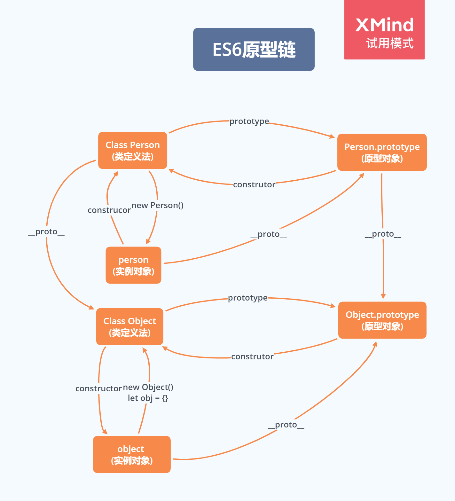

# Class


## Class 的由来

JavaScript 语言中，生成实例对象的传统方法是通过构造函数。下面是一个例子。

```js
function Point(x, y) {
  this.x = x;
  this.y = y;
}

Point.prototype.toString = function () {
  return '(' + this.x + ', ' + this.y + ')';
};

var p = new Point(1, 2);
```

上面这种写法跟传统的面向对象语言（比如 C++ 和 Java）差异很大，很容易让新学习这门语言的程序员感到困惑。

**ES6 提供了更接近传统语言的写法，引入了 Class（类）这个概念，作为对象的模板。通过`class`关键字，可以定义类。**

**基本上，ES6 的`class`可以看作只是一个语法糖，它的绝大部分功能，ES5 都可以做到，新的`class`写法只是让对象原型的写法更加清晰、更像面向对象编程的语法而已。上面的代码用 ES6 的`class`改写，就是下面这样。**

```js
class Point {
  constructor(x, y) {
    this.x = x;
    this.y = y;
  }

  toString() {
    return '(' + this.x + ', ' + this.y + ')';
  }
}
```

上面代码定义了一个“类”，可以看到里面有一个`constructor()`方法，这就是构造方法，而`this`关键字则代表实例对象。这种新的 Class 写法，本质上与本章开头的 ES5 的构造函数`Point`是一致的。

`Point`类除了构造方法，还定义了一个`toString()`方法。注意，定义`toString()`方法的时候，前面不需要加上`function`这个关键字，直接把函数定义放进去了就可以了。另外，方法与方法之间不需要逗号分隔，加了会报错。

ES6 的类，完全可以看作构造函数的另一种写法。

```js
class Point {
  // ...
}

typeof Point // "function"
Point === Point.prototype.constructor // true
```

上面代码表明，类的数据类型就是函数，类本身就指向构造函数。

使用的时候，也是直接对类使用`new`命令，跟构造函数的用法完全一致。

```js
class Bar {
  doStuff() {
    console.log('stuff');
  }
}

const b = new Bar();
b.doStuff() // "stuff"
```


## Class 的本质

###  与JS类的转化

ES6 的类，完全可以看作构造函数的另一种写法。

```js
class Point {
  // ...
}

typeof Point // "function"
Point === Point.prototype.constructor // true
```

上面代码表明，类的数据类型就是函数，类本身就指向构造函数。

使用的时候，也是直接对类使用`new`命令，跟构造函数的用法完全一致。

```js
class Bar {
  doStuff() {
    console.log('stuff');
  }
}

const b = new Bar();
b.doStuff() // "stuff"
```

构造函数的`prototype`属性，在 ES6 的“类”上面继续存在。事实上，类的所有方法都定义在类的`prototype`属性上面。

```js
class Point {
  constructor() {
    // ...
  }

  toString() {
    // ...
  }

  toValue() {
    // ...
  }
}

// 等同于

Point.prototype = {
  constructor() {},
  toString() {},
  toValue() {},
};
```

上面代码中，`constructor()`、`toString()`、`toValue()`这三个方法，其实都是定义在`Point.prototype`上面。

因此，在类的实例上面调用方法，其实就是调用原型上的方法。

```js
class B {}
const b = new B();

b.constructor === B.prototype.constructor // true
```

上面代码中，`b`是`B`类的实例，它的`constructor()`方法就是`B`类原型的`constructor()`方法。

由于类的方法都定义在`prototype`对象上面，所以类的新方法可以添加在`prototype`对象上面。`Object.assign()`方法可以很方便地一次向类添加多个方法。

```js
class Point {
  constructor(){
    // ...
  }
}

Object.assign(Point.prototype, {
  toString(){},
  toValue(){}
});
```

`prototype`对象的`constructor()`属性，直接指向“类”的本身，这与 ES5 的行为是一致的。

```js
Point.prototype.constructor === Point // true
```

### 注意点

**类的内部所有定义的方法，都是不可枚举的（non-enumerable）。**

```js
class Point {
  constructor(x, y) {
    // ...
  }

  toString() {
    // ...
  }
}

Object.keys(Point.prototype)
// []
Object.getOwnPropertyNames(Point.prototype)
// ["constructor","toString"]
```

上面代码中，`toString()`方法是`Point`类内部定义的方法，它是不可枚举的。这一点与 ES5 的行为不一致。

```js
var Point = function (x, y) {
  // ...
};

Point.prototype.toString = function () {
  // ...
};

Object.keys(Point.prototype)
// ["toString"]
Object.getOwnPropertyNames(Point.prototype)
// ["constructor","toString"]
```

上面代码采用 ES5 的写法，`toString()`方法就是可枚举的。


## 基本语法

### Class 表达式

与函数一样，类也可以使用表达式的形式定义。

```js
const MyClass = class Me {
  getClassName() {
    return Me.name;
  }
};
```

上面代码使用表达式定义了一个类。需要注意的是，这个类的名字是`Me`，但是`Me`只在 Class 的内部可用，指代当前类。在 Class 外部，这个类只能用`MyClass`引用。

```js
let inst = new MyClass();
inst.getClassName() // Me
Me.name // ReferenceError: Me is not defined
```

上面代码表示，`Me`只在 Class 内部有定义。

如果类的内部没用到的话，可以省略`Me`，也就是可以写成下面的形式。

```js
const MyClass = class { /* ... */ };
```

采用 Class 表达式，可以写出立即执行的 Class。

```js
let person = new class {
  constructor(name) {
    this.name = name;
  }

  sayName() {
    console.log(this.name);
  }
}('张三');

person.sayName(); // "张三"
```

上面代码中，`person`是一个立即执行的类的实例。

### constructor 方法

`constructor()`方法是类的默认方法，通过`new`命令生成对象实例时，自动调用该方法。一个类必须有`constructor()`方法，如果没有显式定义，一个空的`constructor()`方法会被默认添加。

```js
class Point {
}

// 等同于
class Point {
  constructor() {}
}
```

上面代码中，定义了一个空的类`Point`，JavaScript 引擎会自动为它添加一个空的`constructor()`方法。

`constructor()`方法默认返回实例对象（即`this`），完全可以指定返回另外一个对象。

```js
class Foo {
  constructor() {
    return Object.create(null);
  }
}

new Foo() instanceof Foo
// false
```

上面代码中，`constructor()`函数返回一个全新的对象，结果导致实例对象不是`Foo`类的实例。

类必须使用`new`调用，否则会报错。这是它跟普通构造函数的一个主要区别，后者不用`new`也可以执行。

```js
class Foo {
  constructor() {
    return Object.create(null);
  }
}

Foo()
// TypeError: Class constructor Foo cannot be invoked without 'new'
```

### 取值函数（getter）和存值函数（setter）

与 ES5 一样，在“类”的内部可以使用`get`和`set`关键字，对某个属性设置存值函数和取值函数，拦截该属性的存取行为。

```js
class MyClass {
  constructor() {
    // ...
  }
  get prop() {
    return 'getter';
  }
  set prop(value) {
    console.log('setter: '+value);
  }
}

let inst = new MyClass();

inst.prop = 123;
// setter: 123

inst.prop
// 'getter'
```

上面代码中，`prop`属性有对应的存值函数和取值函数，因此赋值和读取行为都被自定义了。

存值函数和取值函数是设置在属性的 Descriptor 对象上的。

```js
class CustomHTMLElement {
  constructor(element) {
    this.element = element;
  }

  get html() {
    return this.element.innerHTML;
  }

  set html(value) {
    this.element.innerHTML = value;
  }
}

var descriptor = Object.getOwnPropertyDescriptor(
  CustomHTMLElement.prototype, "html"
);

"get" in descriptor  // true
"set" in descriptor  // true
```

上面代码中，存值函数和取值函数是定义在`html`属性的描述对象上面，这与 ES5 完全一致。

### 实例属性的新写法

**实例属性除了定义在`constructor()`方法里面的`this`上面，也可以定义在类的最顶层。**

```js
class IncreasingCounter {
  constructor() {
    this._count = 0;
  }
  get value() {
    console.log('Getting the current value!');
    return this._count;
  }
  increment() {
    this._count++;
  }
}
```

上面代码中，实例属性`this._count`定义在`constructor()`方法里面。另一种写法是，这个属性也可以定义在类的最顶层，其他都不变。

```js
class IncreasingCounter {
  _count = 0;
  get value() {
    console.log('Getting the current value!');
    return this._count;
  }
  increment() {
    this._count++;
  }
}
```

上面代码中，实例属性`_count`与取值函数`value()`和`increment()`方法，处于同一个层级。这时，不需要在实例属性前面加上`this`。

这种新写法的好处是，所有实例对象自身的属性都定义在类的头部，看上去比较整齐，一眼就能看出这个类有哪些实例属性。

```js
class foo {
  bar = 'hello';
  baz = 'world';

  constructor() {
    // ...
  }
}
```

上面的代码，一眼就能看出，`foo`类有两个实例属性，一目了然。另外，写起来也比较简洁。

### 属性表达式

**类的属性名，可以采用表达式。**

```js
let methodName = 'getArea';

class Square {
  constructor(length) {
    // ...
  }

  [methodName]() {
    // ...
  }
}
```

上面代码中，`Square`类的方法名`getArea`，是从表达式得到的。

### 注意点

#### 严格模式

类和模块的内部，默认就是严格模式，所以不需要使用`use strict`指定运行模式。只要你的代码写在类或模块之中，就只有严格模式可用。考虑到未来所有的代码，其实都是运行在模块之中，所以 ES6 实际上把整个语言升级到了严格模式。

#### 不存在提升

类不存在变量提升（hoist），这一点与 ES5 完全不同。

```js
new Foo(); // ReferenceError
class Foo {}
```

上面代码中，`Foo`类使用在前，定义在后，这样会报错，因为 ES6 不会把类的声明提升到代码头部。这种规定的原因与下文要提到的继承有关，必须保证子类在父类之后定义。

```js
{
  let Foo = class {};
  class Bar extends Foo {
  }
}
```

上面的代码不会报错，因为`Bar`继承`Foo`的时候，`Foo`已经有定义了。但是，如果存在`class`的提升，上面代码就会报错，因为`class`会被提升到代码头部，而`let`命令是不提升的，所以导致`Bar`继承`Foo`的时候，`Foo`还没有定义。

#### 关于name 属性

由于本质上，ES6 的类只是 ES5 的构造函数的一层包装，所以函数的许多特性都被`Class`继承，包括`name`属性。

```js
class Point {}
Point.name // "Point"
```

`name`属性总是返回紧跟在`class`关键字后面的类名。

#### 定义Generator 方法

如果某个方法之前加上星号（`*`），就表示该方法是一个 Generator 函数。

```js
class Foo {
  constructor(...args) {
    this.args = args;
  }
  * [Symbol.iterator]() {
    for (let arg of this.args) {
      yield arg;
    }
  }
}

for (let x of new Foo('hello', 'world')) {
  console.log(x);
}
// hello
// world
```

上面代码中，`Foo`类的`Symbol.iterator`方法前有一个星号，表示该方法是一个 Generator 函数。`Symbol.iterator`方法返回一个`Foo`类的默认遍历器，`for...of`循环会自动调用这个遍历器。

#### this 的指向

类的方法内部如果含有`this`，它默认指向类的实例。但是，必须非常小心，一旦单独使用该方法，很可能报错。

```js
class Logger {
  printName(name = 'there') {
    this.print(`Hello ${name}`);
  }

  print(text) {
    console.log(text);
  }
}

const logger = new Logger();
const { printName } = logger;
printName(); // TypeError: Cannot read property 'print' of undefined
```

上面代码中，`printName`方法中的`this`，默认指向`Logger`类的实例。但是，如果将这个方法提取出来单独使用，`this`会指向该方法运行时所在的环境（由于 class 内部是严格模式，所以 this 实际指向的是`undefined`），从而导致找不到`print`方法而报错。

一个比较简单的解决方法是，在构造方法中绑定`this`，这样就不会找不到`print`方法了。

```js
class Logger {
  constructor() {
    this.printName = this.printName.bind(this);
  }

  // ...
}
```

另一种解决方法是使用箭头函数。

```js
class Obj {
  constructor() {
    this.getThis = () => this;
  }
}

const myObj = new Obj();
myObj.getThis() === myObj // true
```

箭头函数内部的`this`总是指向定义时所在的对象。上面代码中，箭头函数位于构造函数内部，它的定义生效的时候，是在构造函数执行的时候。这时，箭头函数所在的运行环境，肯定是实例对象，所以`this`会总是指向实例对象。

还有一种解决方法是使用`Proxy`，获取方法的时候，自动绑定`this`。

```js
function selfish (target) {
  const cache = new WeakMap();
  const handler = {
    get (target, key) {
      const value = Reflect.get(target, key);
      if (typeof value !== 'function') {
        return value;
      }
      if (!cache.has(value)) {
        cache.set(value, value.bind(target));
      }
      return cache.get(value);
    }
  };
  const proxy = new Proxy(target, handler);
  return proxy;
}

const logger = selfish(new Logger());
```


## 类的实例

生成类的实例的写法，与 ES5 完全一样，也是使用`new`命令。前面说过，如果忘记加上`new`，像函数那样调用`Class`，将会报错。

```js
class Point {
  // ...
}

// 报错
var point = Point(2, 3);

// 正确
var point = new Point(2, 3);
```

与 ES5 一样，实例的属性除非显式定义在其本身（即定义在`this`对象上），否则都是定义在原型上（即定义在`class`上）。

```js
//定义类
class Point {

  constructor(x, y) {
    this.x = x;
    this.y = y;
  }

  toString() {
    return '(' + this.x + ', ' + this.y + ')';
  }

}

var point = new Point(2, 3);

point.toString() // (2, 3)

point.hasOwnProperty('x') // true
point.hasOwnProperty('y') // true
point.hasOwnProperty('toString') // false
point.__proto__.hasOwnProperty('toString') // true
```

上面代码中，`x`和`y`都是实例对象`point`自身的属性（因为定义在`this`对象上），所以`hasOwnProperty()`方法返回`true`，而`toString()`是原型对象的属性（因为定义在`Point`类上），所以`hasOwnProperty()`方法返回`false`。这些都与 ES5 的行为保持一致。

与 ES5 一样，类的所有实例共享一个原型对象。

```js
var p1 = new Point(2,3);
var p2 = new Point(3,2);

p1.__proto__ === p2.__proto__
//true
```

上面代码中，`p1`和`p2`都是`Point`的实例，它们的原型都是`Point.prototype`，所以`__proto__`属性是相等的。

这也意味着，可以通过实例的`__proto__`属性为“类”添加方法。

> `__proto__` 并不是语言本身的特性，这是各大厂商具体实现时添加的私有属性，虽然目前很多现代浏览器的 JS 引擎中都提供了这个私有属性，但依旧不建议在生产中使用该属性，避免对环境产生依赖。生产环境中，我们可以使用 `Object.getPrototypeOf` 方法来获取实例对象的原型，然后再来为原型添加方法/属性。

```js
var p1 = new Point(2,3);
var p2 = new Point(3,2);

p1.__proto__.printName = function () { return 'Oops' };

p1.printName() // "Oops"
p2.printName() // "Oops"

var p3 = new Point(4,2);
p3.printName() // "Oops"
```

上面代码在`p1`的原型上添加了一个`printName()`方法，由于`p1`的原型就是`p2`的原型，因此`p2`也可以调用这个方法。而且，此后新建的实例`p3`也可以调用这个方法。这意味着，使用实例的`__proto__`属性改写原型，必须相当谨慎，不推荐使用，因为这会改变“类”的原始定义，影响到所有实例。


## 静态方法

### 基本使用

类相当于实例的原型，所有在类中定义的方法，都会被实例继承。如果在一个方法前，加上`static`关键字，就表示该方法不会被实例继承，而是直接通过类来调用，这就称为“静态方法”。

```js
class Foo {
  static classMethod() {
    return 'hello';
  }
}

Foo.classMethod() // 'hello'

var foo = new Foo();
foo.classMethod()
// TypeError: foo.classMethod is not a function
```

上面代码中，`Foo`类的`classMethod`方法前有`static`关键字，表明该方法是一个静态方法，可以直接在`Foo`类上调用（`Foo.classMethod()`），而不是在`Foo`类的实例上调用。如果在实例上调用静态方法，会抛出一个错误，表示不存在该方法。

### 注意点

**如果静态方法包含`this`关键字，这个`this`指的是类，而不是实例。**

```js
class Foo {
  static bar() {
    this.baz();
  }
  static baz() {
    console.log('hello');
  }
  baz() {
    console.log('world');
  }
}

Foo.bar() // hello
```

上面代码中，静态方法`bar`调用了`this.baz`，这里的`this`指的是`Foo`类，而不是`Foo`的实例，等同于调用`Foo.baz`。另外，从这个例子还可以看出，静态方法可以与非静态方法重名。

### 静态方法继承问题

**父类的静态方法，可以被子类继承。**

```js
class Foo {
  static classMethod() {
    return 'hello';
  }
}

class Bar extends Foo {
}

Bar.classMethod() // 'hello'
```

上面代码中，父类`Foo`有一个静态方法，子类`Bar`可以调用这个方法。

**静态方法也是可以从`super`对象上调用的。**

```js
class Foo {
  static classMethod() {
    return 'hello';
  }
}

class Bar extends Foo {
  static classMethod() {
    return super.classMethod() + ', too';
  }
}

Bar.classMethod() // "hello, too"
```


## 静态属性

静态属性指的是 Class 本身的属性，即`Class.propName`，而不是定义在实例对象（`this`）上的属性。

```js
class Foo {
}

Foo.prop = 1;
Foo.prop // 1
```

上面的写法为`Foo`类定义了一个静态属性`prop`。

**目前，只有这种写法可行，因为 ES6 明确规定，Class 内部只有静态方法，没有静态属性。现在有一个[提案](https://github.com/tc39/proposal-class-fields)提供了类的静态属性，写法是在实例属性的前面，加上`static`关键字。**

```js
class MyClass {
  static myStaticProp = 42;

  constructor() {
    console.log(MyClass.myStaticProp); // 42
  }
}
```

这个新写法大大方便了静态属性的表达。

```js
// 老写法
class Foo {
  // ...
}
Foo.prop = 1;

// 新写法
class Foo {
  static prop = 1;
}
```

上面代码中，老写法的静态属性定义在类的外部。整个类生成以后，再生成静态属性。这样让人很容易忽略这个静态属性，也不符合相关代码应该放在一起的代码组织原则。另外，新写法是显式声明（declarative），而不是赋值处理，语义更好。


## new.target 属性

### 基本用法

`new`是从构造函数生成实例对象的命令。ES6 为`new`命令引入了一个`new.target`属性，该属性一般用在构造函数之中，返回`new`命令作用于的那个构造函数。如果构造函数不是通过`new`命令或`Reflect.construct()`调用的，`new.target`会返回`undefined`，因此这个属性可以用来确定构造函数是怎么调用的。

```js
function Person(name) {
  if (new.target !== undefined) {
    this.name = name;
  } else {
    throw new Error('必须使用 new 命令生成实例');
  }
}

// 另一种写法
function Person(name) {
  if (new.target === Person) {
    this.name = name;
  } else {
    throw new Error('必须使用 new 命令生成实例');
  }
}

var person = new Person('张三'); // 正确
var notAPerson = Person.call(person, '张三');  // 报错
```

上面代码确保构造函数只能通过`new`命令调用。

Class 内部调用`new.target`，返回当前 Class。

```js
class Rectangle {
  constructor(length, width) {
    console.log(new.target === Rectangle);
    this.length = length;
    this.width = width;
  }
}

var obj = new Rectangle(3, 4); // 输出 true
```

需要注意的是，子类继承父类时，`new.target`会返回子类。

```js
class Rectangle {
  constructor(length, width) {
    console.log(new.target === Rectangle);
    // ...
  }
}

class Square extends Rectangle {
  constructor(length, width) {
    super(length, width);
  }
}

var obj = new Square(3); // 输出 false
```

上面代码中，`new.target`会返回子类。

### 实现必须继承后使用的类

**利用这个特点，可以写出不能独立使用、必须继承后才能使用的类。**

```js
class Shape {
  constructor() {
    if (new.target === Shape) {
      throw new Error('本类不能实例化');
    }
  }
}

class Rectangle extends Shape {
  constructor(length, width) {
    super();
    // ...
  }
}

var x = new Shape();  // 报错
var y = new Rectangle(3, 4);  // 正确
```

上面代码中，`Shape`类不能被实例化，只能用于继承。

注意，在函数外部，使用`new.target`会报错。


## 私有方法和私有属性

### 现有的解决方案

私有方法和私有属性，是只能在类的内部访问的方法和属性，外部不能访问。这是常见需求，有利于代码的封装，但 ES6 不提供，只能通过变通方法模拟实现。

一种做法是在命名上加以区别。

```js
class Widget {

  // 公有方法
  foo (baz) {
    this._bar(baz);
  }

  // 私有方法
  _bar(baz) {
    return this.snaf = baz;
  }

  // ...
}
```

上面代码中，`_bar()`方法前面的下划线，表示这是一个只限于内部使用的私有方法。但是，这种命名是不保险的，在类的外部，还是可以调用到这个方法。

另一种方法就是索性将私有方法移出类，因为类内部的所有方法都是对外可见的。

```js
class Widget {
  foo (baz) {
    bar.call(this, baz);
  }

  // ...
}

function bar(baz) {
  return this.snaf = baz;
}
```

上面代码中，`foo`是公开方法，内部调用了`bar.call(this, baz)`。这使得`bar()`实际上成为了当前类的私有方法。

还有一种方法是利用`Symbol`值的唯一性，将私有方法的名字命名为一个`Symbol`值。

```js
const bar = Symbol('bar');
const snaf = Symbol('snaf');

export default class myClass{

  // 公有方法
  foo(baz) {
    this[bar](baz);
  }

  // 私有方法
  [bar](baz) {
    return this[snaf] = baz;
  }

  // ...
};
```

上面代码中，`bar`和`snaf`都是`Symbol`值，一般情况下无法获取到它们，因此达到了私有方法和私有属性的效果。但是也不是绝对不行，`Reflect.ownKeys()`依然可以拿到它们。

```js
const inst = new myClass();

Reflect.ownKeys(myClass.prototype)
// [ 'constructor', 'foo', Symbol(bar) ]
```

上面代码中，Symbol 值的属性名依然可以从类的外部拿到。

### 私有属性的提案

目前，有一个[提案](https://github.com/tc39/proposal-private-methods)，为`class`加了私有属性。方法是在属性名之前，使用`#`表示。

```js
class IncreasingCounter {
  #count = 0;
  get value() {
    console.log('Getting the current value!');
    return this.#count;
  }
  increment() {
    this.#count++;
  }
}
```

上面代码中，`#count`就是私有属性，只能在类的内部使用（`this.#count`）。如果在类的外部使用，就会报错。

```js
const counter = new IncreasingCounter();
counter.#count // 报错
counter.#count = 42 // 报错
```

上面代码在类的外部，读取私有属性，就会报错。

下面是另一个例子。

```js
class Point {
  #x;

  constructor(x = 0) {
    this.#x = +x;
  }

  get x() {
    return this.#x;
  }

  set x(value) {
    this.#x = +value;
  }
}
```

上面代码中，`#x`就是私有属性，在`Point`类之外是读取不到这个属性的。由于井号`#`是属性名的一部分，使用时必须带有`#`一起使用，所以`#x`和`x`是两个不同的属性。

之所以要引入一个新的前缀`#`表示私有属性，而没有采用`private`关键字，是因为 JavaScript 是一门动态语言，没有类型声明，使用独立的符号似乎是唯一的比较方便可靠的方法，能够准确地区分一种属性是否为私有属性。另外，Ruby 语言使用`@`表示私有属性，ES6 没有用这个符号而使用`#`，是因为`@`已经被留给了 Decorator。

这种写法不仅可以写私有属性，还可以用来写私有方法。

```js
class Foo {
  #a;
  #b;
  constructor(a, b) {
    this.#a = a;
    this.#b = b;
  }
  #sum() {
    return this.#a + this.#b;
  }
  printSum() {
    console.log(this.#sum());
  }
}
```

上面代码中，`#sum()`就是一个私有方法。

另外，私有属性也可以设置 getter 和 setter 方法。

```js
class Counter {
  #xValue = 0;

  constructor() {
    super();
    // ...
  }

  get #x() { return #xValue; }
  set #x(value) {
    this.#xValue = value;
  }
}
```

上面代码中，`#x`是一个私有属性，它的读写都通过`get #x()`和`set #x()`来完成。

私有属性不限于从`this`引用，只要是在类的内部，实例也可以引用私有属性。

```js
class Foo {
  #privateValue = 42;
  static getPrivateValue(foo) {
    return foo.#privateValue;
  }
}

Foo.getPrivateValue(new Foo()); // 42
```

上面代码允许从实例`foo`上面引用私有属性。

私有属性和私有方法前面，也可以加上`static`关键字，表示这是一个静态的私有属性或私有方法。

```js
class FakeMath {
  static PI = 22 / 7;
  static #totallyRandomNumber = 4;

  static #computeRandomNumber() {
    return FakeMath.#totallyRandomNumber;
  }

  static random() {
    console.log('I heard you like random numbers…')
    return FakeMath.#computeRandomNumber();
  }
}

FakeMath.PI // 3.142857142857143
FakeMath.random()
// I heard you like random numbers…
// 4
FakeMath.#totallyRandomNumber // 报错
FakeMath.#computeRandomNumber() // 报错
```

上面代码中，`#totallyRandomNumber`是私有属性，`#computeRandomNumber()`是私有方法，只能在`FakeMath`这个类的内部调用，外部调用就会报错。

### in 运算符

`try...catch`结构可以用来判断是否存在某个私有属性。

```js
class A {
  use(obj) {
    try {
      obj.#foo;
    } catch {
      // 私有属性 #foo 不存在
    }
  }
}

const a = new A();
a.use(a); // 报错
```

上面示例中，类`A`并不存在私有属性`#foo`，所以`try...catch`报错了。

这样的写法很麻烦，可读性很差，V8 引擎改进了`in`运算符，使它也可以用来判断私有属性。

```js
class A {
  use(obj) {
    if (#foo in obj) {
      // 私有属性 #foo 存在
    } else {
      // 私有属性 #foo 不存在
    }
  }
}
```

上面示例中，`in`运算符判断当前类`A`的实例，是否有私有属性`#foo`，如果有返回`true`，否则返回`false`。

`in`也可以跟`this`一起配合使用。

```js
class A {
  #foo = 0;
  m() {
    console.log(#foo in this); // true
    console.log(#bar in this); // false
  }
}
```

注意，判断私有属性时，`in`只能用在定义该私有属性的类的内部。

```js
class A {
  #foo = 0;
  static test(obj) {
    console.log(#foo in obj);
  }
}

A.test(new A()) // true
A.test({}) // false

class B {
  #foo = 0;
}

A.test(new B()) // false
```

上面示例中，类`A`的私有属性`#foo`，只能在类`A`内部使用`in`运算符判断，而且只对`A`的实例返回`true`，对于其他对象都返回`false`。

子类从父类继承的私有属性，也可以使用`in`运算符来判断。

```js
class A {
  #foo = 0;
  static test(obj) {
    console.log(#foo in obj);
  }
}

class SubA extend A {};

A.test(new SubA()) // true
```

上面示例中，`SubA`从父类继承了私有属性`#foo`，`in`运算符也有效。

注意，`in`运算符对于`Object.create()`、`Object.setPrototypeOf`形成的继承，是无效的，因为这种继承不会传递私有属性。

```js
class A {
  #foo = 0;
  static test(obj) {
    console.log(#foo in obj);
  }
}
const a = new A();

const o1 = Object.create(a);
A.test(o1) // false
A.test(o1.__proto__) // true

const o2 = {};
Object.setPrototypeOf(o2, A);
A.test(o2) // false
A.test(o2.__proto__) // true
```

上面示例中，对于修改原型链形成的继承，子类都取不到父类的私有属性，所以`in`运算符无效。


## 继承的实现

### 基本使用

Class 可以通过`extends`关键字实现继承，这比 ES5 的通过修改原型链实现继承，要清晰和方便很多。

```js
class Point {
}

class ColorPoint extends Point {
}
```

上面代码定义了一个`ColorPoint`类，该类通过`extends`关键字，继承了`Point`类的所有属性和方法。但是由于没有部署任何代码，所以这两个类完全一样，等于复制了一个`Point`类。下面，我们在`ColorPoint`内部加上代码。

```js
class ColorPoint extends Point {
  constructor(x, y, color) {
    super(x, y); // 调用父类的constructor(x, y)
    this.color = color;
  }

  toString() {
    return this.color + ' ' + super.toString(); // 调用父类的toString()
  }
}
```

上面代码中，`constructor`方法和`toString`方法之中，都出现了`super`关键字，它在这里表示父类的构造函数，用来新建父类的`this`对象。

**子类必须在`constructor`方法中调用`super`方法，否则新建实例时会报错。这是因为子类自己的`this`对象，必须先通过父类的构造函数完成塑造，得到与父类同样的实例属性和方法，然后再对其进行加工，加上子类自己的实例属性和方法。如果不调用`super`方法，子类就得不到`this`对象。**

```js
class Point { /* ... */ }

class ColorPoint extends Point {
  constructor() {
  }
}

let cp = new ColorPoint(); // ReferenceError
```

上面代码中，`ColorPoint`继承了父类`Point`，但是它的构造函数没有调用`super`方法，导致新建实例时报错。

### 本质

**ES5 的继承，实质是先创造子类的实例对象`this`，然后再将父类的方法添加到`this`上面（`Parent.apply(this)`）。**

**ES6 的继承机制完全不同，实质是先将父类实例对象的属性和方法，加到`this`上面（所以必须先调用`super`方法），然后再用子类的构造函数修改`this`。**

如果子类没有定义`constructor`方法，这个方法会被默认添加，代码如下。也就是说，不管有没有显式定义，任何一个子类都有`constructor`方法。

```js
class ColorPoint extends Point {
}

// 等同于
class ColorPoint extends Point {
  constructor(...args) {
    super(...args);
  }
}
```

**另一个需要注意的地方是，在子类的构造函数中，只有调用`super`之后，才可以使用`this`关键字，否则会报错。**这是因为子类实例的构建，基于父类实例，只有`super`方法才能调用父类实例。

```js
class Point {
  constructor(x, y) {
    this.x = x;
    this.y = y;
  }
}

class ColorPoint extends Point {
  constructor(x, y, color) {
    this.color = color; // ReferenceError
    super(x, y);
    this.color = color; // 正确
  }
}
```

上面代码中，子类的`constructor`方法没有调用`super`之前，就使用`this`关键字，结果报错，而放在`super`方法之后就是正确的。

下面是生成子类实例的代码。

```js
let cp = new ColorPoint(25, 8, 'green');

cp instanceof ColorPoint // true
cp instanceof Point // true
```

上面代码中，实例对象`cp`同时是`ColorPoint`和`Point`两个类的实例，这与 ES5 的行为完全一致。

**最后，父类的静态方法，也会被子类继承。**

```js
class A {
  static hello() {
    console.log('hello world');
  }
}

class B extends A {
}

B.hello()  // hello world
```

上面代码中，`hello()`是`A`类的静态方法，`B`继承`A`，也继承了`A`的静态方法。

### 获取父类

`Object.getPrototypeOf`方法可以用来从子类上获取父类。

```
Object.getPrototypeOf(ColorPoint) === Point
// true
```

因此，可以使用这个方法判断，一个类是否继承了另一个类。


## super 关键字

`super`这个关键字，既可以当作函数使用，也可以当作对象使用。在这两种情况下，它的用法完全不同。

### 作为函数使用

第一种情况，`super`作为函数调用时，代表父类的构造函数。ES6 要求，子类的构造函数必须执行一次`super`函数。

```js
class A {}

class B extends A {
  constructor() {
    super();
  }
}
```

上面代码中，子类`B`的构造函数之中的`super()`，代表调用父类的构造函数。这是必须的，否则 JavaScript 引擎会报错。

注意，`super`虽然代表了父类`A`的构造函数，但是返回的是子类`B`的实例，即`super`内部的`this`指的是`B`的实例，因此`super()`在这里相当于`A.prototype.constructor.call(this)`。

```js
class A {
  constructor() {
    console.log(new.target.name);
  }
}
class B extends A {
  constructor() {
    super();
  }
}
new A() // A
new B() // B
```

上面代码中，`new.target`指向当前正在执行的函数。可以看到，在`super()`执行时，它指向的是子类`B`的构造函数，而不是父类`A`的构造函数。也就是说，`super()`内部的`this`指向的是`B`。

作为函数时，`super()`只能用在子类的构造函数之中，用在其他地方就会报错。

```js
class A {}

class B extends A {
  m() {
    super(); // 报错
  }
}
```

上面代码中，`super()`用在`B`类的`m`方法之中，就会造成语法错误。

### 作为对象使用

第二种情况，`super`作为对象时，在普通方法中，指向父类的原型对象；在静态方法中，指向父类。

```js
class A {
  p() {
    return 2;
  }
}

class B extends A {
  constructor() {
    super();
    console.log(super.p()); // 2
  }
}

let b = new B();
```

上面代码中，子类`B`当中的`super.p()`，就是将`super`当作一个对象使用。这时，`super`在普通方法之中，指向`A.prototype`，所以`super.p()`就相当于`A.prototype.p()`。

这里需要注意，由于`super`指向父类的原型对象，所以定义在父类实例上的方法或属性，是无法通过`super`调用的。

```js
class A {
  constructor() {
    this.p = 2;
  }
}

class B extends A {
  get m() {
    return super.p;
  }
}

let b = new B();
b.m // undefined
```

上面代码中，`p`是父类`A`实例的属性，`super.p`就引用不到它。

如果属性定义在父类的原型对象上，`super`就可以取到。

```js
class A {}
A.prototype.x = 2;

class B extends A {
  constructor() {
    super();
    console.log(super.x) // 2
  }
}

let b = new B();
```

上面代码中，属性`x`是定义在`A.prototype`上面的，所以`super.x`可以取到它的值。

**ES6 规定，在子类普通方法中通过`super`调用父类的方法时，方法内部的`this`指向当前的子类实例。**

```js
class A {
  constructor() {
    this.x = 1;
  }
  print() {
    console.log(this.x);
  }
}

class B extends A {
  constructor() {
    super();
    this.x = 2;
  }
  m() {
    super.print();
  }
}

let b = new B();
b.m() // 2
```

上面代码中，`super.print()`虽然调用的是`A.prototype.print()`，但是`A.prototype.print()`内部的`this`指向子类`B`的实例，导致输出的是`2`，而不是`1`。也就是说，实际上执行的是`super.print.call(this)`。

由于`this`指向子类实例，所以如果通过`super`对某个属性赋值，这时`super`就是`this`，赋值的属性会变成子类实例的属性。

```js
class A {
  constructor() {
    this.x = 1;
  }
}

class B extends A {
  constructor() {
    super();
    this.x = 2;
    super.x = 3;
    console.log(super.x); // undefined
    console.log(this.x); // 3
  }
}

let b = new B();
```

上面代码中，`super.x`赋值为`3`，这时等同于对`this.x`赋值为`3`。而当读取`super.x`的时候，读的是`A.prototype.x`，所以返回`undefined`。

如果`super`作为对象，用在静态方法之中，这时`super`将指向父类，而不是父类的原型对象。

```js
class Parent {
  static myMethod(msg) {
    console.log('static', msg);
  }

  myMethod(msg) {
    console.log('instance', msg);
  }
}

class Child extends Parent {
  static myMethod(msg) {
    super.myMethod(msg);
  }

  myMethod(msg) {
    super.myMethod(msg);
  }
}

Child.myMethod(1); // static 1

var child = new Child();
child.myMethod(2); // instance 2
```

上面代码中，`super`在静态方法之中指向父类，在普通方法之中指向父类的原型对象。

**另外，在子类的静态方法中通过`super`调用父类的方法时，方法内部的`this`指向当前的子类，而不是子类的实例。**

```js
class A {
  constructor() {
    this.x = 1;
  }
  static print() {
    console.log(this.x);
  }
}

class B extends A {
  constructor() {
    super();
    this.x = 2;
  }
  static m() {
    super.print();
  }
}

B.x = 3;
B.m() // 3
```

上面代码中，静态方法`B.m`里面，`super.print`指向父类的静态方法。这个方法里面的`this`指向的是`B`，而不是`B`的实例。

注意，使用`super`的时候，必须显式指定是作为函数、还是作为对象使用，否则会报错。

```js
class A {}

class B extends A {
  constructor() {
    super();
    console.log(super); // 报错
  }
}
```

上面代码中，`console.log(super)`当中的`super`，无法看出是作为函数使用，还是作为对象使用，所以 JavaScript 引擎解析代码的时候就会报错。这时，如果能清晰地表明`super`的数据类型，就不会报错。

```js
class A {}

class B extends A {
  constructor() {
    super();
    console.log(super.valueOf() instanceof B); // true
  }
}

let b = new B();
```

上面代码中，`super.valueOf()`表明`super`是一个对象，因此就不会报错。同时，由于`super`使得`this`指向`B`的实例，所以`super.valueOf()`返回的是一个`B`的实例。

**最后，由于对象总是继承其他对象的，所以可以在任意一个对象中，使用`super`关键字。**

```js
var obj = {
  toString() {
    return "MyObject: " + super.toString();
  }
};

obj.toString(); // MyObject: [object Object]
```


## ES6 继承机制

### 基本概述

大多数浏览器的 ES5 实现之中，每一个对象都有`__proto__`属性，指向对应的构造函数的`prototype`属性。Class 作为构造函数的语法糖，同时有`prototype`属性和`__proto__`属性，因此同时存在两条继承链。

（1）子类的`__proto__`属性，表示构造函数的继承，总是指向父类。

（2）子类`prototype`属性的`__proto__`属性，表示方法的继承，总是指向父类的`prototype`属性。

```js
class A {
}

class B extends A {
}

B.__proto__ === A // true
B.prototype.__proto__ === A.prototype // true
```

上面代码中，子类`B`的`__proto__`属性指向父类`A`，子类`B`的`prototype`属性的`__proto__`属性指向父类`A`的`prototype`属性。

这样的结果是因为，类的继承是按照下面的模式实现的。

```js
class A {
}

class B {
}

// B 的实例继承 A 的实例
Object.setPrototypeOf(B.prototype, A.prototype);

// B 继承 A 的静态属性
Object.setPrototypeOf(B, A);

const b = new B();
```

`Object.setPrototypeOf`方法的实现：

```js
Object.setPrototypeOf = function (obj, proto) {
  obj.__proto__ = proto;
  return obj;
}
```

因此，就得到了上面的结果。

```js
Object.setPrototypeOf(B.prototype, A.prototype);
// 等同于
B.prototype.__proto__ = A.prototype;

Object.setPrototypeOf(B, A);
// 等同于
B.__proto__ = A;
```

这两条继承链，可以这样理解：作为一个对象，子类（`B`）的原型（`__proto__`属性）是父类（`A`）；作为一个构造函数，子类（`B`）的原型对象（`prototype`属性）是父类的原型对象（`prototype`属性）的实例。

```js
B.prototype = Object.create(A.prototype);
// 等同于
B.prototype.__proto__ = A.prototype;
```

### extends 关键字

`extends`关键字后面可以跟多种类型的值。

```js
class B extends A {
}
```

上面代码的`A`，只要是一个有`prototype`属性的函数，就能被`B`继承。由于函数都有`prototype`属性（除了`Function.prototype`函数），因此`A`可以是任意函数。

下面，讨论两种情况。第一种，子类继承`Object`类。

```js
class A extends Object {
}

A.__proto__ === Object // true
A.prototype.__proto__ === Object.prototype // true
```

**这种情况下，`A`其实就是构造函数`Object`的复制，`A`的实例就是`Object`的实例。**

第二种情况，不存在任何继承。

```js
class A {
}

A.__proto__ === Function.prototype // true
A.prototype.__proto__ === Object.prototype // true
```

**这种情况下，`A`作为一个基类（即不存在任何继承），就是一个普通函数，所以直接继承`Function.prototype`。但是，`A`调用后返回一个空对象（即`Object`实例），所以`A.prototype.__proto__`指向构造函数（`Object`）的`prototype`属性。**

### 实例的 __proto__ 属性

子类实例的`__proto__`属性的`__proto__`属性，指向父类实例的`__proto__`属性。也就是说，子类的原型的原型，是父类的原型。

```js
var p1 = new Point(2, 3);
var p2 = new ColorPoint(2, 3, 'red');

p2.__proto__ === p1.__proto__ // false
p2.__proto__.__proto__ === p1.__proto__ // true
```

上面代码中，`ColorPoint`继承了`Point`，导致前者原型的原型是后者的原型。

因此，通过子类实例的`__proto__.__proto__`属性，可以修改父类实例的行为。

```js
p2.__proto__.__proto__.printName = function () {
  console.log('Ha');
};

p1.printName() // "Ha"
```

上面代码在`ColorPoint`的实例`p2`上向`Point`类添加方法，结果影响到了`Point`的实例`p1`。

下面用一张图进行总结：



## 继承原生构造函数

原生构造函数是指语言内置的构造函数，通常用来生成数据结构。ECMAScript 的原生构造函数大致有下面这些。

- Boolean()
- Number()
- String()
- Array()
- Date()
- Function()
- RegExp()
- Error()
- Object()

以前，这些原生构造函数是无法继承的，比如，不能自己定义一个`Array`的子类。

```js
function MyArray() {
  Array.apply(this, arguments);
}

MyArray.prototype = Object.create(Array.prototype, {
  constructor: {
    value: MyArray,
    writable: true,
    configurable: true,
    enumerable: true
  }
});
```

上面代码定义了一个继承 Array 的`MyArray`类。但是，这个类的行为与`Array`完全不一致。

```js
var colors = new MyArray();
colors[0] = "red";
colors.length  // 0

colors.length = 0;
colors[0]  // "red"
```

之所以会发生这种情况，是因为子类无法获得原生构造函数的内部属性，通过`Array.apply()`或者分配给原型对象都不行。原生构造函数会忽略`apply`方法传入的`this`，也就是说，原生构造函数的`this`无法绑定，导致拿不到内部属性。

ES5 是先新建子类的实例对象`this`，再将父类的属性添加到子类上，由于父类的内部属性无法获取，导致无法继承原生的构造函数。比如，`Array`构造函数有一个内部属性`[[DefineOwnProperty]]`，用来定义新属性时，更新`length`属性，这个内部属性无法在子类获取，导致子类的`length`属性行为不正常。

下面的例子中，我们想让一个普通对象继承`Error`对象。

```js
var e = {};

Object.getOwnPropertyNames(Error.call(e))
// [ 'stack' ]

Object.getOwnPropertyNames(e)
// []
```

上面代码中，我们想通过`Error.call(e)`这种写法，让普通对象`e`具有`Error`对象的实例属性。但是，`Error.call()`完全忽略传入的第一个参数，而是返回一个新对象，`e`本身没有任何变化。这证明了`Error.call(e)`这种写法，无法继承原生构造函数。

**ES6 允许继承原生构造函数定义子类，因为 ES6 是先新建父类的实例对象`this`，然后再用子类的构造函数修饰`this`，使得父类的所有行为都可以继承。**

下面是一个继承`Array`的例子。

```js
class MyArray extends Array {
  constructor(...args) {
    super(...args);
  }
}

var arr = new MyArray();
arr[0] = 12;
arr.length // 1

arr.length = 0;
arr[0] // undefined
```

上面代码定义了一个`MyArray`类，继承了`Array`构造函数，因此就可以从`MyArray`生成数组的实例。这意味着，ES6 可以自定义原生数据结构（比如`Array`、`String`等）的子类，这是 ES5 无法做到的。

**上面这个例子也说明，`extends`关键字不仅可以用来继承类，还可以用来继承原生的构造函数。因此可以在原生数据结构的基础上，定义自己的数据结构。**

下面就是定义了一个带版本功能的数组。

```js
class VersionedArray extends Array {
  constructor() {
    super();
    this.history = [[]];
  }
  commit() {
    this.history.push(this.slice());
  }
  revert() {
    this.splice(0, this.length, ...this.history[this.history.length - 1]);
  }
}

var x = new VersionedArray();

x.push(1);
x.push(2);
x // [1, 2]
x.history // [[]]

x.commit();
x.history // [[], [1, 2]]

x.push(3);
x // [1, 2, 3]
x.history // [[], [1, 2]]

x.revert();
x // [1, 2]
```

上面代码中，`VersionedArray`会通过`commit`方法，将自己的当前状态生成一个版本快照，存入`history`属性。`revert`方法用来将数组重置为最新一次保存的版本。除此之外，`VersionedArray`依然是一个普通数组，所有原生的数组方法都可以在它上面调用。

下面是一个自定义`Error`子类的例子，可以用来定制报错时的行为。

```js
class ExtendableError extends Error {
  constructor(message) {
    super();
    this.message = message;
    this.stack = (new Error()).stack;
    this.name = this.constructor.name;
  }
}

class MyError extends ExtendableError {
  constructor(m) {
    super(m);
  }
}

var myerror = new MyError('ll');
myerror.message // "ll"
myerror instanceof Error // true
myerror.name // "MyError"
myerror.stack
// Error
//     at MyError.ExtendableError
//     ...
```

注意，继承`Object`的子类，有一个[行为差异](https://stackoverflow.com/questions/36203614/super-does-not-pass-arguments-when-instantiating-a-class-extended-from-object)。

```js
class NewObj extends Object{
  constructor(){
    super(...arguments);
  }
}
var o = new NewObj({attr: true});
o.attr === true  // false
```

上面代码中，`NewObj`继承了`Object`，但是无法通过`super`方法向父类`Object`传参。这是因为 ES6 改变了`Object`构造函数的行为，一旦发现`Object`方法不是通过`new Object()`这种形式调用，ES6 规定`Object`构造函数会忽略参数。

## Mixin 模式的实现

Mixin 指的是多个对象合成一个新的对象，新对象具有各个组成成员的接口。它的最简单实现如下。

```js
const a = {
  a: 'a'
};
const b = {
  b: 'b'
};
const c = {...a, ...b}; // {a: 'a', b: 'b'}
```

上面代码中，`c`对象是`a`对象和`b`对象的合成，具有两者的接口。

下面是一个更完备的实现，将多个类的接口“混入”（mix in）另一个类。

```js
function mix(...mixins) {
  class Mix {
    constructor() {
      for (let mixin of mixins) {
        copyProperties(this, new mixin()); // 拷贝实例属性
      }
    }
  }

  for (let mixin of mixins) {
    copyProperties(Mix, mixin); // 拷贝静态属性
    copyProperties(Mix.prototype, mixin.prototype); // 拷贝原型属性
  }

  return Mix;
}

function copyProperties(target, source) {
  for (let key of Reflect.ownKeys(source)) {
    if ( key !== 'constructor'
      && key !== 'prototype'
      && key !== 'name'
    ) {
      let desc = Object.getOwnPropertyDescriptor(source, key);
      Object.defineProperty(target, key, desc);
    }
  }
}
```

上面代码的`mix`函数，可以将多个对象合成为一个类。使用的时候，只要继承这个类即可。

```js
class DistributedEdit extends mix(Loggable, Serializable) {
  // ...
}
```

