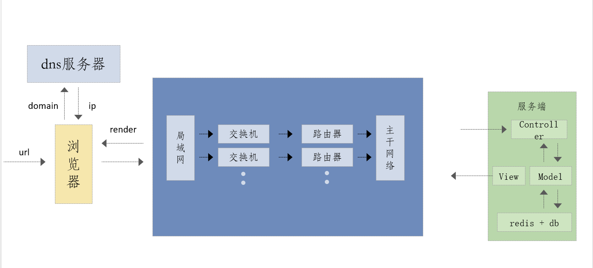
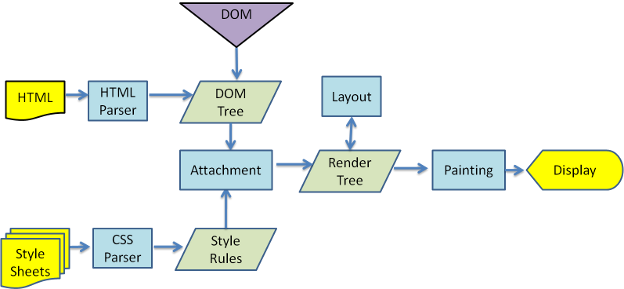
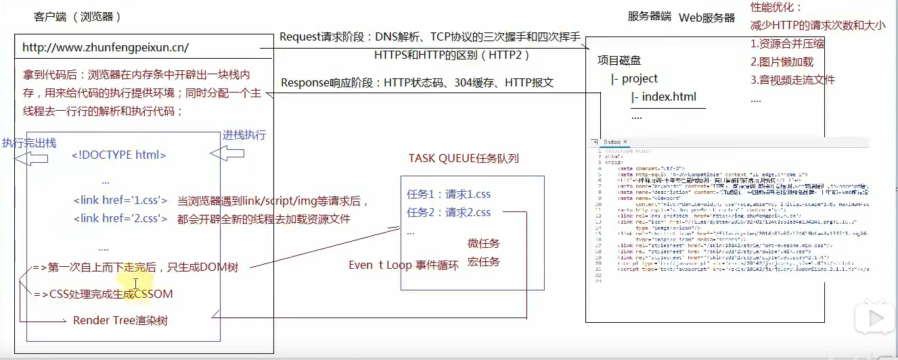
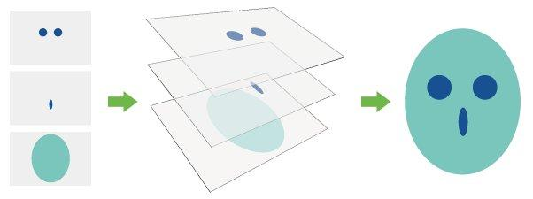
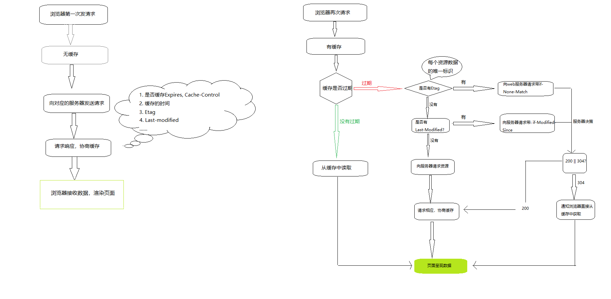

# 浏览器渲染原理及性能优化

[[toc]]

## 1. Web 前后端整体示意图



## 2. 浏览器功能与组成

### 2.1 浏览器应该具备的功能

1. **网络**

   浏览器通过网络模块来下载各式各样的资源，如 html 文本；javascript 代码；样式表；图片；音视频文件等。

   网络部分本质上十分重要，因为它耗时长，而且需要安全访问互联网上的资源。

2. **资源管理**

   ​ 从网络下载，或者本地获取到的资源需要有高效的机制来管理它们。

   ​ 例如如何避免重复下载，资源如何缓存等

3. **网页浏览**

   这是浏览器的核心也是最基本的功能，最重要的功能。

   如何将资源转变为可视化的结果。

多页面管理
插件与管理
账户和同步
安全机制
开发者工具
...
...

**浏览器的主要功能总结起来就是一句话:将用户输入的 url 转变成可视化的图像。**

​ 1.从 url 到 DOM 树

​ 2.从 DOM 树到可视化图像

这两个过程之间的关系并没有那么明确,我们可以统称这两个过程为页面的渲染

### 2.2 浏览器的内核(渲染引擎)

    在浏览器中有一个最重要的模块，它主要的作用是将页面转变为可视化的图像结果。
    这个模块就是浏览器内核，通常它也被称为渲染引擎。

    IE---------->Trident

    Safari------>WebKit
    	WebKit本身主要是由两个引擎构成的，
    		一个正是渲染引擎“WebCore”，
    		另一个则是javascript解释引擎“JSCore”，
    		它们均是从KDE的渲染引擎KHTML及javascript解释引擎KJS衍生而来。

    Chrome------>WebKit的分支引擎----->Blink
    	 在13年发布的Chrome 28.0.1469.0版本开始，Chrome放弃Chromium引擎转
    	 而使用最新的Blink引擎（基于WebKit2——苹果公司于2010年推出的新的WebKit引擎），
    	 Blink对比上一代的引擎精简了代码、改善了DOM框架，也提升了安全性。

    Opera
    	旧版Opera 4至6版本 :Elektra排版引擎
    	Opera7.0	:Presto渲染引擎
    	Opera在2013年2月宣布放弃Presto:
    				采用Chromium引擎;
    				又转为Blink引擎;

    Firefox------>Gecko

### 2.3 现代浏览器：多进程、多线程模型

不堪回首的过去
当你通过浏览器打开很多页面的时候,如果其中一个页面不响应了或者崩溃了,
那么随之而来的将会是更不幸的事情,你开打的所有页面都会得不到响应,
最让人不能忍受的是,其中的一些页面可能还包含了未保存或者未发送的信息
浏览器产商如何解决

    1. 采用多进程模型,该模型可以带来的好处

2. 避免因单个页面的不响应或者崩溃影响整个浏览器的稳定性 3. 当第三方插件崩溃时,也不会影响整个浏览器的稳定性 4. 安全

## 3. 进程与线程

### 3.1 进程

程序的一次执行, 它占有一片独有的内存空间.是操作系统执行的基本单元。

其中：

1. 一个进程中至少有一个运行的线程: 主线程, 进程启动后自动创建

   2. 一个进程中也可以同时运行多个线程, 我们会说程序是多线程运行的
   3. 一个进程内的数据可以供其中的多个线程直接共享，多个进程之间的数据是不能直接共享的

### 3.2 线程

是进程内的一个独立执行单元,是 CPU 调度的最小单元，是程序运行的基本单元。

线程池(thread pool): 保存多个线程对象的容器, 实现线程对象的反复利用

js 引擎是单线程运行的！（回忆事件轮询机制）

### 3.3 浏览器中的进程

1. Browser 进程:
   浏览器的主进程,负责浏览器界面的显示,和各个页面的管理,
   浏览器中所有其他类型进程的祖先,负责其他进程的的创建和销毁
   它有且只有一个!!!!!
2. Renderer 进程:
   网页渲染进程,负责页面的渲染,可以有多个
   当然渲染进程的数量不一定等于你开打网页的个数
3. 各种插件进程
4. GPU 进程

**每个进程内部又有很多线程，多线程的目的主要是保持用户界面的高度响应**

例如:

1. 为了不让 Browser 进程的 UI 线程被其他耗时的操作(数据库读写,本地文件读写)所阻塞,那么我们就把这些操作放到分线程中去处理

2. 在 Renderer 进程中,为了不让其他操作阻止渲染线程的高速执行,我们通常会将渲染过程**管线化,**利用计算机的多核优势,让渲染的不同阶段在不同的线程中执行

**管线化解释：**

CPU 的工作方式不是先来先处理(这样你使用一个程序，另一个就不能用了)，而是时间片轮转法(每个程序执行一段时间，由于速度快，基本看不出来)，同时配置优先级算法。

管线化，就是本来只需要一个 Renderer 进程，可以浏览器为了抢占资源，开出了几十个或者更多，为了防止别的进程把它挤掉。

**移动设备的浏览器可能不太一样**:

1. Android 不支持插件,所以就没有插件进程

2. GPU 演化成了 Browser 进程的一个线程

3. Renderer 进程演化成了操作系统的一个服务进程,它仍然是独立的

## 4. 浏览器的渲染

### 4.1 主要模块

- 一个渲染引擎主要包括：HTML 解析器，CSS 解析器，javascript 引擎，布局 layout 模块，绘图模块

  - **HTML 解析器：**解释 HTML 文档的解析器，主要作用是将 HTML 文本解释成 DOM 树。

  - **CSS 解析器：**它的作用是为 DOM 中的各个元素对象计算出样式信息，为布局提供基础设施

  - **Javascript 引擎**：使用 Javascript 代码可以修改网页的内容，也能修改 css 的信息，javascript 引擎能够解释 javascript 代码，并通过 DOM 接口和 CSS 树接口来修改网页内容和样式信息，从而改变渲染的结果。

  - **布局(layout)：**在 DOM 创建之后，Webkit 需要将其中的元素对象同样式信息结合起来，计算他们的大小位置等布局信息，形成一个能表达这所有信息的内部表示模型

  - **绘图模块(paint)：**使用图形库将布局计算后的各个网页的节点绘制成图像结果

备注：文档对象模型（Document Object Model，简称 DOM）

### 4.2 渲染规则

浏览器渲染页面的整个过程：浏览器会从上到下解析文档。

1. 遇见 HTML 标记，调用 HTML 解析器解析为对应的 token （一个 token 就是一个标签文本的序列化）并构建 DOM 树（就是一块内存，保存着 tokens，建立它们之间的关系）。
2. 遇见 style/link 标记 调用解析器 处理 CSS 标记并构建 CSS 样式树。
3. 遇见 script 标记 调用 javascript 解析器 处理 script 标记，绑定事件、修改 DOM 树/CSS 树 等
4. 将 DOM 树 与 CSS 树 合并成一个渲染树。
5. 根据渲染树来渲染，以计算每个节点的几何信息（这一过程需要依赖图形库）。
6. 将各个节点绘制到屏幕上。

以上这些模块依赖很多其他的基础模块, 包括要使用到网络 存储 2D/3D 图像 音频视频解码器 和 图片解码器。

所以渲染引擎中还会包括如何使用这些依赖模块的部分。

### 4.3 渲染过程





浏览器收到 html 文档后，开始逐行解析，其中遇到 style、img 等需要引入外部资源的时候，有以下规则：

1. 浏览器加载资源是异步的，加载一点解析一点
2. 页面 style 标签写的内部样式是异步解析的，style 标签的内容是由 html 解析器解析的

但是对于 link 进来的外部 css 样式：

1. link 进来的样式，是由 css 解析器去解析，并且是同步解析的
2. css 解析器会阻塞页面的渲染。（也可以说 link 进来的外部样式会阻塞页面渲染，利用他避免闪屏）
3. 推荐使用 link 方式去引入样式，一来方便管理，二来避免闪屏

### 4.4 EventLoop

在`JavaScript`中，任务被分为两种，一种宏任务（`MacroTask`）也叫`Task`，一种叫微任务（`MicroTask`）。

#### 4.4.1 MacroTask（宏任务）

- `script`全部代码、`setTimeout`、`setInterval`、`setImmediate`（浏览器暂时不支持，只有 IE10 支持，具体可见`MDN`）、`I/O`、`UI Rendering`。

#### 4.4.2 MicroTask（微任务）

- `Process.nextTick（Node独有）`、`Promise`、`Object.observe(废弃)`、`MutationObserver`（具体使用方式查看[这里](https://link.zhihu.com/?target=https%3A//link.juejin.im/%3Ftarget%3Dhttp%3A%2F%2Fjavascript.ruanyifeng.com%2Fdom%2Fmutationobserver.html)）

#### 4.4.3 浏览器中的 Event Loop

`Javascript` 有一个 `main thread` 主线程和 `call-stack` 调用栈(执行栈)，所有的任务都会被放到调用栈等待主线程执行。

#### 4.4.4 JS 调用栈

JS 调用栈采用的是后进先出的规则，当函数执行的时候，会被添加到栈的顶部，当执行栈执行完成后，就会从栈顶移出，直到栈内被清空。

#### 4.4.5 同步任务和异步任务

`Javascript`单线程任务被分为**同步任务**和**异步任务**，同步任务会在调用栈中按照顺序等待主线程依次执行，异步任务会在异步任务有了结果后，将注册的回调函数放入任务队列中等待主线程空闲的时候（调用栈被清空），被读取到栈内等待主线程的执行。


## 5. 阻塞渲染

### 5.1 css 阻塞

**声明：只有 link 引入的外部 css 才能够产生阻塞。**

1. **style 标签中的样式**
   (1) 由 html 解析器进行解析
   (2) 不阻塞浏览器渲染（可能会产生“闪屏现象”）
   (3) 不阻塞 DOM 解析

2) **link 引入的外部 css 样式（推荐使用的方式）**
   (1) 由 CSS 解析器进行解析
   (2) 阻塞浏览器渲染(可以利用这种阻塞避免“闪屏现象”)  
    (3) 阻塞其后面的 js 语句的执行

​ **原因:** 如果后面 js 的内容是获取元素的样式，例如宽高等 CSS 控制的属性, 如果不等样式解析完毕，后面的 js 就获得了错误的信息。由于浏览器也不知道后续 js 的具体内容，所以只好等前面所有的样式解析完毕后，再执行 js。

​ **例如:** Firefox 在样式表加载和解析的过程中，会禁止掉所有的脚本。

​ **注意:** 现代浏览越发注重用户体验，对于 WebKit 内核的浏览器而言，仅当脚本尝试访问的样式属性、或可能受尚未加载的样式表影响时，它才会禁止该脚本。

​ (4) 不阻塞 DOM 的解析

​ **原因:** DOM 解析和 CSS 解析是两个并行的进程，浏览器解析 DOM 生成 DOM Tree, 解析 cSS 生成 CSS Tree, 最终组成 render Tree，再渲染页面

​ **即:** DOM 的解析，ICSS 的解析是 并行执行的，即:不阻塞 DOM 的解析。

3. **优化核心理念：尽可能快的提高外部 css 加载速度**
   (1) 使用 CDN 节点进行外部资源加速
   (2) 对 css 进行压缩(利用打包工具，比如 webpack,gulp 等)
   (3) 减少 http 请求数，将多个 css 文件合并
   (4) 优化样式表的代码

### 5.2 关于 js 阻塞

1. 阻塞 DOM 解析

​ 原因：浏览器不知道后续脚本的内容，如果先去解析了下面的 DOM，而随后的 js 删除了后面所有的 DOM，
​ 那么浏览器就做了无用功，浏览器无法预估脚本里面具体做了什么操作，例如像 document.write
​ 这种操作，索性全部停住，等脚本执行完了，浏览器再继续向下解析 DOM。

2. 阻塞页面渲染
   原因：js 中也可以给 DOM 设置样式，浏览器同样等该脚本执行完毕，再继续干活，避免做无用功。

3) 阻塞后续 js 的执行

   ​ 原因：维护依赖关系，例如：必须先引入 jQuery 再引入 bootstrap

### 5.3 写在后面

1. css 的解析和 js 的执行是互斥的（互相排斥），css 解析的时候 js 停止执行，js 执行的时候 css 停止解析。

2. 无论 css 阻塞，还是 js 阻塞，都不会阻塞浏览器加载外部资源（图片、视频、样式、脚本等）

   原因：浏览器始终处于一种：“先把请求发出去”的工作模式，只要是涉及到网络请求的内容，无论是：图片、

   样式、脚本，都会先发送请求去获取资源，至于资源到本地之后什么时候用，由浏览器自己协调。这种做法效

   率很高

3. WebKit 和 Firefox 都进行了【预解析】这项优化。在执行 js 脚本时，浏览器的其他线程会解析文档的其余部

   分，找出并加载需要通过网络加载的其他资源。通过这种方式，资源可以在并行连接上加载， 从而提高总体

   速度。请注意，预解析器不会修改 DOM 树

在上述的过程中，网页在加载和渲染过程中会触发“DOMContentloaded”和“onload”事件

分别是在 DOM 树构建（解析）完成之后，以及 DOM 树构建完并且网页所依赖的资源都加载完之后

上面介绍的是一个完整的渲染过程，但现代网页很多都是动态的，这意味着在渲染完成之后，由于网页的动画或者

用户的交互，浏览器其实一直在不停地重复执行渲染过程（重绘重排），以上的数字表示的是基本顺序，这不是严

格一致的，这个过程可能重复也可能交叉

## 6. 图层与重绘重排

### 6.1 css 图层与浏览器绘制

浏览器在渲染一个页面时，会将页面分为很多个图层，图层有大有小，每个图层上有一个或多个节点。

在渲染 DOM 的时候，浏览器所做的工作实际上是：
说

1. 获取 DOM 后分割为多个图层

2. 对每个图层的节点计算样式结果 （Recalculate style--样式重计算）
3. 为每个节点生成图形和位置 （Layout--重排,回流）
4. 将每个节点绘制填充到图层位图中 （Paint--重绘）
5. 图层作为纹理上传至 GPU
6. 组合多个图层到页面上生成最终屏幕图像 （Composite Layers--图层重组）



### 6.2 图层创建的条件

Chrome 浏览器满足以下任意情况就会创建图层：

1. 拥有具有 3D 变换的 CSS 属性

2. 使用加速视频解码的 video 节点
3. canvas 节点
4. CSS3 动画的节点
5. 拥有 CSS 加速属性的元素(will-change)

### 6.3 重绘(Repaint)

重绘是一个元素外观的改变所触发的浏览器行为，例如改变 outline、背景色等属性。

浏览器会根据元素的新属性重新绘制，使元素呈现新的外观。重绘不会带来重新布局，所以并不一定伴随重排。

**需要注意的是：**

重绘是以图层为单位，如果图层中某个元素需要重绘，那么整个图层都需要重绘。比如一个图层包含很多节点，其中有个 gif 图，gif 图的每一帧，都会重回整个图层的其他节点，然后生成最终的图层位图。

所以这需要通过特殊的方式来强制 gif 图属于自己一个图层（translateZ(0)或者 translate3d(0,0,0)

CSS3 的动画也是一样（好在绝大部分情况浏览器自己会为 CSS3 动画的节点创建图层）

### 6.4 重排(Reflow 回流)

渲染对象在创建完成并添加到渲染树时，并不包含位置和大小信息，计算这些值的过程称为布局或重排

"重绘"不一定需要"重排"，比如改变某个网页元素的颜色，就只会触发"重绘"，不会触发"重排"，因为布局没有改变。

但是，"重排"必然导致"重绘"，比如改变一个网页元素的位置，就会同时触发"重排"和"重绘"，因为布局改变了。

### 6.5 触发重绘的属性

```
    * color								* background									* outline-color
    * border-style						* background-image								* outline
    * border-radius						* background-position							* outline-style
    * visibility						* background-repeat								* outline-width
    * text-decoration					* background-size								* box-shadow
```

### 6.6 触发重排(回流)的属性

```
盒子模型相关属性会触发重布局			定位属性及浮动也会触发重布局：				改变节点内部文字结构也会触发重布局：
		* width							* top											* text-align
		* height						* bottom										* overflow-y
		* padding						* left											* font-weight
		* margin						* right											* overflow
		* display						* position										* font-family
		* border-width					* float											* line-height
		* border							* clear											* vertival-align
		* min-height																		* white-space
```

### 6.7 常见的触发重排的操作

Reflow 的成本比 Repaint 的成本高得多的多。

DOM Tree 里的每个结点都会有 reflow 方法，一个结点的 reflow 很有可能导致子结点，甚至父点以及同级结点的 reflow。

在一些高性能的电脑上也许还没什么，但是如果 reflow 发生在手机上，那么这个过程是非常痛苦和耗电的。

所以，下面这些动作有很大可能会是成本比较高的：

1. 当你增加、删除、修改 DOM 结点时，会导致 Reflow , Repaint。 2. 当你 Resize 窗口的时候（移动端没有这个问题，因为移动端的缩放没有影响布局视口） 3. 当你修改网页的默认字体时。 4. 获取某些属性时(width,height...)，注：display:none 会触发 reflow，而 visibility:hidden 只会触发 repaint，因为没有发生位置变化。 5. 当你移动 DOM 的位置 6. 当你修改 CSS 样式的时候。

### 6.8 优化方案

如果我们需要使得动画或其他节点渲染的性能提高，需要做的就是减少浏览器在运行时所需要做的工作（尽量减少 1234 步）：

1. 计算需要被加载到节点上的样式结果（Recalculate style--样式重计算） 2. 为每个节点生成图形和位置（Layout--回流和重布局） 3. 将每个节点填充到图层中（Paint Setup 和 Paint--重绘） 4. 组合图层到页面上（Composite Layers--图层重组）

一些解决方法：

1. 元素位置移动变换时尽量使用 CSS3 的 transform 来代替对 top left 等的操作, 可以减少重绘重排的次数

​ 变换（transform）和透明度（opacity）的改变仅仅影响图层的组合

2. 使用 opacity 来代替 visibility
   (1) 使用 visibility 不触发重排，但是依然重绘。
   (2) 直接使用 opacity 即触发重绘，又触发重排（GPU 底层设计如此！）。
   (3) opacity 配合图层使用，即不触发重绘也不触发重排。
   原因：
   透明度的改变时，GPU 在绘画时只是简单的降低之前已经画好的纹理的 alpha 值来达到效果，并不需要整体的重绘。
   不过这个前提是这个被修改 opacity 本身必须是一个图层。

3. 不要使用 table 布局
   table-cell

4. 将多次改变样式属性的操作合并成一次操作
   不要一条一条地修改 DOM 的样式，预先定义好 class，然后修改 DOM 的 className

5. 将 DOM 离线后再修改
   由于 display 属性为 none 的元素不在渲染树中，对隐藏的元素操作不会引发其他元素的重排。
   如果要对一个元素进行复杂的操作时，可以先隐藏它，操作完成后再显示。这样只在隐藏和显示时触发 2 次重排。

6. 利用文档碎片(documentFragment)------vue 使用了该种方式提升性能。

7. 不要把获取某些 DOM 节点的属性值放在一个循环里当成循环的变量

   当你请求向浏览器请求一些 style 信息的时候，就会让浏览器 flush 队列，比如：

   - offsetTop, offsetLeft, offsetWidth, offsetHeight

   - scrollTop/Left/Width/Height

   - clientTop/Left/Width/Height

   - width,height

   当你请求上面的一些属性的时候，浏览器为了给你最精确的值，需要刷新内部队列，因为队列中可能会有影响到这些值的操作。即使你获取元素的布局和样式信息跟最近发生或改变的布局信息无关，浏览器都会强行刷新渲染队列。

8. 动画实现过程中，启用 GPU 硬件加速:transform: tranlateZ(0)
9. 为动画元素新建图层,提高动画元素的 z-index，z-index 会提升图层位置（注意，脱离文档流并不代表开启了一个图层）

### 6.9 请求动画帧

```js
window.requestAnimationFrame();

window.requestAnimationFrame();
// 说明：该方法会告诉浏览器在重绘之前调用你所指定的函数
// 1.参数：该方法使用一个回调函数作为参数，这个回调函数会在浏览器重绘之前调用。
// 回调函数会被自动传入一个参数，DOMHighResTimeStamp，标识requestAnimationFrame()开始触发回调函数的当前时间
// 2.返回值：
// 一个long整数，也成为请求 ID，是个非零值 ，是回调列表中唯一的标识，没别的意义。

window.cancelAnimationFrame(requestID);

// 用此方法代替定时器实现移动
let i = 0;

let id = window.requestAnimationFrame(move);

function move() {
  i++;
  document.getElementById("test").style.transform = `tanslateX(${i}px)`;
  id = window.requestAnimationFrame(move);
}

setTimeout(() => {
  window.cancelAnimationFrame(id);
}, 2000);
```

取消一个先前通过调用 window.requestAnimationFrame()方法添加到计划中的动画帧请求。
requestID 是先前调用 window.requestAnimationFrame()方法时返回的 ID

## 7. 硬件加速

硬件加速意味着**Graphics Processing Unit**（GPU）会通过代替**Central Processing Unit** (CPU)做一些负荷比较大的事情，来协助浏览器快速渲染页面，当 CSS 操作使用硬件加速的时候，通常会使页面渲染速度加快

顾名思义，CPU 和 GPU 都是计算机处理单元。CPU 在电脑主板，几乎处理电脑的一切操作，有电脑大脑之称；GPU 在显卡上，负责处理和渲染图形。此外 GPU 通过特殊的设计，使其擅长于渲染图形所需的数学和几何运算。因此把操作转嫁到 GPU 可以获得显著的性能提升，同时也可以减少移动设备 CPU 的争用。

硬件加速（或者说 GPU 加速）依赖于浏览器渲染页面使用的`layering model`，当特定的操作（CSS 3D 变形）作用于页面上的一个元素，元素移动到它自己的`layer`，在这个 layer 中元素合一不受页面其他元素的干扰独立渲染，然后复合到页面中去。在这种隔离内容渲染的工作方式下，如果页面的变化仅仅是该元素的变形，其余部分不必被重新渲染，这会带来显著的速度优势。值得注意的是只有 3D 变形会有自己的 layer，2D 变形不会。

CSS 的动画、变形、渐变并不会自动的触发 GPU 加速，而是使用浏览器稍慢的软件渲染引擎。然而一些浏览器提供了 hardware acceleration by means of certain properties 来获取更高的渲染性能。 举个例子，`opacity`属性是几个能够加速的属性之一，因为 GPU 可以方便的处理。基本上任何层的透明度渐变浏览器都会交给 GPU 处理来加速。除了 opacity 能够使用 GPU 处理的就是 CSS 3D 变形了

### 7.1 translateZ() (or translate3d()) Hack

很长一段时间内我们都通过`translateZ()`或者`translate3d()` hack 来骗取浏览器触发硬件加速，具体做法就是为元素添加没有变化的 3D 变形，比如元素在 2 维空间可以通过添加以下 CSS 来硬件加速

```css
transform: translate3d(0, 0, 0);
```

所谓硬件加速就是创建了一个被传递到 GPU 处理的层的操作，然而强制使用 hack 方式创建 layer 并不是长久之计，创建 layer 的技术可以使页面加速，但是也有代价：它们占用 RAM 和 GPU 存储空间（考虑到移动设备的存储容量有限），所以必须呗小心使用，确保这么做真的对页面渲染有所帮助

为了避免创建 layer 的 hacks，一个允许我们提前通知浏览器我们将对元素做何种变化的 CSS 属性被引入，这样浏览器可以优化处理元素渲染的方式，为元素提前准备昂贵的动画处理操作，这就是`wiil-change`属性

### 7.2 will-change 属性

will-change 属性可以提前通知浏览器我们要对元素做什么动画，这样浏览器可以提前准备合适的优化设置。这样可以避免对页面响应速度有重要影响的昂贵成本。元素可以更快的被改变，渲染的也更快，这样页面可以快速更新，表现的更加流畅。

举个例子，当对于素使用 CSS 3D 变形时，元素及其内容可以在合成到页面之前被创建到我们之前说的 layer。然而把元素放到 layer 中是个昂贵的操作，这将会导致变形动画延迟一个课件的瞬间，也就是`flicker`

为了避免这种延时，我们可以在发生之前通知浏览器，这样浏览器会有一定的时间去准备这些变化，当发生的时候 layer 已经准备好了，这样动画酒会很流畅，不会闪屏

使用 will-change 提示浏览器关于即将发生的变形十分简单，添加个 CSS 属性就行

```css
will-change: transform;
```

也可以告诉浏览器要改变元素的滚动条位置，或者多个要变化的属性，写下属性的名字就行，也可以写多个，逗号隔开

```css
will-change: transform, opacity;
```

声明了元素即将进行的变化会让浏览器在渲染页面时做更好的决定，这明显比之前说的 3D hacks 要好。

### 7.3 合理使用

了解了 will-change 的行为，为浏览器上一切元素设置 will-change 是不是效率会变高？答案是否定的，will-change 如果被滥用会使页面崩溃。

will-change 也有副作用，虽然并不直接可见，毕竟它只是在背后和浏览器说悄悄话，为了合理使用 will-change，

**不要声明太多属性或为太多元素声明**

```css
::before,
::after {
  will-change: all;
}
```

虽然看起来很屌，但其实对页面渲染伤害很大，这样的规则设了和没设没什么区别，浏览器本来就尝试最优的渲染所有元素，就等于你让老师重点照顾班里每个同学一样，就是废话！

其实这甚至是有害的，因为一些操作会占用太多的资源，甚至会导致页面奔溃，就等于强制要求老师为每个学生补课，累死了。。。

**给浏览器足够的时间工作**

will-change 顾名思义，通知浏览器**即将**发生的变化，而不是**正在**发生的变化。使用 will-change，我们要求浏览器重点照顾我们声明的元素，为了这个浏览器需要一定的时间来组织优化操作，这样当变化发生的时候，优化才能没有延迟的作用到元素

在变化前立即为元素添加 will-change 几乎没有作用，可能还不如不设置，因为会导致新的 layer 创建

```css
.element:hover {
  will-change: transform;
  transition: transform 2s;
  transform: rotate(30deg) scale(1.5);
}
```

这样的设置就没什么用，我们需要给浏览器足够的时间，下面这样就是有用的，感受一下

```css
.element {
  /* style rules */
  transition: transform 1s ease-out;
}
.element:hover {
  will-change: transform;
}
.element:active {
  transform: rotateY(180deg);
}
```

如果一定要 hover 的时候，也有技巧

```css
.element {
  transition: opacity 0.3s linear;
}
/* declare changes on the element when the mouse enters / hovers its ancestor */
.ancestor:hover .element {
  will-change: opacity;
}
/* apply change when element is hovered */
.element:hover {
  opacity: 0.5;
}
```

其实核心思想就是让浏览器有时间去准备

**变化完成后移除 will-change**

对于一般的优化，当变化完成的时候浏览器会撤销优化，恢复普通模式，但是如果使用了 will-change 会导致该优化迟迟不能释放，这就要求我们用完了就释放

这时候我们需要借助 JavaScript

```
// Rough generic example
// Get the element that is going to be animated on click, for example
var el = document.getElementById('element');

// Set will-change when the element is hovered
el.addEventListener('mouseenter', hintBrowser);
el.addEventListener('animationEnd', removeHint);

function hintBrowser() {
    // The optimizable properties that are going to change
    // in the animation's keyframes block
    this.style.willChange = 'transform, opacity';
}

function removeHint() {
    this.style.willChange = 'auto';
}
```

当然对于用户会反复触发的操作放在 style 中不移除也可以

**will-change 属性的值**

1. auto 表示没有明确的意图; 无论是启发式和最优化，用户代理应该应用都和正常情况相同

2. scroll-position 表示开发者期望去在接下来去改变或者有动画应用元素的滚动位置

3. contents 表示开发者期望去在接下来去改变或者有动画应用元素的内容

4. 用来排除关键字 will-change, none, all, auto, scroll-position, and contents, 从之外增加一些通用的关键字

   will-change： transform：
   will-change： opacity：
   will-change： top, left, bottom, right：

如果一个属性无最初的值,在这个元素上这个属性将创建一个堆栈的内容, 明确规定在 will-change 的属性必须在这个元素上创建一个堆栈的内容.

如果一个属性无最初的值, 这个属性将造成这个元素产生一个包含区块的固定定位的元素, 明确规定在 will-change 的属性必须造成这个元素产生一个包含区块的固定定位的元素

## 8. 函数防抖与函数节流

### 8.1 防抖与节流的作用

**防抖与节流是用来处理事件频繁地触发所产生的技术，都是用来限制事件频繁地发生的**

**事件频繁触发可能造成的问题：**

- 一些浏览器事件如`window.onresize`、`window.onmousemove`等触发频率非常高的事件会造成浏览器的性能问题

- 向后台请求数据会频繁地触发，对服务器造成不必要的压力

- 而要限制事件处理函数的频繁调用，有防抖与节流两种技术来解决这个麻烦

### 8.2 函数防抖

函数防抖的主要思想为**在规定时间内，只让最后一次的处理事件的效果生效，而让前面的处理事件不生效。**该方法适合多次事件一次响应的情况

**函数防抖的使用场景：**

- 实时的搜索框（实时根据输入框的数据发送 ajax 请求）（keyup）

- 文本输入的验证（连续输入文字后发送`ajax`请求进行验证，但是只验证最后一次输入的内容）(input)

- 判断`scroll`是否滚动到底部（scrolll）

```js
/*
 * 函数防抖：
 *   概念： 延迟要执行的动作，若在延时的这段时间内，再次触发了，则取消之前开启的动作，重新计时。
 *   举例： 电脑无操作1分钟后会进入休眠，当第40秒时鼠标被移动一下，重新计时1分钟。
 *   实现： 定时器。
 *   应用：搜索时等用户完整输入内容后再发送查询请求。
 */

// 主要使用的是函数闭包的概念，保存上次点击的时刻，与下一次点击的时刻做对比
function debounce(callback, delay) {
  return function() {
    // 保存this和arguments
    const _self = this;
    const args = arguments;
    // 清除待执行的定时器任务
    if (callback.timer) {
      clearTimeout(callback.timer);
    }
    // 将定时器挂载到函数对象上
    callback.timer = setTimeout(() => {
      // 因为是箭头函数其实可以不在外部保存this直接绑定this
      callback.apply(_self, args);
      // 执行完后删除函数的timer属性
      delete callback.timer;
    }, delay);
  };
}
/*
    下面是测试
*/
function handleClick() {
  console.log("点击事件");
}
document.getElementById("throttle").onclick = debounce(handleClick, 1000);
```

### 8.3 函数节流（throttle）

函数节流的主要思想为**在函数需要频繁触发时，函数触发一次后，只有大于设定的执行周期后才会第二次执行改函数。**该方法适合多次事件按照时间做平均分配触发

**函数节流的使用场景：**

- 窗口调整（resize）

- 页面滚动（scroll）

- DOM 元素的拖拽功能实现（mousemove）

- 类似电商抢购商品时的疯狂点击抢购按钮（mousedown）

```js
/*
 * 函数节流：
 *   概念：设定一个特定的时间，让函数在特定的时间内只执行一次，不会频繁执行
 *   举例：fps游戏，鼠标按住不松手，子弹也不会连成一条线
 *   实现：定时器、标识
 *   需求：在鼠标滚轮滚动的时候，每隔2秒钟，打印一次
 */

// 主要使用的是函数闭包的概念，保存上次点击的时刻，与下一次点击的时刻做对比
function throttle(callback, delay) {
  let last = 0;
  return function() {
    const now = Date.now();
    if (now - last > delay) {
      // 从第二次点击开始都需要有间隔时间
      // 现在函数中的this为点击事件对象的this，也就是返回的函数内的this
      callback.apply(this, arguments);
      last = now;
    }
  };
}
/*
    下面是测试
*/
function handleClick() {
  console.log("点击事件");
}
document.getElementById("throttle").onclick = throttle(handleClick, 1000);
```

## 9. CDN

### 9.1 CDN 定义

网站通常将其所有的服务器都放在同一个地方，当用户群增加时，公司就必须在多个地理位置不同的服务器上部署

内容,为了缩短 http 请求的时间，我们应该把大量的静态资源放置的离用户近一点。
内容发布网络 CDN（Content Delivery Networks）

CDN 是一组分布在多个不同地理位置的 web 服务器，用于更加有效的向用户发布内容

### 9.2 设计基本思路

1. 尽可能避开互联网上有可能影响数据传输速度和稳定性的瓶颈和环节，使内容传输的更快、更稳定。
2. 通过在网络各处放置节点服务器所构成的在现有的互联网基础之上的一层智能虚拟网络，
3. CDN 系统能够实时地根据网络流量和各节点的连接、负载状况以及到用户的距离和响应时间等综合信息
4. 将用户的请求重新导向离用户最近的服务节点上。

### 9.3 基础架构

最简单的 CDN 网络由一个 DNS 服务器和几台缓存服务器组成

1. 当用户点击网站页面上的内容 URL，经过本地 DNS 系统解析，DNS 系统会最终将域名的解析权交给 CNAME 指向的 CDN 专用 DNS 服务器。

2. CDN 的 DNS 服务器将 CDN 的全局负载均衡设备 IP 地址返回用户。

3. .用户向 CDN 的全局负载均衡设备发起内容 URL 访问请求。

4. CDN 全局负载均衡设备根据用户 IP 地址，以及用户请求的内容 URL，选择一台用户所属区域的区域负载均衡设备，告诉用户向这台设备发起请求。

5. 区域负载均衡设备会为用户选择一台合适的缓存服务器提供服务，
   选择的依据包括：

   - 根据用户 IP 地址，判断哪一台服务器距用户最近；

   - 根据用户所请求的 URL 中携带的内容名称，判断哪一台服务器上有用户所需内容；

   - 查询各个服务器当前的负载情况，判断哪一台服务器尚有服务能力。

     基于以上这些条件的综合分析之后，区域负载均衡设备会向全局负载均衡设备返回一台缓存服务器的 IP 地址。

6) 全局负载均衡设备把服务器的 IP 地址返回给用户。

7) 用户向缓存服务器发起请求，缓存服务器响应用户请求，将用户所需内容传送到用户终端。

   如果这台缓存服务器上并没有用户想要的内容，而区域均衡设备依然将它分配给了用户，那么这台服务器就要向它的上一级缓存服务器请求内容，直至追溯到网站的源服务器将内容拉到本地。

## 10. 浏览器本地存储

Cookie、SessionStorage、LocalStorage 这三者都可以被用来在浏览器端存储数据，而且都是字符串类型的键值对。

(另外还有一种存储模式叫：Session，这种级别的存储属于服务端会话级别的存储)

### 10.1 cookie

**cookie 是什么?**

1. cookie 翻译过来是小甜饼的意思，是网景公司的前雇员 Lou Montulli 在 1993 年 3 月的发明的。
2. cookie 是纯文本格式，不包含任何可执行的代码信息，伴随着用户请求在 Web 服务器和浏览器之间传递
3. cookie 本质上属于 http 的范畴，因为 http 协议本身是无状态的，服务端是没有办法区分请求来自于哪个客户端，即便是来自于同一个客户端的多次请求 我们的服务端也是没有能力来区分的。就是因为 http 协议是无状态的，所以才需要 cookie 去维持客户端的状态。

**cookie 的生成方式:**

1. 客户端生成:
   在 JavaScript 中通过 document.cookie 属性，你可以创建、维护和删除 cookie
   设置 document.cookie 属性的值并不会删除存储在页面中的所有 cookie。它只简单的创建或修改字符串中指定的 cookie
   要使用 JavaScript 提取 cookie 的值，只需要从 document.cookie 中读取即可

2. 服务端生成:
   Web 服务器通过发送一个称为 Set-Cookie 的 HTTP 消息头来创建一个 cookie

   ​ HttpOnly
   ​ 为避免跨域脚本 (XSS) 攻击，通过 JavaScript 的 Document.cookie API 无法访问有 HttpOnly 标记的 Cookie，
   ​

**cookie 的缺点**

1. 安全性 ：由于 cookie 在 HTTP 中是明文传递的，其中包含的数据都可以被他人访问，可能会被篡改、盗用。 2. 大小限制： cookie 的大小限制在 4KB 左右，若要做大量存储显然不是理想的选择。 3. 增加流量： cookie 每次请求都会被自动添加到 Request Header 中，无形中增加了流量。cookie 信息越大，对服务器请求的时间也越长。因此要慎用 cookie，不要在 cookie 中存储重要和敏感的数据。

### 10.2 Web Storage

SessionStorage 和 LocalStorage 都是本地存储,同时空间比 Cookie 大很多，一般支持 5-10M

浏览器端通过 Window.sessionStorage 和 Window.localStorage 属性来实现本地存储机制

**SessionStorage 和 LocalStorage 的区别**

localStorage 生命周期是永久，这意味着除非用户显示在浏览器提供的 UI 上清除 localStorage 信息，否则这些信息将永远存在。

sessionStorage 生命周期为当前窗口或标签页，一旦窗口或标签页被永久关闭了，那么所有通过 sessionStorage 存储的数据也就被清空了。

不同浏览器无法共享 localStorage 或 sessionStorage 中的信息。

相同浏览器的不同页面间可以共享相同的 localStorage（页面属于相同域名和端口），但是不同页面或标签页间无法共享 sessionStorage 的信息。这里需要注意的是，页面及标签页仅指顶级窗口，如果一个标签页包含多个 iframe 标签且他们属于同源页面，那么他们之间是可以共享 sessionStorage 的。

**用法：**

var data = xxxxxStorage.getItem('person');

​ 该方法接受一个键名作为参数，返回键名对应的值。

xxxxxStorage.setItem('key', 'value');

​ 该方法接受一个键名和值作为参数，将会把键值对添加到存储中，如果键名存在，则更新其对应的值。

xxxxxStorage.removeItem('key');

​ 该方法接受一个键名作为参数，并把该键名从存储中删除。

xxxxxStorage.clear()

​ 调用该方法会清空存储中的所有键名

**storage 事件**

​ Storage 对象发生变化时（即创建/更新/删除数据项时，Storage.clear() 方法至多触发一次该事件）会触发

​ 在同一个页面内发生的改变不会起作用

​ 在相同域名下的其他页面发生的改变才会起作用。(修改的页面不会触发事件，与它共享的页面会触发事件)

​ key: 修改或删除的 key 值，如果调用 clear(),为 null

​ newValue: 新设置的值，如果调用 clear(),为 null

​ oldValue: 调用改变前的 value 值,如果调用 clear(),为 null

​ url: 触发该脚本变化的文档的 url

​ storageArea: 当前的 storage 对象

### 10.3 备注

1. 静态资源是不会携带 cookie 的

2. cookie 一般都是后台种的，很少让前端来直接写

3. cookie 分:持久级别、session 级别

4. cookie 一般用于和 session 通信

### 10.4 浏览器储存量的支持

参考：http://dev-test.nemikor.com/web-storage/support-test/

​

## 11. 缓存

### 11.1 缓存理解

1. 缓存定义:

   浏览器在本地磁盘上将用户之前请求的数据存储起来，当访问者再次需要改数据的时候无需再次发送请求，直接从浏览器本地获取数据

2. 缓存的好处:

   - 减少请求的个数

   - 节省带宽，避免浪费不必要的网络资源

   - 减轻服务器压力

   - 提高浏览器网页的加载速度，提高用户体验

### 11.2 缓存分类

1. 强缓存

   - 不会向服务器发送请求，直接从本地缓存中获取数据

   - 请求资源的的状态码为: 200 ok(from memory cache)

2. 协商缓存

   - 向服务器发送请求，服务器会根据请求头的资源判断是否命中协商缓存

   - 如果命中，则返回 304 状态码通知浏览器从缓存中读取资源

3. 强缓存 & 协商缓存的共同点

   - 都是从浏览器端读取资源

4. 强缓存 VS 协商缓存的不同点

   - 强缓存不发请求给服务器

   - 协商缓存发请求给服务器，根据服务器返回的信息决定是否使用缓存

### 11.3 缓存使用示意图



### 11.4 缓存中的 header 参数

**强缓存的 header 参数**:

1. expires：

   1. 这是 http1.0 时的规范；它的值为一个绝对时间的 GMT 格式的时间字符串，如`Mon, 10 Jun 2015 21:31:12 GMT`，如果发送请求的时间在 expires 之前，那么本地缓存始终有效，否则就会发送请求到服务器来获取资源

2. cache-control：max-age=number

   1. 这是 http1.1 时出现的 header 信息，主要是利用该字段的 max-age 值来进行判断，它是一个相对值；资源第一次的请求时间和 Cache-Control 设定的有效期，计算出一个资源过期时间，再拿这个过期时间跟当前的请求时间比较，如果请求时间在过期时间之前，就能命中缓存，否则就不行；

   2. cache-control 常用的值（做一个简单了解即可）：

      - no-cache: 不使用本地缓存，需要使用协商缓存。先与服务器确认返回的响应是否被更改，如果之前的响应中存在 Etag，那么请求的额时候会与服务器端进行验证，如果资源为被更改则使用缓存。

      - no-store: 直接禁止游览器缓存数据，每次用户请求该资源，都会向服务器发送一个请求，每次都会下载完整的资源。

      - public：可以被所有的用户缓存，包括终端用户和 CDN 等中间代理服务器。

      - private：只能被终端用户的浏览器缓存，不允许 CDN 等中继缓存服务器对其缓存。

   3. **注意：当 cache-control 与 Expires 共存的时候 cache-control 的优先级高**

**协商缓存的 header 参数**

**重点：协商缓存都是由服务器来确定缓存资源是否可用的，所以客户端与服务器端要通过某种标识来进行通信，从而让服务器判断请求资源是否可以缓存访问**

- Last-Modified/If-Modified-Since:二者的值都是 GMT 格式的时间字符串

  1.  浏览器第一次跟服务器请求一个资源，服务器在返回这个资源的同时，在 respone 的 header 加上 Last-Modified 的 header，这个 header 表示这个资源在服务器上的最后修改时间
  2.  浏览器再次跟服务器请求这个资源时，在 request 的 header 上加上 If-Modified-Since 的 header，这个 header 的值就是上一次请求时返回的 Last-Modified 的值
  3.  服务器再次收到资源请求时，根据浏览器传过来 If-Modified-Since 和资源在服务器上的最后修改时间判断资源是否有变化，如果没有变化则返回 304 Not Modified，但是不会返回资源内容；如果有变化，就正常返回资源内容。当服务器返回 304 Not Modified 的响应时，response header 中不会再添加 Last-Modified 的 header，因为既然资源没有变化，那么 Last-Modified 也就不会改变，这是服务器返回 304 时的 response header
  4.  浏览器收到 304 的响应后，就会从缓存中加载资源
  5.  如果协商缓存没有命中，浏览器直接从服务器加载资源时，Last-Modified 的 Header 在重新加载的时候会被更新，下次请求时，If-Modified-Since 会启用上次返回的 Last-Modified 值

- Etag/If-None-Match

  1.  这两个值是由服务器生成的每个资源的唯一标识字符串，只要资源有变化就这个值就会改变
  2.  其判断过程与 Last-Modified/If-Modified-Since 类似

- 既生 Last-Modified 何生 Etag

  1. HTTP1.1 中 Etag 的出现主要是为了解决几个 Last-Modified 比较难解决的问题
  2. 一些文件也许会周期性的更改，但是他的内容并不改变(仅仅改变的修改时间)，这个时候我们并不希望客户端认为这个文件被修改了，而重新 GET
  3. 某些文件修改非常频繁，比如在秒以下的时间内进行修改，(比方说 1s 内修改了 N 次)，If-Modified-Since 能检查到的粒度是 s 级的，这种修改无法判断(或者说 UNIX 记录 MTIME 只能精确到秒)；
  4. 某些服务器不能精确的得到文件的最后修改时间。

- 小结：

  - 利用 Etag 能够更加准确的控制缓存，因为 Etag 是服务器自动生成或者由开发者生成的对应资源在服务器端的唯一标识符。

  - Last-Modified 与 ETag 是可以一起使用的，服务器会优先验证 ETag，一致的情况下，才会继续比对 Last-Modified，最后才决定是否返回 304。

### 11.5 强缓存如何重新加载新的资源

- 通过更新页面中引用的资源路径，让浏览器主动放弃加载缓存去加载新的资源

- 示例：https://www.baidu.com/s?t=7aec0h3KB3Ba8lAbuyPg0AC0eDa59IvtDSmtMQBc6eW

  给原本请求的链接，加上一些无关的参数，这样让浏览器以为是新的请求

- 好处：

  每次文件改变后 query 的值就会发生修改，当 query 值不同的时候也就是页面引用的资源路径不同。此时浏览器会主动加载新的资源。
