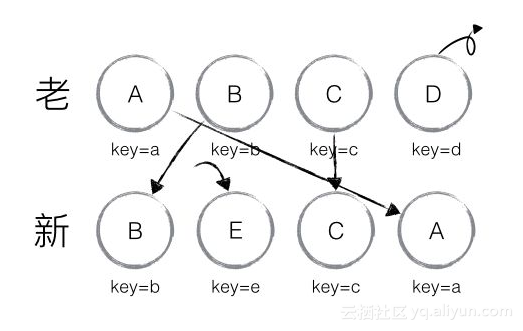

# DOM Diff 算法

## 1. 总述


DIFF 算法在执行时有三个维度，分别是 Tree DIFF、Component DIFF 和 Element DIFF，执行时按顺序依次执行，它们的差异仅仅因为 DIFF 粒度不同、执行先后顺序不同。

## 2. 过程

Tree DIFF 是对树的每一层进行遍历，如果某组件不存在了，则会直接销毁。如图所示，左边是旧属，右边是新属，第一层是 R 组件，一模一样，不会发生变化；第二层进入 Component DIFF，同一类型组件继续比较下去，发现 A 组件没有，所以直接删掉 A、B、C 组件；继续第三层，重新创建 A、B、C 组件。


如图所示，第一层遍历完，进行第二层遍历时，D 和 G 组件是不同类型的组件，不同类型组件直接进行替换，将 D 删掉，再将 G 重建。


Element DIFF 紧接着以上统一类型组件继续比较下去，常见类型就是列表。同一个列表由旧变新有三种行为，插入、移动和删除，它的比较策略是对于每一个列表指定 key，先将所有列表遍历一遍，确定要新增和删除的，再确定需要移动的。如图所示，第一步将 D 删掉，第二步增加 E，再次执行时 A 和 B 只需要移动位置即可。



## 3. 实现

**Patch.js**

```js
var REPLACE = 0; // 替换原先的节点
var REORDER = 1; // 重新排序
var PROPS = 2; // 修改了节点的属性
var TEXT = 3; // 文本内容改变

function patch(node, patches) {
  var walker = { index: 0 };
  dfsWalk(node, walker, patches);
}

function dfsWalk(node, walker, patches) {
  // 从patches拿出当前节点的差异
  var currentPatches = patches[walker.index];

  var len = node.childNodes ? node.childNodes.length : 0;
  // 深度遍历子节点
  for (var i = 0; i < len; i++) {
    var child = node.childNodes[i];
    walker.index++;
    dfsWalk(child, walker, patches);
  }
  // 对当前节点进行DOM操作
  if (currentPatches) {
    applyPatches(node, currentPatches);
  }
}

function applyPatches(node, currentPatches) {
  currentPatches.forEach((currentPatch) => {
    switch (currentPatch.type) {
      case REPLACE:
        var newNode =
          typeof currentPatch.node === "string"
            ? document.createTextNode(currentPatch.node)
            : currentPatch.node.render();
        node.parentNode.replaceChild(newNode, node);
        break;
      case REORDER:
        reorderChildren(node, currentPatch.moves);
        break;
      case PROPS:
        setProps(node, currentPatch.props);
        break;
      case TEXT:
        node.textContent = currentPatch.content;
        break;
      default:
        throw new Error("Unknown patch type " + currentPatch.type);
    }
  });
}

function setProps(node, props) {
  for (var key in props) {
    if (!props[key]) {
      node.removeAttribute(key);
    } else {
      var value = props[key];
      setAttr(node, key, value);
    }
  }
}

function reorderChildren(node, moves) {
  var staticNodeList = Array.from(node.childNodes);
  var maps = {};

  staticNodeList.forEach((node) => {
    // 如果是一个元素节点
    if (node.nodeType === 1) {
      var key = node.getAttribute("key");
      if (key) {
        maps[key] = node;
      }
    }
  });

  moves.forEach((move) => {
    var index = move.index;
    if (move.type === 0) {
      // type为 0，表示新的dom对象已经删除该节点
      if (staticNodeList[index] === node.childNodes[index]) {
        // maybe have been removed for inserting
        node.removeChild(node.childNodes[index]);
      }
      staticNodeList.splice(index, 1);
    } else if (move.type === 1) {
      // type为 1，表示新的dom对象插入该节点
      var insertNode = maps[move.item.key]
        ? maps[move.item.key].cloneNode(true) // reuse old item
        : typeof move.item === "object"
        ? move.item.render()
        : document.createTextNode(move.item);
      staticNodeList.splice(index, 0, insertNode);
      node.insertBefore(insertNode, node.childNodes[index] || null);
    }
  });
}

function setAttr(node, key, value) {
  switch (key) {
    case "style":
      node.style.cssText = value;
      break;
    case "value":
      var tagName = node.tagName || "";
      tagName = tagName.toLowerCase();
      if (tagName === "input" || tagName === "textarea") {
        node.value = value;
      } else {
        // if it is not a input or textarea, use `setAttribute` to set
        node.setAttribute(key, value);
      }
      break;
    default:
      node.setAttribute(key, value);
      break;
  }
}

patch.REPLACE = REPLACE;
patch.REORDER = REORDER;
patch.PROPS = PROPS;
patch.TEXT = TEXT;

module.exports = patch;
```

**Diff.js**

```js
var patch = require("./patch");
var listDiff = require("list-diff2");

// diff 函数，对比两棵树
function diff(oldTree, newTree) {
  var index = 0; // 当前节点的标志
  var patches = {}; // 用来记录每个节点差异的对象
  dfsWalk(oldTree, newTree, index, patches);
  return patches;
}

// 对两棵树进行深度优先遍历
function dfsWalk(oldNode, newNode, index, patches) {
  var currentPatch = [];
  if (typeof oldNode === "string" && typeof newNode === "string") {
    // 文本内容改变
    if (newNode !== oldNode) {
      currentPatch.push({ type: patch.TEXT, content: newNode });
    }
  } else if (
    newNode != null &&
    oldNode.tagName === newNode.tagName &&
    oldNode.key === newNode.key
  ) {
    // 节点相同，比较属性
    var propsPatches = diffProps(oldNode, newNode);
    if (propsPatches) {
      currentPatch.push({ type: patch.PROPS, props: propsPatches });
    }
    // 比较子节点，如果子节点有'ignore'属性，则不需要比较
    if (!isIgnoreChildren(newNode)) {
      diffChildren(
        oldNode.children,
        newNode.children,
        index,
        patches,
        currentPatch
      );
    }
  } else if (newNode !== null) {
    // 新节点和旧节点不同，用 replace 替换
    currentPatch.push({ type: patch.REPLACE, node: newNode });
  }

  if (currentPatch.length) {
    patches[index] = currentPatch;
  }
}

// 遍历子节点
function diffChildren(oldChildren, newChildren, index, patches, currentPatch) {
  var diffs = listDiff(oldChildren, newChildren, "key");
  newChildren = diffs.children;

  if (diffs.moves.length) {
    var reorderPatch = { type: patch.REORDER, moves: diffs.moves };
    currentPatch.push(reorderPatch);
  }

  var leftNode = null;
  var currentNodeIndex = index;
  oldChildren.forEach((child, i) => {
    var newChild = newChildren[i];
    currentNodeIndex =
      leftNode && leftNode.count
        ? currentNodeIndex + leftNode.count + 1
        : currentNodeIndex + 1;
    dfsWalk(child, newChild, currentNodeIndex, patches);
    leftNode = child;
  });
}

// 比较节点属性
function diffProps(oldNode, newNode) {
  var count = 0;
  var oldProps = oldNode.props;
  var newProps = newNode.props;
  var propsPatches = {};
  // 查找属性值不同的属性
  for (var key in oldProps) {
    if (newProps[key] !== oldProps[key]) {
      count++;
      propsPatches[key] = newProps[key];
    }
  }
  // 查找新属性
  for (var key in newProps) {
    if (!oldProps.hasOwnProperty(key)) {
      count++;
      propsPatches[key] = newProps[key];
    }
  }
  // 没有属性改变
  if (count === 0) {
    return null;
  }
  return propsPatches;
}

function isIgnoreChildren(node) {
  return node.props && node.props.hasOwnProperty("ignore");
}

module.exports = diff;
```
