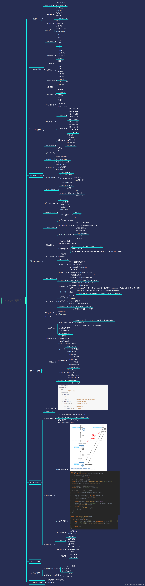

## Vue 简介

### 1.1 Vue 的特性

**Vue 是一套用于构建用户界面的渐进式框架,与其它大型框架不同的是,Vue 被设计为可以自底向上逐层应用,Vue 拥有以下特性:**

- 组件化思想
- 模板的使用和数据渲染非常灵活，层次结构鲜明
- 简单的语法并能够简单快速构建一个项目
- 轻量级，体积小渲染速度更快
- Vue 采用的脚手架工具为 vue-cli
- 初期是尤雨溪维护，现在有加入的团队组织个人提供技术一同维护迭代更新
- Vue 中指令和组件分得更清晰。指令只封装 DOM 操作,而组件代表一个自给自足的独立单元,都拥有有自己的视图样式和数据逻辑

### 1.2 Vue 知识框架

### 1.3 开发准备

#### 1.3.1 下载 Node.js

去 Node.js 的官网下载最新版的 node,需要用到其包管理工具 npm ([Node.js 官网](https://nodejs.org/en/))

#### 1.3.2 配置淘宝镜像

因为 npm 是国外的,在国内用会特别慢,所以需要先用淘宝的 cnpm 代替 npm

在命令行窗口输入 npm install -g cnpm --registry=https://registry.npm.taobao.org 配置淘宝镜像

#### 1.3.3 vue-cli 脚手架

vue-cli 是一个基于 vue 的构建工具,用于搭建 vue 项目的环境,有着兼容,方便,快速的优点,能够完全遵循前后端分离的原则,用 vue 开发单网页项目(SPA)的能力尤其的好

**注:**可以不用脚手架(vue-cli)就可以基于 webpack 打包工具 ,webpack 最终会把整个项目打包成一个 js 文件但需要自己进行配置各个版本兼容问题,正因为这样,前端有一个专门的配置工程师

#### 1.3.4 使用 vue-cli

在命令行窗口输入 cnpm i -g vue-cli **全局安装 vue-cli 脚手架**

Vue-cli 要全局安装

**注:**安装完成后可以使用 vue -V 查看是否安装成功

**安装项目文件**

先到项目文件夹,打开命令行窗口输入 vue init webpack 项目文件夹名(不输入则就是在该文件夹里创建)

**运行项目文件**

在项目文件中使用 npm run dev 运行项目文件

**打包项目**

在项目文件夹中运行 npm run build 将项目打包 ,打包后的文件将会保存在该文件的 list 文件夹中

npm run build --report 生成打包视图，可视化显示所有包在项目中占的大小

生产环境打包发布

​ npm run build

​ npm install -g serve

​ serve dist

​

#### 1.3.5 ESLint

说明：

1. ESLint 是一个代码规范检查工具

2. 它定义了很多特定的规则, 一旦你的代码违背了某一规则,eslint 会作出非常有用的提示

3. 官网:http://eslint.org/

4. 基本已替代以前的 JSLint

ESLint 提供以下支持：

1. ES

2. JSX

3. style 检查

4. 自定义错误和提示

ESLint 提供以下几种校验：

1. 语法错误校验

2. 不重要或丢失的标点符号，如分号

3. 没法运行到的代码块（使用过 WebStorm 的童鞋应该了解）

4. 未被使用的参数提醒

5. 确保样式的统一规则，如 sass 或者 less

6. 检查变量的命名

规则的错误等级有三种：

1. 0：关闭规则。

2. 1：打开规则，并且作为一个警告（信息打印黄色字体）

3. 2：打开规则，并且作为一个错误（信息打印红色字体）

相关配置文件

1. eslintrc.js: 全局规则配置文件 'rules':{ 'no-new':1 }

2. 在 js/vue 文件中修改局部规则 /_eslint-disableno-new_/ newVue({ el:'body', components:{App} })

3. eslintignore: 指令检查忽略的文件 _.js _.vue
