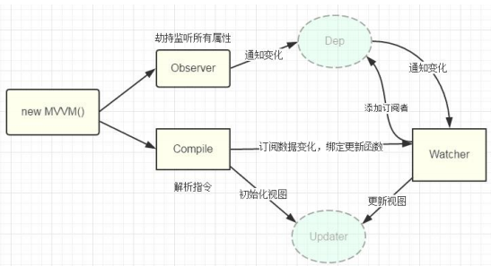

## Vue 原码分析

### 18.1 准备知识

1. [].slice.call(lis): 将伪数组转换为真数组

2. node.nodeType: 得到节点类型

3. Object.defineProperty(obj, propName, {}): 给对象添加/修改属性(指定描述符) configurable: true/false 是否可以重新 define

enumerable: true/false 是否可以枚举(for..in / keys())

value: 指定初始值 writable: true/false value 是否可以修改

get: 回调函数, 用来得到当前属性值

set: 回调函数, 用来监视当前属性值的变化

4. Object.keys(obj): 得到对象自身可枚举的属性名的数组

5. DocumentFragment: 文档碎片(高效批量更新多个节点)

6. obj.hasOwnProperty(prop): 判断 prop 是否是 obj 自身的属性

### 18.2 数据代理

1. 数据代理: 通过一个对象代理对另一个对象(在前一个对象内部)中属性的操作(读/写)

2. vue 数据代理: 通过 vm 对象来代理 data 对象中所有属性的操作

3. 好处: 更方便的操作 data 中的数据

4. 基本实现流程

a. 通过 Object.defineProperty()给 vm 添加与 data 对象的属性对应的属性描述符

b. 所有添加的属性都包含 getter/setter

c. getter/setter 内部去操作 data

### 18.3 模板解析

#### 18.3.1 模板解析的基本流程

1. 将 el 的所有子节点取出, 添加到一个新建的文档 fragment 对象中

2. 对 fragment 中的所有层次子节点递归进行编译解析处理

\* 对大括号表达式文本节点进行解析

\* 对元素节点的指令属性进行解析

\* 事件指令解析

\* 一般指令解析

3. 将解析后的 fragment 添加到 el 中显示

#### 18.3.2 大括号表达式解析

1. 根据正则对象得到匹配出的表达式字符串: 子匹配/RegExp.\$1 name

2. 从 data 中取出表达式对应的属性值

3. 将属性值设置为文本节点的 textContent

####18.3.3 事件指令解析

1. 从指令名中取出事件名

2. 根据指令的值(表达式)从 methods 中得到对应的事件处理函数对象

3. 给当前元素节点绑定指定事件名和回调函数的 dom 事件监听

4. 指令解析完后, 移除此指令属性

#### 18.3.4 一般指令解析

1. 得到指令名和指令值(表达式) text/html/class msg/myClass

2. 从 data 中根据表达式得到对应的值

3. 根据指令名确定需要操作元素节点的什么属性 _ v-text---textContent 属性 _ v-html---innerHTML 属性 \* v-class--className 属性

4. 将得到的表达式的值设置到对应的属性上

5. 移除元素的指令属性

### 18.4 数据绑定

#### 18.4.1 数据绑定效果

一旦更新了 data 中的某个属性数据, 所有界面上直接使用或间接使用了此属性的节点都会 更新

####18.4.2 数据劫持

1. 数据劫持是 vue 中用来实现数据绑定的一种技术

2. 基本思想: 通过 defineProperty()来监视 data 中所有属性(任意层次)数据的变化, 一旦变 化就去更新界面

#### 18.4.3 四个重要对象

**1) Observer**

a. 用来对 data 所有属性数据进行劫持的构造函数

b. 给 data 中所有属性重新定义属性描述(get/set)

c. 为 data 中的每个属性创建对应的 dep 对象

**2) Dep(Depend)**

a. **data 中的每个属性(所有层次)都对应一个 dep 对象**

b. 创建的时机:

\* 在初始化 define data 中各个属性时创建对应的 dep 对象

\* 在 data 中的某个属性值被设置为新的对象时

c. 对象的结构

{

id, // 每个 dep 都有一个唯一的 id

subs //包含 n 个对应 watcher 的数组(subscribes 的简写)

}

d. subs 属性说明

\* 当 watcher 被创建时, 内部将当前 watcher 对象添加到对应的 dep 对象的 subs 中

\* 当此 data 属性的值发生改变时, subs 中所有的 watcher 都会收到更新的通知,从而最终更新对应的界面

**3) Compiler**

a. 用来解析模板页面的对象的构造函数(一个实例)

b. 利用 compile 对象解析模板页面

c. 每解析一个表达式(非事件指令)都会创建一个对应的 watcher 对象, 并建立 watcher

与 dep 的关系

d. complie 与 watcher 关系: 一对多的关系

**4) Watcher**

a. **模板中每个非事件指令或表达式都对应一个 watcher 对象**

b. 监视当前表达式数据的变化

c. 创建的时机: 在初始化编译模板时

d. 对象的组成

{

vm, //vm 对象

exp, //对应指令的表达式

cb, //当表达式所对应的数据发生改变的回调函数

value, //表达式当前的值

depIds //表达式中各级属性所对应的 dep 对象的集合对象

//属性名为 dep 的 id, 属性值为 dep

}

**5) 总结: dep 与 watcher 的关系: 多对多**

a. data 中的一个属性对应一个 dep, 一个 dep 中可能包含多个 watcher(模板中有几个

表达式使用到了同一个属性)

b. 模板中一个非事件表达式对应一个 watcher, 一个 watcher 中可能包含多个 dep(表

达式是多层: a.b)

c. 数据绑定使用到 2 个核心技术

`defineProperty()` 消息订阅与发布

#### 18.4.4 双向数据绑定

1. 双向数据绑定是建立在单向数据绑定(model==>View)的基础之上的

2. 双向数据绑定的实现流程:

a. 在解析 v-model 指令时, 给当前元素添加 input 监听

b. 当 input 的 value 发生改变时, 将最新的值赋值给当前表达式所对应的 data 属性

### 18.5 数据驱动

#### 18.5.1 Vue 与模板

**使用步骤**:

1. 编写页面模板，直接在 HTML 标签中写标签

2. 使用 template

3. 使用 单文件 `<template />`

4. 创建 Vue 的实例

5. 在 Vue 的构造函数中提供: data, methods, computed, watcher, props 等

6. 将 Vue 挂载到 页面中 `mount`

#### 18.5.2 数据驱动模型

**Vue 的执行流程**：

1. 获得模板: 模板中有 "坑"

2. 利用 Vue 构造函数中所提供的数据来 "填坑", 得到可以在页面中显示的 "标签了"

3. 将标签替换页面中原来有坑的标签

**所以，Vue 利用我们提供的数据和页面中模板生成了一个新的 HTML 标签 ( node 元素 )，替换到了页面中放置模板的位置。**

```js
<!DOCTYPE html>
<html lang="en">
  <head>
    <meta charset="UTF-8" />
    <meta name="viewport" content="width=device-width, initial-scale=1.0" />
    <meta http-equiv="X-UA-Compatible" content="ie=edge" />
    <title>Document</title>
    <script src="./node_modules/vue/dist/vue.min.js"></script>
  </head>
  <body>
    <!-- 第一步、写模板 -->
    <div id="root">
      <p>{{name}}</p>
      <p>{{message}}</p>
    </div>
    <script>
      // 第一个打印的root鼠标放上去页面是不会有高亮的
      console.log(root)
      // 第二步，创建实例
      const app = new Vue({
        el: '#root',
        data: {
          name: '张三',
          message: '是人'
        }
      })
      // 第三步，挂载，Vue已经帮我们实现
      // 第二个打印的root鼠标放上去页面才会有高亮的，因为Vue是替换模板，而不是在模板基础上进行修改
      console.log(root)
    </script>
  </body>
</html>
```

### 18.6 函数科里化和渲染模型

#### 18.6.1 函数科里化

**什么是函数科里化？**

- [函数式编程](https://llh911001.gitbooks.io/mostly-adequate-guide-chinese/content/)

- [维基百科](https://zh.wikipedia.org/wiki/柯里化)

#### 18.6.2 基本概念

- **科里化**： 一个函数原本有多个参数, 只传入**一个**参数, 生成一个新函数, 由新函数接收剩下的参数来运行得到结构。

- **偏函数**： 一个函数原本有多个参数, 只传入**一部分**参数, 生成一个新函数, 由新函数接收剩下的参数来运行得到结构。

- **高阶函数**：一个函数**参数是一个函数**, 该函数对参数这个函数进行加工, 得到一个函数, 这个加工用的函数就是高阶函数。

#### 18.6..3 Vue 中的函数科里化

**Vue 中使用函数科里化的直接受益就是能够提升性能，使用科里化能够缓存函数的一部分能力。**

Vue 本质上是使用 HTML 的字符串作为模板的, 将字符串的 模板 转换为 AST, 再转换为 VNode。

- 模板 -> AST

- AST -> VNode

- VNode -> DOM

在这三个阶段中，第一个阶段 模板 -> AST 是最消耗性能的，因为在这里面进行了字符串的解析。在前面我们进行简单的模板渲染时并没有说明这个问题，其实 Vue 在真正的转换的时候不是那样直接转换的。

**以 Vue 的例子来说，在 Vue 中每一个标签可以是真正的 HTML 标签, 也可以是自定义组件, 那么怎么区分？**

其实，观察 Vue 的源码我们可以知道，Vue 已经内部事先将可以用的 HTML 标签都保存起来了。

```js
const tags =
  "html,body,base,head,link,meta,style,title," +
  "address,article,aside,footer,header,h1,h2,h3,h4,h5,h6,hgroup,nav,section," +
  "div,dd,dl,dt,figcaption,figure,picture,hr,img,li,main,ol,p,pre,ul," +
  "a,b,abbr,bdi,bdo,br,cite,code,data,dfn,em,i,kbd,mark,q,rp,rt,rtc,ruby," +
  "s,samp,small,span,strong,sub,sup,time,u,var,wbr,area,audio,map,track,video," +
  "embed,object,param,source,canvas,script,noscript,del,ins," +
  "caption,col,colgroup,table,thead,tbody,td,th,tr," +
  "button,datalist,fieldset,form,input,label,legend,meter,optgroup,option," +
  "output,progress,select,textarea," +
  "details,dialog,menu,menuitem,summary," +
  "content,element,shadow,template,blockquote,iframe,tfoot";
```

但是，如果我们每次在进行判断的时候都要循环一次判断，这样做是非常消耗性能的。而使用科里化能够将指数次的时间复杂度降为 O(1)。

```js
const tags =
  "html,body,base,head,link,meta,style,title," +
  "address,article,aside,footer,header,h1,h2,h3,h4,h5,h6,hgroup,nav,section," +
  "div,dd,dl,dt,figcaption,figure,picture,hr,img,li,main,ol,p,pre,ul," +
  "a,b,abbr,bdi,bdo,br,cite,code,data,dfn,em,i,kbd,mark,q,rp,rt,rtc,ruby," +
  "s,samp,small,span,strong,sub,sup,time,u,var,wbr,area,audio,map,track,video," +
  "embed,object,param,source,canvas,script,noscript,del,ins," +
  "caption,col,colgroup,table,thead,tbody,td,th,tr," +
  "button,datalist,fieldset,form,input,label,legend,meter,optgroup,option," +
  "output,progress,select,textarea," +
  "details,dialog,menu,menuitem,summary," +
  "content,element,shadow,template,blockquote,iframe,tfoot";
function makeMap(tags) {
  const keys = tags.split(",");
  const set = {};
  keys.forEach((key) => (set[key] = true));
  // 我们只需要通过函数是否有该属性来判断
  return function(tagName) {
    return !!set[tagName.toLowerCase()];
  };
}

// 得到这个函数来进行HTML标签和组件的判断
const isHTMLTag = makeMap(tags);
```

**那么，为什么不将`set`定义为全局对象，这样一样能够实现效果？**

因为使用`makeMap`获取各种判断的函数并不止会用一次，在 Vue 中不止是处理了 HTML 的标签，还有很多其他的标签，类似`svg`这样。所以，为了区分开以及代码的复用性，我们更倾向将其进行科里化处理。

#### 18.6.4 Vue 的渲染模型（极简）

**Vue 在获取到渲染函数的时候也是通过函数科里化实现的，目的在于将抽象语法树保存在内存中，增加性能。**

我们在这里不直接将抽象语法树转换为 VNode，写一个极简的渲染模型，使用空的 VNode 模板进行渲染。

```js
<!DOCTYPE html>
<html lang="en">
  <head>
    <meta charset="UTF-8" />
    <meta name="viewport" content="width=device-width, initial-scale=1.0" />
    <meta http-equiv="X-UA-Compatible" content="ie=edge" />
    <title>Document</title>
  </head>
  <body>
    <div id="root">
      <p>{{name}}</p>
      <p>{{age}}</p>
      <p>{{gender}}</p>
      <div class="box">
        <p>box</p>
      </div>
    </div>
    <script>
      // 将真正的DOM转换为VNode
      function getVNode(node) {
        const nodeType = node.nodeType
        let _vnode = null
        if (nodeType === 1) {
          const nodeName = node.nodeName
          const attrs = node.attributes
          let _attrObj = {}
          for (let i = 0; i < attrs.length; i++) {
            _attrObj[attrs[i].nodeName] = attrs[i].nodeValue
          }
          _vnode = new VNode(nodeName, _attrObj, undefined, nodeType)

          // 考虑node的子元素
          const childNodes = node.childNodes
          for (let i = 0; i < childNodes.length; i++) {
            _vnode.appendChild(getVNode(childNodes[i]))
          }
        } else if (nodeType === 3) {
          _vnode = new VNode(undefined, undefined, node.nodeValue, nodeType)
        }
        return _vnode
      }
      // 将VNode转换为真正的DOM
      function parseVNode(vnode) {
        // 创建真实的DOM节点
        const type = vnode.type
        let _node = null
        if (type === 3) {
          // 创建文本节点
          return document.createTextNode(vnode.value)
        } else if (type === 1) {
          _node = document.createElement(vnode.tag)
          // 属性
          const data = vnode.data // 现在这个data是键值对
          Object.keys(data).forEach(key => {
            const attrName = key
            const attrValue = data[key]
            _node.setAttribute(attrName, attrValue)
          })

          // 创建子元素
          const children = vnode.children
          children.forEach(subvnode => {
            _node.appendChild(parseVNode(subvnode))
          })
          return _node
        }
      }
      const Mustache = /\{\{(.+?)\}\}/g
      // 根据路径访问对象成员
      function getValueByPath(obj, path) {
        const paths = path.split('.') // a.b.c
        // 先取到a.b，再取到a.b.c
        let res = obj
        let prop = ''
        // 如果没有值最后为undefined
        while ((prop = paths.shift())) {
          res = res[prop]
        }
        return res
      }
      // 让模板与数据结合
      function combine(vnode, data) {
        const _type = vnode.type
        const _data = vnode.data
        const _value = vnode.value
        const _tag = vnode.tag
        const _children = vnode.children

        let _vnode = null
        // 对文本节点的处理
        if (_type === 3) {
          _parsedValue = _value.replace(Mustache, (_, g) =>
            getValueByPath(data, g.trim())
          )
          _vnode = new VNode(_tag, _data, _parsedValue, _type)
        } else if (_type === 1) {
          // 元素节点
          _vnode = new VNode(_tag, _data, _value, _type)
          _children.forEach(_subvnode =>
            _vnode.appendChild(combine(_subvnode, data))
          )
        }
        return _vnode
      }

      class VNode {
        constructor(tag, data, value, type) {
          this.tag = tag && tag.toLowerCase()
          this.data = data
          this.value = value
          this.type = type
          this.children = []
        }
        appendChild(vnode) {
          this.children.push(vnode)
        }
      }

      class MyVue {
        constructor(options) {
          this._options = options
          this._data = options.data
          this._el = options.el
          const elm = document.querySelector(options.el) // 在Vue中这里是字符串，我们这里简化为DOM
          this._template = elm
          this._parent = elm.parentNode
          this.mount() // 挂载
        }
        mount() {
          // 需要提供一个render方法来生成虚拟DOM,引入Vue是可以传入自定义render方法的，该方法让用户提供自定义的VNode
          if (typeof this._options.render !== 'function') {
            this.render = this.createRenderFn() // 带有缓存
          }
          this.mountComponent()
        }
        mountComponent() {
          // 执行 mountComponent函数
          const mount = function() {
            this.update(this.render())
          }
          // 在Vue中其实是交给 watcher 来调用，现在就这样写
          mount.call(this)
        }
        /*
          在真正的 Vue中使用了二次提交的设计结构
          1.在页面中的DOM和虚拟DOM是一一对应的关系
          2.先由 AST 和数据生成VNode（这个是新产生的VNode）
          3.将原来的旧的VNode与新的VNode进行比较（使用diff算法），再更新（update）
        */
        // 这里是生成render函数，目的是缓存抽象语法树（现在这里我们先使用虚拟DOM来进行模拟）
        createRenderFn() {
          const ast = getVNode(this._template)
          // 在Vue中是直接：AST + DATA -> VNode

          // 我们这里做简化，将模板转换的直接的空的VNode转换为由数据的VNode
          return function() { // 带有缓存
            const _tmp = combine(ast, this._data)
            return _tmp
          }
        }

        // 将虚拟DOM渲染到页面中，diff算法就在这个地方
        update(vnode) {
          const realDOM = parseVNode(vnode)
          // 对这个过程简化，直接生成 DOM 通过替换的方式到页面中去，真实情况不是这样全部替换，而是通过diff算法一级一级比较然后改变原来的对象
          this._parent.replaceChild(realDOM, document.querySelector(this._el))
        }
      }

      const app = new MyVue({
        el: '#root',
        data: {
          name: '张三',
          age: 18,
          gender: '男'
        }
      })
    </script>
  </body>
</html>
```

### 18.7 响应式原理

**Vue 的响应式基本有着下面几点：**

- 在使用 Vue 时候, 赋值属性获得属性都是直接使用的 Vue 实例（通过`this.xxx`获取，而不是`this._data.xxx`）。

- 在涉及属性值的时候, 页面的数据更新。

#### 18.7.1 属性描述符

在 ES5 之前，JavaScript 没有内置的机制来指定或者检查对象某个属性(property)的特性(characteristics)，比如某个属性是只读(readonly)的或者不能被枚举(enumerable)的。但是在 ES5 之后，JavaScript 被赋予了这个能力，所有的对象属性都可以通过属性描述符(Property Descriptor)来指定。

```js
let myObject = {};

Object.defineProperty(myObject, "a", {
  value: 2,
  writable: true, // 可写
  configurable: true, // 可配置
  enumerable: true, // 可遍历
});
// 上面的定义等同于 myObject.a = 2;
// 所以如果不需要修改这三个特性，我们一般不会用 `Object.defineProperty`

console.log(myObject.a); // 2
```

**属性描述符的六个属性**

- value：属性值

- writable：是否允许赋值，

  true

  表示允许，否则该属性不允许赋值

  ```
  let myObject = {}

  Object.defineProperty(myObject, 'a', {
    value: 2,
    writable: false, // 不可写
    configurable: true,
    enumerable: true
  })

  myObject.a = 3 // 写入的值将会被忽略
  console.log(myObject.a) // 2
  ```

- get：返回属性值的函数。如果为 **undefined** 则直接返回描述符中定义的 **value** 值

- set：属性的赋值函数。如果为 **undefined** 则直接将赋值运算符右侧的值保存为属性值
  **注：**

- - 一旦同时使用了`get`和`set`，需要一个中间变量存储真正的值。

- - `set`和`writable:false`是不能共存的。

- configurable：如果为

  true

  ，则表示该属性可以重新使用（

  ```js
  Object.defineProperty(...)
  ```

  ）定义描述符，或者从属性的宿主删除。缺省为

  ```js
  true;
  ```

  ```js
  let myObject = {
    a: 2,
  };

  Object.defineProperty(myObject, "a", {
    value: 4,
    writable: true,
    configurable: false, // 不可配置!
    enumerable: true,
  });

  console.log(myObject.a); // 4
  myObject.a = 5;
  // 因为最开始writable时true，所以不会影响到赋值
  console.log(myObject.a); // 5

  Object.defineProperty(myObject, "a", {
    value: 6,
    writable: true,
    configurable: true,
    enumerable: true,
  }); // TypeError
  ```

  注：

  一旦某个属性被指定为

  ```
  configurable: false
  ```

  ，那么就不能从新指定为

  ```
  configurable: true
  ```

  了，这个操作是单向，不可逆的

  这个特性还会影响`delete` 操作的行为

  ```js
  let myObject = {
    a: 2,
  };

  Object.defineProperty(myObject, "a", {
    value: 4,
    writable: true,
    configurable: false, // 不可配置!
    enumerable: true,
  });
  delete myObject.a;
  console.log(myObject.a); // 4
  ```

- enumerable：如果为

  true

  ，则表示遍历宿主对象时，该属性可以被遍历到（比如

  ```
  for..in
  ```

  循环中）。缺省为

  ```
  true
  ```

  ```js
  let myObject = {};

  Object.defineProperty(
    myObject,
    "a",
    // make `a` enumerable, as normal
    { enumerable: true, value: 2 }
  );

  Object.defineProperty(
    myObject,
    "b",
    // make `b` NON-enumerable
    { enumerable: false, value: 3 }
  );
  console.log(myObject.b); // 3
  console.log("b" in myObject); // true
  myObject.hasOwnProperty("b"); // true

  // .......
  // 无法被遍历到
  for (let k in myObject) {
    console.log(k, myObject[k]);
  }
  // "a" 2

  myObject.propertyIsEnumerable("a"); // true
  myObject.propertyIsEnumerable("b"); // false
  Object.keys(myObject); // ["a"]
  Object.getOwnPropertyNames(myObject); // ["a", "b"]
  ```

  可以看出，

  ```
  enumerable: false
  ```

  使得该属性从对象属性枚举操作中被隐藏，但

  ```
  Object.hasOwnProperty(...)
  ```

  仍然可以检测到属性的存在。另外，

  ```
  Object.propertyIsEnumerable(..)
  ```

  可以用来检测某个属性是否可枚举,

  ```
  Object.keys(...)
  ```

  仅仅返回可枚举的属性，而

  ```
  Object.getOwnPropertyNames(...)
  ```

  则返回该对象上的所有属性，包括不可枚举的

**注**：Object 有专门操作属性的方法，在这里就不再多讲了

#### 18.7.2 Vue 中使用属性描述符

在 Vue 中因为全部依赖的是响应式，所以直接使用会有命名冲突的问题，我们使用闭包来解决这个问题。

```js
const o = {
  name: "张三",
  age: "18",
  gender: "男",
};
// 简化后的版本
function defineRective(target, key, value, enumerable) {
  // 函数内部形成一个局部作用域，value只在内部使用（闭包，避免污染全局）
  Object.defineProperty(target, key, {
    configurable: true,
    enumerable: !!enumerable,
    get() {
      console.log(`读取 o 的 ${key} 属性`); // 额外
      return value;
    },
    set(newValue) {
      console.log(`设置 o 的 ${key} 属性为: ${newValue}`); // 额外
      value = newValue;
    },
  });
}

console.log(o); // {name: "张三", age: "18", gender: "男"}
// 将对象转换为响应式的，会将原来的键值覆盖掉
Object.keys(o).forEach((key) => {
  defineRective(o, key, o[key], true);
});
console.log(o); // {}
```

但是，上面的只能对基本类型的数据进行响应式化，所以我们需要进行递归修改。

```js
const o = {
  name: "张三",
  age: "18",
  gender: "男",
  courses: [
    {
      name: "语文",
    },
    {
      name: "数学",
    },
  ],
};
// 简化后的版本
function defineRective(target, key, value, enumerable) {
  // 函数内部形成一个局部作用域，value只在内部使用（闭包，避免污染全局）
  if (typeof value === "object" && value !== null && !Array.isArray(value)) {
    // 非数组引用类型
    reactify(value);
  }

  Object.defineProperty(target, key, {
    configurable: true,
    enumerable: !!enumerable,
    get() {
      console.log(`获取${key}属性`);
      return value;
    },
    set(newValue) {
      console.log(`设置${key}属性`);
      value = newValue;
    },
  });
}
function reactify(o) {
  Object.keys(o).forEach((key) => {
    // 将对象转换为响应式的，会将原来的键值覆盖掉
    /*
          1.判断这个属性是否为引用类型，是否是数组
          2.
          （1）如果是引用类型就递归，如果不是就不需要
          （2）如果是数组，需要循环数组，然后将数组里面的元素进行响应式话
        */
    // 数组
    if (Array.isArray(o[key])) {
      o[key].forEach((value) => reactify(value));
    } else {
      // 对象或值类型
      defineRective(o, key, o[key], true);
    }
  });
}
reactify(o);
console.log(o);
```

#### 18.7.3 Vue 中对数组方法的扩展

对于对象和数组添加新的属性时也需要做到响应式，在 Vue 官方文档中可以通过`$set`方法进行设置，都是使用递归来进行响应式化，但是数组的的一些改变原数组的方法在调用时也需要有响应式化，如：

- push

- pop

- shift

- unshift

- reverse

- sort

- splice

**我们需要在改变数组的数据的时候, 发出通知，将新加入的元素变成响应式的。**

**注意**：在 Vue 2.x 中，因为使用的是 Object 的`defineProperty`方法, 数组发生变化, 设置 length 没法通知 ( Vue 3 中使用 Proxy 语法 ES6 的语法解决了这个问题 )。

##### 18.7.3.1 扩展函数功能

**如果一个函数已经定义了, 但是我们需要扩展其功能, 我们一般的处理办法:**

1. 使用一个临时的函数名存储函数

2. 重新定义原来的函数

3. 定义扩展的功能

4. 调用临时的那个函数

##### 18.7.3.2 Vue 中的拦截数组

如果要修改数组的方法，我们不能通过直接修改数组的`prototype`，因为这样会将所有的数组方法都改了，而是**修改要进行响应式化的数组的原型 ( `__proto__` )。**

```js
const ARRAY_METHOD = [
  "push",
  "pop",
  "shift",
  "unshift",
  "reverse",
  "sort",
  "splice",
];
// 原型式继承：修改原型链的结构
let arr = [];
let array_method = Object.create(Array.prototype);
ARRAY_METHOD.forEach((method) => {
  array_method[method] = function() {
    //调用原来的方法
    console.log(`调用拦截的${method}方法`);
    // 将数据进行响应式化
    const res = Array.prototype[method].apply(this, arguments);
    return res;
  };
});
arr.__proto__ = array_method;
/*
        Vue的源码中也做了这样的办法：
        1.如果浏览器支持__proto__就放原型上
        2.如果不支持Vue使用的混入的方法，Vue会挂载到当前对象上
*/
```

这样，在使用数组方法的时候就能够触发`console.log`了。

##### 18.7.3.3 Vue 数组的响应式化

所以，在数组中要响应式需要再修改一下上面的`reactify`函数。同时，如果是直接用对象或者数组进行赋值，也需要响应式化，需要修改一下`defineRective`函数定义属性时候的`set`方法

**注意：**下面的代码在，直接赋值的响应式化只能够原来的值不是数组或者对象才行，数组和对象在一开始赋值的时候本身就不是一个响应式数据，而是它的成员或属性才是，所以直接赋值的时候并不会触发`set`方法，在之后会单独再进行修改。

```js
function defineRective(target, key, value, enumerable) {
  // 函数内部形成一个局部作用域，value只在内部使用（闭包，避免污染全局）
  if (typeof value === "object" && value !== null && !Array.isArray(value)) {
    // 非数组引用类型
    reactify(value);
  }

  Object.defineProperty(target, key, {
    configurable: true,
    enumerable: !!enumerable,
    get() {
      console.log(`获取${key}属性`);
      return value;
    },
    set(newValue) {
      console.log(`设置${key}属性`);
      // 如果是数组等直接赋值，也需要响应式化
      value = newValue;
      reactify(value);
    },
  });
}
function reactify(o) {
  Object.keys(o).forEach((key) => {
    // 将对象转换为响应式的，会将原来的键值覆盖掉
    /*
          1.判断这个属性是否为引用类型，是否是数组
          2.
          （1）如果是引用类型就递归，如果不是就不需要
          （2）如果是数组，需要循环数组，然后将数组里面的元素进行响应式话
        */
    // 数组
    if (Array.isArray(o[key])) {
      // 现在的数组就是响应式
      o[key].__proto__ = array_method;
      o[key].forEach((value) => reactify(value));
    } else {
      // 对象或值类型
      defineRective(o, key, o[key], true);
    }
  });
}
```

##### 18.7.3.4 响应式刷新页面

将响应式读取数据与前面的模板页面相结合，就能够做到响应式刷新页面了。

**下面是集成上面代码的一个简易框架：**

```js
<!DOCTYPE html>
<html lang="en">
  <head>
    <meta charset="UTF-8" />
    <meta name="viewport" content="width=device-width, initial-scale=1.0" />
    <meta http-equiv="X-UA-Compatible" content="ie=edge" />
    <title>Document</title>
  </head>
  <body>
    <div id="root">
      <p>{{name}}</p>
      <p>{{age}}</p>
      <p>{{gender}}</p>
      <div class="box">
        <p>box</p>
      </div>
    </div>
    <script>
      const ARRAY_METHOD = [
        'push',
        'pop',
        'shift',
        'unshift',
        'reverse',
        'sort',
        'splice'
      ]

      // 原型式继承：修改原型链的结构
      const array_method = Object.create(Array.prototype)

      ARRAY_METHOD.forEach(method => {
        array_method[method] = function() {
          // 将数据进行响应式化
          for (let i = 0; i < arguments.length; i++) {
            // 因为缺陷，这里无法传入vm
            reactify(arguments[i])
          }

          //调用原来的方法
          const res = Array.prototype[method].apply(this, arguments)
          return res
        }
      })

      // 简化后的版本
      function defineRective(target, key, value, enumerable) {
        // 函数内部形成一个局部作用域，value只在内部使用（闭包，避免污染全局）
        // 折中处理后的Vue实例
        const _this = this

        if (
          typeof value === 'object' &&
          value !== null &&
          !Array.isArray(value)
        ) {
          // 非数组引用类型
          reactify(value)
        }

        Object.defineProperty(target, key, {
          configurable: true,
          enumerable: !!enumerable,
          get() {
            console.log(`获取${key}属性`)
            return value
          },
          set(newValue) {
            console.log(`设置${key}属性`)
            value = newValue
            if (typeof value === 'object' && value !== null) {
              reactify(value)
            }
            // 进行模板刷新，因为要获取Vue实例，这里就通过传入参数的形式获取，真实的Vue是通过watcher来获取的，以后会有修改
            _this.mountComponent()
          }
        })
      }
      function reactify(o, vm) {
        Object.keys(o).forEach(key => {
          // 将对象转换为响应式的，会将原来的键值覆盖掉
          /*
          1.判断这个属性是否为引用类型，是否是数组
          2.
          （1）如果是引用类型就递归，如果不是就不需要
          （2）如果是数组，需要循环数组，然后将数组里面的元素进行响应式话
        */
          // 数组
          if (Array.isArray(o[key])) {
            // 现在的数组就是响应式
            o[key].__proto__ = array_method
            o[key].forEach(value => reactify(value, vm))
          } else {
            // 对象或值类型
            defineRective.call(vm, o, key, o[key], true)
          }
        })
      }
      // 将真正的DOM转换为VNode
      function getVNode(node) {
        const nodeType = node.nodeType
        let _vnode = null
        if (nodeType === 1) {
          const nodeName = node.nodeName
          const attrs = node.attributes
          let _attrObj = {}
          for (let i = 0; i < attrs.length; i++) {
            _attrObj[attrs[i].nodeName] = attrs[i].nodeValue
          }
          _vnode = new VNode(nodeName, _attrObj, undefined, nodeType)

          // 考虑node的子元素
          const childNodes = node.childNodes
          for (let i = 0; i < childNodes.length; i++) {
            _vnode.appendChild(getVNode(childNodes[i]))
          }
        } else if (nodeType === 3) {
          _vnode = new VNode(undefined, undefined, node.nodeValue, nodeType)
        }
        return _vnode
      }
      // 将VNode转换为真正的DOM
      function parseVNode(vnode) {
        // 创建真实的DOM节点
        const type = vnode.type
        let _node = null
        if (type === 3) {
          // 创建文本节点
          return document.createTextNode(vnode.value)
        } else if (type === 1) {
          _node = document.createElement(vnode.tag)
          // 属性
          const data = vnode.data // 现在这个data是键值对
          Object.keys(data).forEach(key => {
            const attrName = key
            const attrValue = data[key]
            _node.setAttribute(attrName, attrValue)
          })

          // 创建子元素
          const children = vnode.children
          children.forEach(subvnode => {
            _node.appendChild(parseVNode(subvnode))
          })
          return _node
        }
      }
      const Mustache = /\{\{(.+?)\}\}/g
      // 根据路径访问对象成员
      function getValueByPath(obj, path) {
        const paths = path.split('.') // a.b.c
        // 先取到a.b，再取到a.b.c
        let res = obj
        let prop = ''
        // 如果没有值最后为undefined
        while ((prop = paths.shift())) {
          res = res[prop]
        }
        return res
      }
      // 让模板与数据结合
      function combine(vnode, data) {
        const _type = vnode.type
        const _data = vnode.data
        const _value = vnode.value
        const _tag = vnode.tag
        const _children = vnode.children

        let _vnode = null
        // 对文本节点的处理
        if (_type === 3) {
          _parsedValue = _value.replace(Mustache, (_, g) =>
            getValueByPath(data, g.trim())
          )
          _vnode = new VNode(_tag, _data, _parsedValue, _type)
        } else if (_type === 1) {
          // 元素节点
          _vnode = new VNode(_tag, _data, _value, _type)
          _children.forEach(_subvnode =>
            _vnode.appendChild(combine(_subvnode, data))
          )
        }
        return _vnode
      }
      class VNode {
        constructor(tag, data, value, type) {
          this.tag = tag && tag.toLowerCase()
          this.data = data
          this.value = value
          this.type = type
          this.children = []
        }
        appendChild(vnode) {
          this.children.push(vnode)
        }
      }

      class MyVue {
        constructor(options) {
          this._options = options
          this._data = options.data
          reactify(this._data, this) // 先传入实例
          this._el = options.el
          const elm = document.querySelector(options.el) // 在Vue中这里是字符串，我们这里简化为DOM
          this._template = elm
          this._parent = elm.parentNode
          this.mount() // 挂载
        }
        mount() {
          // 需要提供一个render方法来生成虚拟DOM,引入Vue是可以传入自定义render方法的，该方法让用户提供自定义的VNode
          if (typeof this._options.render !== 'function') {
            this.render = this.createRenderFn() // 带有缓存
          }
          this.mountComponent()
        }
        mountComponent() {
          // 执行 mountComponent函数
          const mount = function() {
            this.update(this.render())
          }
          // 在Vue中其实是交给 watcher 来调用，现在就这样写
          mount.call(this)
        }
        /*
          在真正的 Vue中使用了二次提交的设计结构
          1.在页面中的DOM和虚拟DOM是一一对应的关系
          2.先由 AST 和数据生成VNode（这个是新产生的VNode）
          3.将原来的旧的VNode与新的VNode进行比较（使用diff算法），再更新（update）
        */
        // 这里是生成render函数，目的是缓存抽象语法树（现在这里我们先使用虚拟DOM来进行模拟）
        createRenderFn() {
          const ast = getVNode(this._template)
          // 在Vue中是直接：AST + DATA -> VNode

          // 我们这里做简化，将模板转换的直接的空的VNode转换为由数据的VNode
          return function() {
            const _tmp = combine(ast, this._data)
            return _tmp
          }
        }

        // 将虚拟DOM渲染到页面中，diff算法就在这个地方
        update(vnode) {
          const realDOM = parseVNode(vnode)
          // 对这个过程简化，直接生成 DOM 通过替换的方式到页面中去，真实情况不是这样全部替换，而是通过diff算法一级一级比较然后改变原来的对象
          this._parent.replaceChild(realDOM, document.querySelector(this._el))
        }
      }

      const app = new MyVue({
        el: '#root',
        data: {
          name: '张三',
          age: 18,
          gender: '男',
          datas: {
            info: '11'
          }
        }
      })
    </script>
  </body>
</html>
```

##### 18.7.3.5 代理方法

代理方法的实现就是将 Vue 上的`this._data`上的成员映射到`this`上。由于需要在更新数据的时候，更新页面的内容，所有`this._data`访问的成员与`this`访问的成员应该是同一个成员。

**我们现在对我们自己的简易框架做一点修改：**

```js
class MyVue {
  constructor(options) {
    this._options = options;
    this._data = options.data;
    this._el = options.el;
    const elm = document.querySelector(options.el); // 在Vue中这里是字符串，我们这里简化为DOM
    this._template = elm;
    this._parent = elm.parentNode;
    // <------------------------------>
    this.initData(); // 将data进行响应式转换，代理
    // <------------------------------>
    this.mount(); // 挂载
  }
  mount() {
    // 需要提供一个render方法来生成虚拟DOM,引入Vue是可以传入自定义render方法的，该方法让用户提供自定义的VNode
    if (typeof this._options.render !== "function") {
      this.render = this.createRenderFn(); // 带有缓存
    }
    this.mountComponent();
  }
  mountComponent() {
    // 执行 mountComponent函数
    const mount = function() {
      this.update(this.render());
    };
    // 在Vue中其实是交给 watcher 来调用，现在就这样写
    mount.call(this);
  }
  /*
          在真正的 Vue中使用了二次提交的设计结构
          1.在页面中的DOM和虚拟DOM是一一对应的关系
          2.先由 AST 和数据生成VNode（这个是新产生的VNode）
          3.将原来的旧的VNode与新的VNode进行比较（使用diff算法），再更新（update）
        */
  // 这里是生成render函数，目的是缓存抽象语法树（现在这里我们先使用虚拟DOM来进行模拟）
  createRenderFn() {
    const ast = getVNode(this._template);
    // 在Vue中是直接：AST + DATA -> VNode

    // 我们这里做简化，将模板转换的直接的空的VNode转换为由数据的VNode
    return function() {
      const _tmp = combine(ast, this._data);
      return _tmp;
    };
  }

  // 将虚拟DOM渲染到页面中，diff算法就在这个地方
  update(vnode) {
    const realDOM = parseVNode(vnode);
    // 对这个过程简化，直接生成 DOM 通过替换的方式到页面中去，真实情况不是这样全部替换，而是通过diff算法一级一级比较然后改变原来的对象
    this._parent.replaceChild(realDOM, document.querySelector(this._el));
  }
  // <------------------------------------------->
  initData() {
    // 遍历this._data的成员，将属性转换为响应式，同时代理到实例上
    Object.keys(this._data).forEach((key) => {
      // 响应式化
      reactify(this._data, this);
      // 代理
      /*
              将this._data[key]映射到this[key]上，就是提供代理，在访问this[key]的时候相当于是在访问this._data[key]
            */
      proxy(this, "_data", key);
    });
  }
  // <------------------------------------------->
}
// <------------------------------------------->
function proxy(target, prop, key) {
  Object.defineProperty(target, key, {
    enumerable: true,
    configurable: true,
    get() {
      return target[prop][key];
    },
    set(newValue) {
      target[prop][key] = newValue;
    },
  });
}
// <------------------------------------------->
```

### 18.8 发布订阅模式

**发布订阅模式的目标是通过解耦, 让各个模块之间没有紧密的联系。**

在之前我们的简单模板中的处理办法是属性在更新的 时候调用`mountComponent`方法。但是这种方法目前还存在着问题，

现在调用该方法更新的是全部的页面，也就是当前虚拟 DOM 对应的页面 DOM。

**但是，在 Vue 中, 整个的更新是按照组件为单位进行断, 已节点为单位进行更新：**

- 如果代码中没有自定义组件，那么在比较算法的时候，会将全部的模板对应的虚拟 DOM 进行比较。

- 如果代码中含有自定义组件，那么在比较算法的时候，就会判断更新的是哪一些组件中的属性，只会判断更新数据的组件，其他组件不会更新。

**所以，我们的目标是如果修改了什么属性，就尽可能只更新这些属性对应的页面 DOM。**

**发布订阅模式 ( 形式不局限于函数, 形式可以是对象等 )**：

1. 中间的**全局的容器**，用来**存储**可以被触发的东西（函数, 对象）。

2. 需要一个方法，可以往容器中**传入**东西（函数, 对象）。

3. 需要一个方法，可以将容器中的东西取出来**使用**（函数调用, 对象的方法调用）。

#### 18.8.1 事件模型

**总的来说发布订阅模式的一种事件就是创立一个事件模型，当需要更新的时候触发对应的事件实现更新。**

该事件模型需要做到以下几点：

- 有一个`event`对象。

- 有`on`，`off`，`emit`等绑定、取消、触发事件的方法。

- 通过`event.on('事件名', 处理函数)`订阅事件，可以同时对同一个事件订阅多个处理函数。

- 通过`event.off()`方法传入 0、1、2 个参数可以分别移除所有处理函数、对应事件名的所有处理函数和对应事件名的对应处理函数。

- 通过`event.emit('事件名', 参数)`, 先前注册的事件处理函数就会依次调用。

```js
const event = (function() {
  const eventObjs = {};
  return {
    /*
            注册事件：可以连续注册，可以注册多个事件
          */
    on(type, handler) {
      (eventObjs[type] || (eventObjs[type] = [])).push(handler);
    },
    /*
            移除事件：
            1.如果没有参数，移除所有事件
            2.如果只带有事件名参数，就移除这个事件名下的所有事件
            3.如果带有两个参数，那么就移除某一个事件的具体函数
          */
    off(type, handler) {
      if (arguments.length === 0) {
        // 没有参数，移除所有事件
        eventObjs = {};
      } else if (arguments.length === 1) {
        eventObjs[type] = [];

        //只有事件类型，移除该事件的所有处理函数
      } else if (arguments.length === 2) {
        // 移除type事件的handler处理函数
        // 使用循环移除所有的改函数对应的type事件
        const _events = eventObjs[type];
        if (!events) {
          return;
        }
        // 循环数组，倒着防止序号影响
        for (let i = _events.length - 1; i >= 0; i--) {
          if (_events[i] === handler) {
            _events.splice(i, 1);
          }
        }
      }
    },
    /*
            发射事件：触发事件，包装事件，传递给事件处理函数
          */
    emit(type) {
      const _events = eventObjs[type];
      const args = Array.prototype.slice.call(arguments, 1); // 获得arguments从1开始后的所有参数，返回数组
      if (!_events) {
        return;
      }
      for (let i = 0; i < _events.length; i++) {
        _events[i].apply(null, args);
      }
    },
  };
})();

/*
    测试
*/

//注册事件
event.on("click", () => {
  console.log("click event");
});
setTimeout(() => {
  event.emit("click");
}, 2000);
```

#### 18.8.2 Vue 中的模型

**页面中的变更（diff）是以组件为单位的**：

- 如果页面中只有一个组件 ( Vue 实例 ), 不会有性能损失

- 但是如果页面中有多个组件（多 watcher 的一种情况），第一次会有多个组件的 watcher 存入到全局 watcher 容器中。如果修改了局部的数据（例如其中一个组件的数据），表示只会对该组件进行 diff 算法, 也就是说只会重新生成该组件的抽象语法树，只会访问该组件的 watcher，然后调用完改 watcher 后，再次往全局存储的该组件的新的 watcher ，页面更新的时候也就只需要更新一部分。

### 18.9 Flow

Flow 是一个静态的检测工具，语法与 TypeScript 类似，在 Vue 2.x 中是使用它来进行编码的，具体的用法可查看[官方文档](https://flow.org/en/docs/getting-started/)

### 18.10 Vue 的 MVVM 模式


