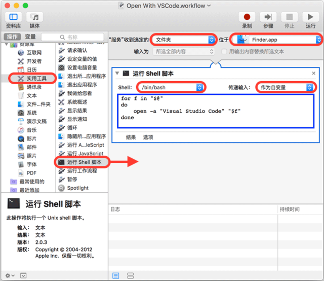
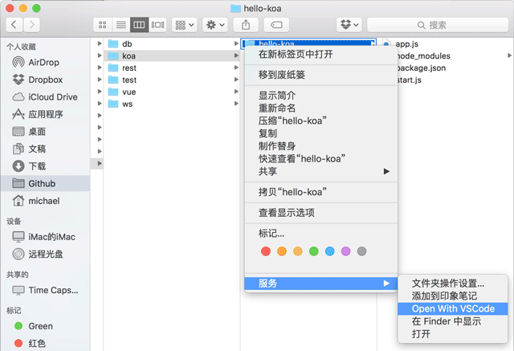

# VSCode 安装

## 下载

在 [官网下载地址](https://code.visualstudio.com/Download) 或群内下载最新版 Win64User 安装包。

## 安装

双击安装包打开同意用户协议。

安装过程中，请务必钩上以下选项:


勾选 **添加到目录上下文菜单**、**添加到文件上下文菜单**、**将 code 注册为受支持的文件编辑器**、**添加到 path**。

在 VSCode 初次启动后，若未提前安装 Git 可能会提示未找到 Git 软件，忽略即可；推荐立即执行简体中文扩展安装以保证界面语言为简体中文。

## 更新频率

VS Code 每月发布一个具有新功能和重要错误修复的新版本。大多数平台都支持自动更新，并且会在新版本发布时提示您安装新版本。您还可以通过运行“帮助”>“检查更新”来手动检查更新。

## Mac 添加 “通过 Code 打开”

在 Mac 系统上，Finder 选中一个目录，右键菜单并没有 “通过 Code 打开” 这个操作。不过我们可以通过 Automator 自己添加这个操作。

先运行 Automator，选择“服务”:


然后，执行以下操作:



1. 在右侧面板选择 “服务” 收到选定的 “文件夹”，位于 “Finder.app“，该选项是为了从 Finder 中接收一个文件夹；

2. 在左侧面板选择 ”实用工具“，然后找到 ”运行 Shell 脚本“，把它拽到右侧面板里；

3. 在右侧 ”运行 Shell 脚本“ 的面板里，选择 Shell ”/bin/bash“，传递输入“作为自变量”，然后修改 Shell 脚本如下:

```sh
for f in "$@"
do
    open -a "Visual Studio Code" "$f"
done
```

保存为 “Open With VSCode” 后，打开 Finder，选中一个文件夹，点击右键，“服务”，就可以看到 “Open With VSCode” 菜单:


